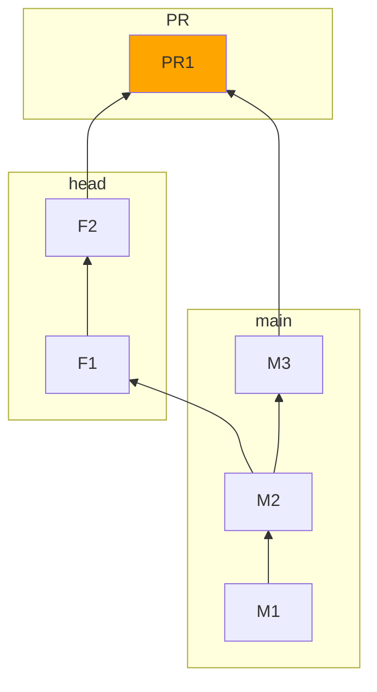
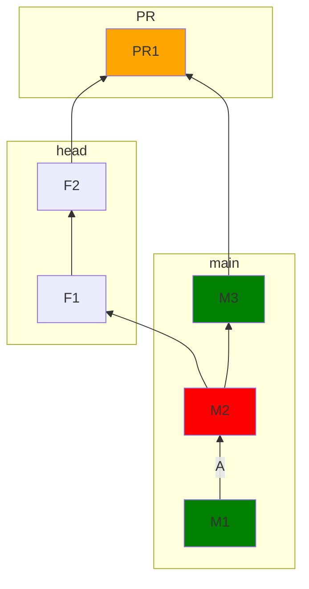

# GitHub Actions supporting scripts

In this section of the repo you will find GitHub specific integrations. We really hope there will not be many of them.

## Testing

```
yarn
yarn test
```

## Building/Packaging

```
yarn
yarn build
```

## Running locally

Running locally can be done by using [local-runner.ts](./local-runner.ts). You will need a GitHub PAT with `repo` permissions.

```shell
node -r esbuild-runner/register local-runner.ts
```
 
# Change detection script

What is a Github PR

Basically a PR is a sort of "dry-run" of what would happen if you merged your branch to the base branch at a given point in time. Here is what roughly happens when you open a PR:



If the two branches cannot be merged together, someone must step in to fix that up.
If the two branches can be merged together than that's great and at least it means the head branch can be merged into the base one. If there are GitHub Actions workflows configured for this event (pull request, that is) and the `PR1` merge was successful then those are executed.


