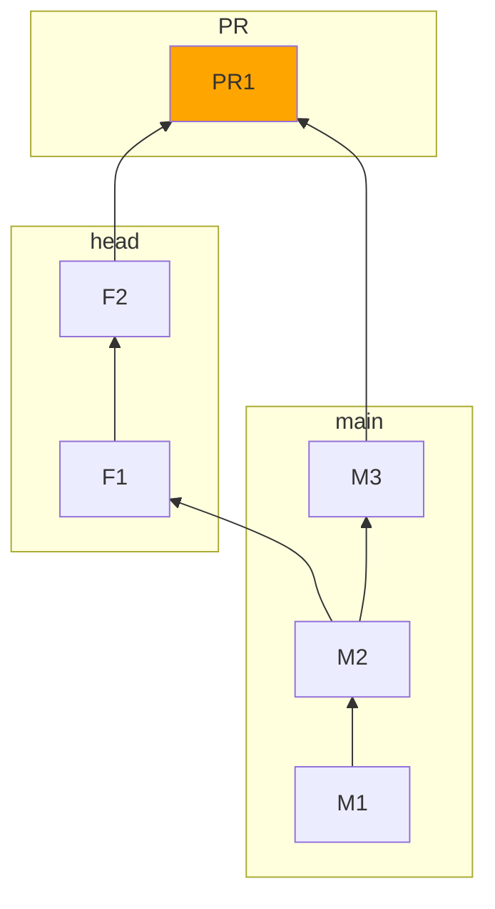

# GitHub Actions supporting scripts

In this section of the repo you will find GitHub specific integrations. We really hope there will not be many of them.

## Testing

```
yarn
yarn test
```

## Building/Packaging

```
yarn
yarn build
```

## Running locally

Running locally can be done by using [local-runner.ts](./local-runner.ts). You will need a GitHub PAT with `repo`
permissions.

```shell
node -r esbuild-runner/register local-runner.ts
```

# Change detection script

## What is a Github PR?

Basically a PR is a sort of "dry-run" of what would happen if you merged your branch to the base branch at a given point
in time. Here is what roughly happens when you open a PR:



If the two branches cannot be merged together, someone must step in to fix that up. If the two branches can be merged
together, then that's great and at least it means the head branch can be auto-merged into the base one. If there are
GitHub Actions workflows configured for this event (pull request, that is) and the `PR1` merge was successful, then
those are executed.

## The challenge

In the context of monorepo, such as we are, re-building and re-integrating the code at every step fully is very
expensive (and only getting more so over time) in all kinds of ways and is therefore impractical. We are employing a
process where we re-integrate and re-build only the components that have changed from the last successful build.

This is extra tricky when we have a PR since it is being re-build on pushes on the head branch but integrates changes
from both the head and the base branch. PR builds specifically incorporate both changes and that supports feature
deployments that use parts from the `main` line as well as provide with more accurate presentation of feature status as
it would be when merged to the base branch.

This script takes care of this aggressively incremental change detection. More details about this coming soon.
