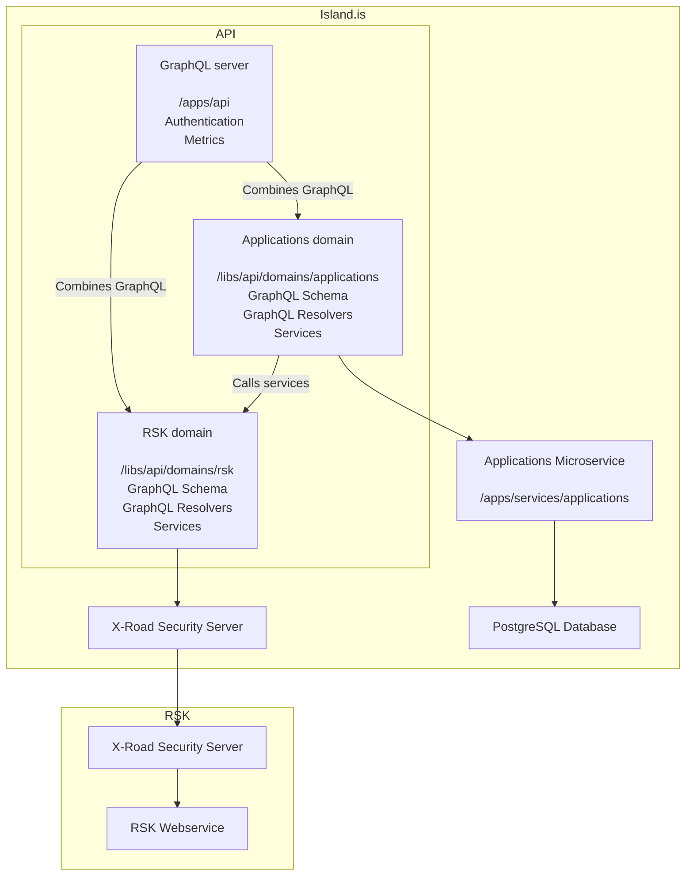

# API

## Quickstart

Ensure Docker is running. For initial setup, execute:

```bash
yarn dev-init api
```

To start the app:

```bash
yarn dev api
```

## About

This project is a unified API for island.is products, built as a thin GraphQL layer on top of data/services from government organizations and island.is microservices. Each unit is wrapped in a domain.

Here is a diagram of the project structure:



## URLs

- Staging: [https://beta.staging01.devland.is/api](https://beta.staging01.devland.is/api)

## Project structure

Keep app package code minimal. Business logic should reside in [domain libraries](https://github.com/island-is/island.is/tree/main/libs/api/domains). Shared utilities should also be in libraries.

### Domains

Domain libraries wrap data models or services. Microservices and organizations should have their own domain library, potentially including:

- **typeDefs**: GraphQL schema for domain types, inputs, queries, mutations.
- **resolvers**: GraphQL resolvers for the domain.
- **services**: Services for other domains, with strong typing and no internal exposure.

Resolvers are merged into a single GraphQL server. They manage resolver arguments, delegating logic to service functions that may interact with other domains or services.

### Services

Services encapsulate domain logic. They are easy to test and use dependency injection (DI) for accessing services/connectors. Dependency setup is manual in tests and `/apps/api/src/graphql/context`.

### Type Generation

Using [graphql-codegen](https://graphql-code-generator.com/), we generate TypeScript types for GraphQL schemas. Client apps can use it to merge the API schema with client operations for validation and type definitions.

### Shared libraries

Reusable code should be in shared libraries. API-specific code goes in `/libs/api`. Structure can be flat or grouped as needed.

Examples:

```text
# Flat
/libs/api/middlewares

# Grouped
/libs/api/clients/cms
/libs/api/clients/x-road
/libs/api/utilities/graphql
```

### Fetch development secrets

Use `AWS_PROFILE=<profile> yarn nx get-secrets <project>`. Example:

```bash
AWS_PROFILE=islandis yarn nx get-secrets api
```

### Test requirements

This API mainly wraps external services. Focus is on unit tests with mocked external dependencies. Shared code/services should have good test coverage. Resolvers should stay simple.

## Getting started

Start the API:

```bash
yarn start api
```

### Codegen

After modifying a GraphQL schema, update generated TypeScript types:

```bash
yarn nx run api-schema:codegen/frontend-client
```

### Tests

Run all affected tests or specify a project:

```bash
yarn affected:test
yarn test api
```

Add `--help` for jest arguments:

```bash
yarn test api --help
yarn test api --watch
yarn test api --updateSnapshots
yarn test api --runInBand
```

### New domain

Create a new domain or library with an NX schematic:

```bash
yarn generate @nrwl/node:library api/domains/your-domain
yarn generate @nrwl/node:library api/your-library
```

To expose fields in the GraphQL schema, export `typeDefs` and `resolvers` in your domain's `index.ts`, then add to `/apps/spi/src/graphql/domains.ts`.

## Code owners and maintainers

- [Júní](https://github.com/orgs/island-is/teams/juni/members): `libs/cms`, `libs/api/domains/content-search`
- [Aranja](https://github.com/orgs/island-is/teams/aranja/members): `libs/cms`, `libs/api/domains/application`, `libs/api/domains/content-search`
- [Norda](https://github.com/orgs/island-is/teams/norda/members): `libs/api/domains/documents`, `libs/api/domains/national-registry`
- [Stefna](https://github.com/orgs/island-is/teams/stefna/members): `libs/api/domains/content-search`
- [Advania](https://github.com/orgs/island-is/teams/advania/members): `libs/api/domains/api-catalogue`
