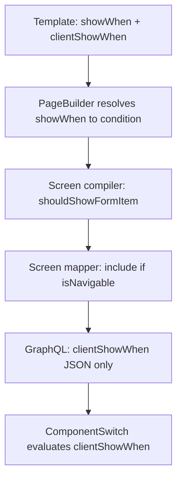
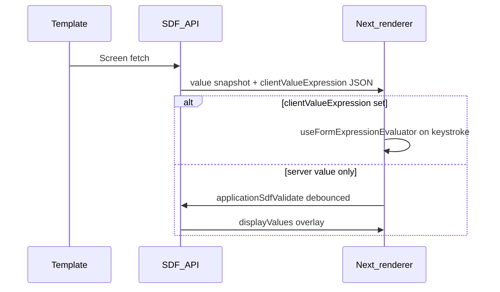

# SDF Expressions Guide

This guide explains how **conditional visibility** and **computed display values** work in server-driven forms (SDF). It is written for template authors using `FormBuilder` and for contributors working on the SDF renderer.

SDF splits responsibility across three layers:

1. **Author-time** — you define rules in application templates (`showWhen`, `clientShowWhen`, `value`, `clientValueExpression`).
2. **Server-time** — the API compiles the form, evaluates server rules, and sends a screen payload.
3. **Client-time** — the Next.js renderer reactively evaluates client expressions as the user edits answers.

```ts
import { FormBuilder, expr, serverExpr } from '@island.is/application/core'
```

## Naming cheat sheet

| You write in a template     | Stored on the field     | Sent over GraphQL                   | Evaluated by                               |
| --------------------------- | ----------------------- | ----------------------------------- | ------------------------------------------ |
| `showWhen`                  | `condition`             | _(omitted)_                         | Server — `shouldShowFormItem`              |
| `clientShowWhen`            | `clientShowWhen`        | `clientShowWhen`                    | Client — `useFormExpressionEvaluator`      |
| `value` (on display fields) | `value` closure         | `value` (queried as `displayValue`) | Server — screen fetch + VALIDATE recompute |
| `clientValueExpression`     | `clientValueExpression` | `clientValueExpression`             | Client — `useFormExpressionEvaluator`      |

Server rules never cross the wire as `condition`. The browser only receives `clientShowWhen` and `clientValueExpression` as JSON expression trees.

`showWhen` and `clientShowWhen` are positive predicates: when the condition is present it answers "should this be shown?" If the condition is `null` or omitted, the field is treated as visible at that layer.

---

## Conditional visibility

### Server: `showWhen`

Use `showWhen` when visibility depends on **external data**, the **current user**, navigation structure, sensitive business rules, or logic that should not run in the browser.

At build time, `PageBuilder` resolves `showWhen` into an internal `condition` on the field. During screen compilation, `shouldShowFormItem` evaluates that condition and sets `isNavigable` on each screen node. Fields with `isNavigable: false` are **omitted from the API payload**. `clientShowWhen` only runs for components that passed server visibility and were sent to the browser.

Server conditions are re-evaluated on every screen build, page navigation, and **REFETCH** (for example after a select field triggers a template API).

#### Three authoring styles

**1. Typed static conditions (`serverExpr`)**

Bind answer keys and comparison values to your Zod schema for compile-time safety:

```ts
const server = serverExpr.forSchema<typeof dataSchema>()

page.addSelectField('categoryClassGroup', 'Category group', {
  showWhen: server.equals(
    server.answer('propertyInfo.categoryClass'),
    RentalHousingCategoryClass.SPECIAL_GROUPS,
  ),
})
```

Available helpers: `answer`, `equals`, `notEquals`, `contains`, `gt`, `gte`, `lt`, `lte`, `all`, `any`.

`contains` means **array membership**. It checks whether an answer array includes the supplied string or number. It does not perform string substring matching.

**2. Plain object conditions**

Simple field comparisons compile to static checks:

```ts
showWhen: { field: 'needsWaterAccess', equals: 'yes' }
```

**3. Dynamic closures (`DynamicCheck`)**

Use when you need `externalData` or arbitrary logic. For template API data, prefer `hasSuccessfulExternalData` / `getSuccessfulExternalData` so the status check and payload guard stay readable:

```ts
const isPlotDetailsData = (data: unknown): data is PlotDetailsData => {
  if (typeof data !== 'object' || data === null) return false
  const o = data as Record<string, unknown>
  return typeof o.soilType === 'string'
}

const showWhenPlotDetailsLoaded: DynamicCheck = (_answers, externalData) =>
  hasSuccessfulExternalData(
    externalData,
    PlotDetailsApi.action,
    isPlotDetailsData,
  )

page.addKeyValueField('plotSoilType', 'Soil', getSoilType, {
  showWhen: showWhenPlotDetailsLoaded,
})
```

For real `showWhen` closures, see `showOwnedProperty` / `showOtherProperty` in
`libs/application/templates/v2/hms/fire-compensation-appraisal/src/forms/mainForm/index.ts`.

Use `getSuccessfulExternalData` when the template also needs the typed payload:

```ts
const getPlotDetailsData = (app: Application): PlotDetailsData | null =>
  getSuccessfulExternalData(
    app.externalData,
    PlotDetailsApi.action,
    isPlotDetailsData,
  ) ?? null
```

#### When to use server `showWhen`

- Visibility depends on template API / external data payloads.
- Visibility depends on the authenticated user or role.
- The field should be excluded from the screen payload entirely when hidden.
- Business rules that must not be bypassed client-side.
- Pricing, eligibility, entitlement, permission, or other sensitive decisions are involved.

Do not use server `showWhen` for same-page reveal/hide interactions that should update immediately after another field changes. A server-hidden component is not sent to the client, so the browser cannot reveal it without a new screen payload. Use `clientShowWhen` for those cases.

### Client: `clientShowWhen`

Use `clientShowWhen` for **instant show/hide** based on other answer fields, without a network round-trip.

Build expressions with the `expr` DSL. These compile to a serializable `FormExpression` JSON tree that is shipped on each component and evaluated in the browser:

```ts
page.addSelectField('irrigationType', 'Irrigation type', {
  clientShowWhen: expr.equals(expr.get('needsWaterAccess'), 'yes'),
})
```

#### Available `expr` operators

| Helper                                    | Operator           | Purpose                             |
| ----------------------------------------- | ------------------ | ----------------------------------- |
| `expr.get('fieldId')`                     | `GET`              | Read an answer value                |
| `expr.isEmpty(x)`                         | `IS_EMPTY`         | True when value is missing/empty    |
| `expr.isNotEmpty(x)`                      | `NOT` + `IS_EMPTY` | Inverse of `isEmpty`                |
| `expr.equals(a, b)`                       | `EQUALS`           | Equality check                      |
| `expr.gt(a, b)`                           | `GT`               | Numeric greater-than check          |
| `expr.gte(a, b)`                          | `GTE`              | Numeric greater-than-or-equal check |
| `expr.lt(a, b)`                           | `LT`               | Numeric less-than check             |
| `expr.lte(a, b)`                          | `LTE`              | Numeric less-than-or-equal check    |
| `expr.and(...)`                           | `AND`              | All conditions true                 |
| `expr.or(...)`                            | `OR`               | Any condition true                  |
| `expr.not(x)`                             | `NOT`              | Negation                            |
| `expr.if({ condition, then, otherwise })` | `IF`               | Conditional value/visibility        |
| `expr.sum(...)`                           | `SUM`              | Numeric sum                         |
| `expr.multiply(...)`                      | `MULTIPLY`         | Numeric product                     |

Client evaluation uses **flat `answers` only**. There is no access to `externalData` or `user`. `expr.get('propertyInfo.categoryClass')` reads the literal answer key `answers['propertyInfo.categoryClass']`; it does not traverse nested objects.

For schema-bound field ids, use `expr.forSchema<T>()`:

```ts
const client = expr.forSchema<typeof dataSchema>()

page.addTextField('requestedSizeSqm', 'Requested size', {
  clientShowWhen: client.gte(client.get('currentSizeSqm'), 0),
})
```

If `clientShowWhen` is `null` or omitted, the client treats the field as visible. Server-only `showWhen` rules can still hide the component before it reaches the browser.

#### When to use client `clientShowWhen`

- Toggle fields based on other inputs on the same page.
- Avoid latency from server round-trips while typing or selecting options.
- Progressive disclosure within a page the user is already on.

Example: show an \"other amount\" input when a radio field selects `other`:

```ts
page.addTextField('input4', 'Upphæð leigu', {
  clientShowWhen: expr.equals(expr.get('radioFieldForDisplayField'), 'other'),
})
```

### Using both together

A field can define **both** `showWhen` and `clientShowWhen`:

- **Server `showWhen`** controls whether the component is compiled and included in the payload. If the server condition is false, the component is not sent to the client.
- **Client `clientShowWhen`** refines visibility reactively for components already on the wire.

Example from `displayFieldProduct` in `libs/application/templates/v2/examples/example-inputs/src/forms/mainForm/simpleInputsSection/displayFieldSubsection.ts`:

```ts
.addDisplayField('displayFieldProduct', 'Display Field Formula', serverValueFn, {
  showWhen: (answers) => {
    const value1 = getValueViaPath<string>(answers, 'multiplyInput1')
    const value2 = getValueViaPath<string>(answers, 'multiplyInput2')
    return value1 !== undefined && value2 !== undefined
  },
  clientShowWhen: expr.and(
    expr.isNotEmpty('multiplyInput1'),
    expr.isNotEmpty('multiplyInput2'),
  ),
})
```

### Visibility pipeline



### Visibility decision guide

| Situation                                      | Use                 |
| ---------------------------------------------- | ------------------- |
| Rule needs `externalData` or `user`            | `showWhen` (server) |
| Instant toggle from other answers              | `clientShowWhen`    |
| Server gates inclusion, client refines on page | Both                |

---

## Computed display values

Display fields (`addDisplayField`) show read-only computed output. Every display field requires a server **`value`** closure. You can optionally add **`clientValueExpression`** for instant client-side recomputation.

```ts
page.addDisplayField(
  'displayField',
  'Display Field',
  (answers) => `${sumAnswers(answers)}`, // required server closure
  {
    variant: 'currency',
    clientValueExpression: expr.sum(
      expr.get('input1'),
      expr.get('input2'),
      expr.get('input3'),
    ),
  },
)
```

### Server: `value`

**Signature:** `(answers: FormValue, externalData: ExternalData) => string`

The server evaluates `value` when building the screen:

1. **Screen fetch** — `display.mapper.ts` runs the closure against persisted answers and external data, resolves i18n, and returns a string snapshot on the `value` field (the client GraphQL query aliases this as `displayValue`).
2. **VALIDATE recompute** — for display fields **without** `clientValueExpression`, `useDisplayRecompute` debounces answer changes (300 ms) and calls `applicationSdfValidate`. The server re-runs `value` closures with the merged answer snapshot and returns a `displayValues` map. This does **not** persist answers.

Use server `value` when the computation needs:

- `externalData` (registry lookups, payment info, template API results).
- Sensitive values such as pricing, fees, eligibility, entitlement, or permission decisions.
- i18n message resolution through the server resolver.
- Logic that cannot be expressed in the client `expr` DSL.

### Client: `clientValueExpression`

Built with the same `expr` DSL as `clientShowWhen`. The expression tree is passed through as JSON and **not evaluated on the server**.

The client evaluates it synchronously on every answer change in `SdfDisplayField.tsx`. When present, it takes priority over the VALIDATE overlay and the initial screen snapshot.

Use `clientValueExpression` when the computation is:

- Pure math or logic over current form answers.
- Needed with zero latency (no debounced network call).
- Expressible with `GET`, `SUM`, `MULTIPLY`, `IF`, etc.

If **all** display fields on a page have `clientValueExpression`, no VALIDATE calls are made for display recompute.

Keep server and client calculations equivalent when both are provided. While editing, `clientValueExpression` wins over the server snapshot and the VALIDATE overlay.

### Resolution priority in the renderer

`SdfDisplayField` resolves the displayed string in this order:

1. **`clientValueExpression`** — client evaluator (`useFormExpressionEvaluator`)
2. **`displayValues[id]`** — VALIDATE overlay from `useDisplayRecompute`
3. **`displayValue` / `value`** — initial snapshot from screen fetch

Client expressions cannot read other display field values. A display field does not write its computed value into `answers`, so `expr.get('displayField')` reads `answers.displayField`, not the displayed value. Reuse or inline the source expression instead.

### Display value timing



### Template examples

**Sum with both paths** (`displayField`):

```ts
.addDisplayField(
  'displayField',
  'Display Field',
  (answers) => {
    const sum = summedInputIds.reduce(
      (total, inputId) =>
        total + toCurrencyNumber(getValueViaPath<string>(answers, inputId)),
      0,
    )
    return `${sum}`
  },
  {
    variant: 'currency',
    clientValueExpression: expr.sum(...summedInputIds.map(expr.get)),
  },
)
```

**Formula with dual visibility** (`displayFieldProduct`):

```ts
clientValueExpression: expr.sum(
  expr.multiply(expr.get('multiplyInput1'), expr.get('multiplyInput2')),
  expr.get('multiplyInput3'),
),
```

**Conditional multiply** (`displayField2`):

```ts
clientValueExpression: expr.if({
  condition: expr.or(
    expr.isEmpty('input4'),
    expr.isEmpty('radioFieldForDisplayField'),
  ),
  then: '',
  otherwise: expr.if({
    condition: expr.equals(expr.get('radioFieldForDisplayField'), 'other'),
    then: 'Önnur upphæð',
    otherwise: expr.multiply(
      expr.get('input4'),
      expr.sum(expr.get('input1'), expr.get('input2'), expr.get('input3')),
    ),
  }),
}),
```

Full examples: `libs/application/templates/v2/examples/example-inputs/src/forms/mainForm/simpleInputsSection/displayFieldSubsection.ts`.

### Display value decision guide

| Situation                                | Use                                                                                 |
| ---------------------------------------- | ----------------------------------------------------------------------------------- |
| Needs `externalData` or i18n             | Server `value`                                                                      |
| Answer-only math, instant updates        | `clientValueExpression`                                                             |
| Server snapshot + client instant updates | Both, but keep calculations equivalent because the client result wins while editing |

---

## Limitations

- Client expressions read `answers` only. They cannot read `externalData`, `user`, or server-only context.
- Client expressions cannot read computed display field output. Inline the source expression or keep the calculation server-only.
- `expr.get` uses literal answer keys. Dotted ids are supported as literal keys, not nested paths.
- `clientValueExpression` is authoritative while editing. If it returns a non-null value, the server recompute overlay is ignored for that field.
- `serverExpr.contains` is array membership only.

---

## Wire format reference

Server `showWhen` / `condition` never appears in the screen payload. Client expressions are sent as JSON trees.

**Select field with client visibility:**

```json
{
  "id": "irrigationType",
  "clientShowWhen": {
    "operator": "EQUALS",
    "args": [{ "operator": "GET", "args": ["needsWaterAccess"] }, "yes"]
  }
}
```

**Display field with client value expression:**

```json
{
  "id": "displayField",
  "displayValue": "400",
  "clientValueExpression": {
    "operator": "SUM",
    "args": [
      { "operator": "GET", "args": ["input1"] },
      { "operator": "GET", "args": ["input2"] },
      { "operator": "GET", "args": ["input3"] }
    ]
  }
}
```

**VALIDATE response (server-only display fields):**

```json
{
  "errors": [],
  "displayValues": {
    "displayField2": "2000"
  }
}
```

GraphQL schema: `libs/application/sdf-types/src/sdf.graphql`. Client queries: `apps/application-system-next/lib/graphql.ts` (`displayValue: value` alias on `SdfDisplayField`).

---

## Related code

| Area                                 | Path                                                                                                                       |
| ------------------------------------ | -------------------------------------------------------------------------------------------------------------------------- |
| FormBuilder / field options          | `libs/application/core/src/builders/PageBuilder.ts`                                                                        |
| Client expression DSL                | `libs/application/core/src/lib/formExpressionHelper.ts`                                                                    |
| Server expression DSL                | `libs/application/core/src/lib/serverExpressionHelper.ts`                                                                  |
| Shared evaluator                     | `libs/application/core/src/lib/formExpressionEvaluator.ts`                                                                 |
| Server condition runtime             | `libs/application/core/src/lib/conditionUtils.ts`                                                                          |
| Screen compilation                   | `libs/application/screen-compiler/src/convertFormToScreens.ts`                                                             |
| Display field mapping                | `apps/application-system/api/src/app/modules/sdf/field-mappers/display.mapper.ts`                                          |
| Screen mapper (visibility inclusion) | `apps/application-system/api/src/app/modules/sdf/screen-mapper.ts`                                                         |
| Server display recompute             | `apps/application-system/api/src/app/modules/sdf/sdf-screen.service.ts`                                                    |
| Client visibility gate               | `apps/application-system-next/components/form-renderer/ComponentSwitch.tsx`                                                |
| Client display field                 | `apps/application-system-next/components/form-renderer/fields/SdfDisplayField.tsx`                                         |
| Client display recompute hook        | `apps/application-system-next/hooks/useDisplayRecompute.ts`                                                                |
| Client expression hook               | `apps/application-system-next/hooks/useFormExpressionEvaluator.ts`                                                         |
| Example templates                    | `libs/application/templates/v2/examples/example-inputs/`, `libs/application/templates/v2/hms/fire-compensation-appraisal/` |

For adding new SDF field components to the renderer, see [README.md](./README.md).
