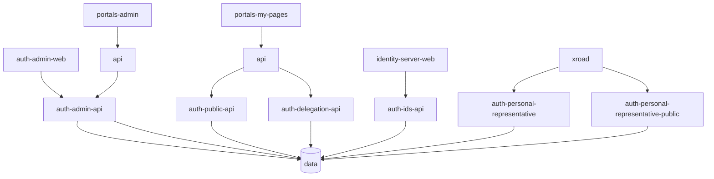

# Authentication Services

The following services contain APIs for our Authentication Platform. They have a shared database and are hosted separately from all other island.is services.

- [Auth IDS API](./api/README.md) - the main auth API. This app "owns" the shared database when it comes to local dev-services and migrations.
- [Auth Admin API](./admin-api/README.md) - used by the [Admin app](../../auth-admin-web) to manage IDS clients, resources and more.
- [Auth Public API](./public-api/README.md) - allows authorized clients to query available delegations.
- [Auth Delegation API](./delegation-api/README.md) - used by my-pages to manage delegations.
- [Personal Representative](./personal-representative) - used by the Ministry of Social Affairs to manage personal representatives.
- [Personal Representative Public](./personal-representative-public) - allows external clients to query personal representatives.
