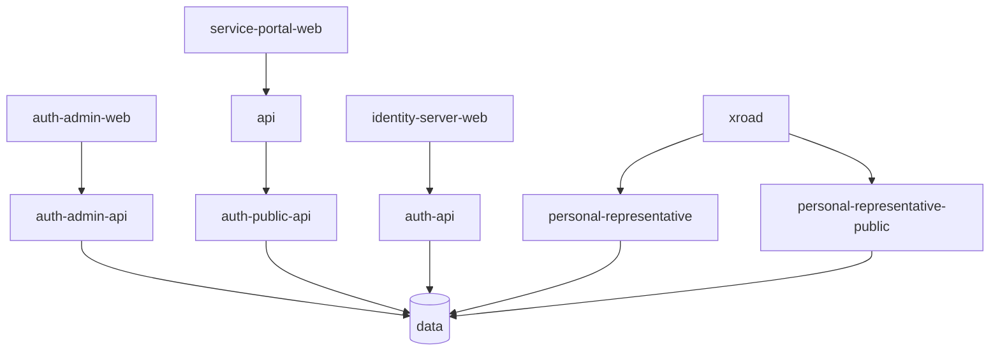

````markdown
# Authentication Services

The following services provide APIs for our Authentication Platform. They utilize a shared database and are hosted separately from all other island.is services.


````

## Services Overview

- **[Auth API](./api/README.md)** - This is the main authentication API. It "owns" the shared database for local development services and migrations.
- **[Auth Admin API](./admin-api/README.md)** - Used by the [Admin app](../../auth-admin-web) to manage IDS clients, resources, and related functions.
- **[Auth Public API](./public-api/README.md)** - Allows authorized clients to query available delegations. Utilized by the service portal to manage delegations.
- **[Personal Representative](./personal-representative)** - Used by the Ministry of Social Affairs to manage personal representatives.
- **[Personal Representative Public](./personal-representative-public)** - Enables external clients to query information about personal representatives.

```

```
