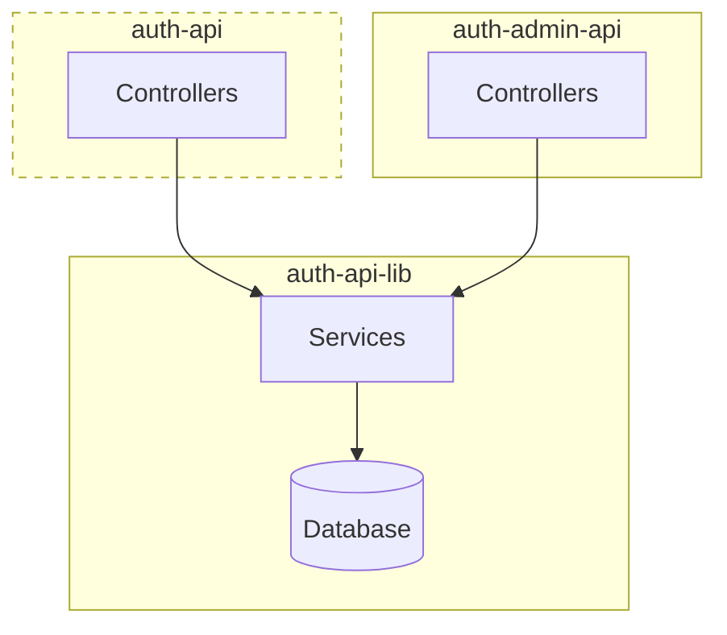

# Auth Admin API

## About

This is the backend API for the authentication administration user interface.

## Project Structure

The API supports the authentication administration user interface and shares services and a database with the backend API for the authentication server ([auth-api](https://docs.devland.is/apps/services/auth/ids-api)).



## URLs

- Dev: N/A
- Staging: N/A
- Production: N/A

## Getting Started

To run the API locally:

1. Start the database container:

   ```bash
   yarn dev-services services-auth-ids-api
   ```

2. Run migration and seed scripts:

   ```bash
   yarn nx run services-auth-ids-api:migrate
   yarn nx run services-auth-ids-api:seed
   ```

3. Start the service:

   ```bash
   yarn start services-auth-admin-api
   ```

## Code Owners and Maintainers

- [Aranja](https://github.com/orgs/island-is/teams/aranja/members)
- [Fuglar](https://github.com/orgs/island-is/teams/fuglar/members)
