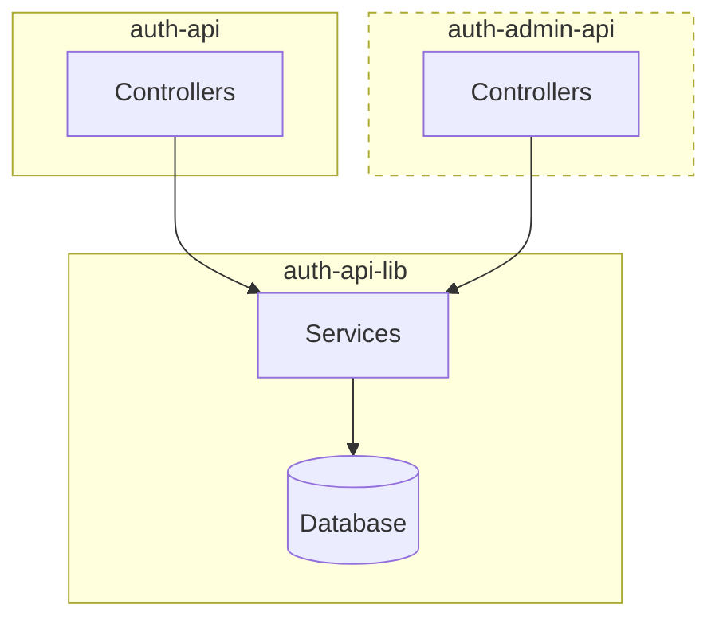

# IDS API

## About

The IDS API serves as the backend API for the island.is authentication server, sharing services and a database with the authentication administration user interface ([auth-admin-api](https://docs.devland.is/apps/services/auth/admin-api)).



## URLs

- Dev: N/A
- Staging: N/A
- Production: N/A

## Getting Started

To run the API, connect to either the AWS dev database or a local database container.

**Important:** Use a local database container for database migrations.

### Using Local Database

Configure environment variables or clear them:

```bash
export DB_USER=dev_db
export DB_PASS=dev_db
export DB_NAME=dev_db
export DB_PORT=5433
```

Start the container:

```bash
yarn dev-services services-auth-ids-api
```

Run migration and seed scripts:

```bash
yarn nx run services-auth-ids-api:migrate
yarn nx run services-auth-ids-api:seed
```

### Using DEV Database

Set necessary environment variables:

```bash
export DB_USER=servicesauth
export DB_PASS=<DB_PASSWORD from AWS Param Store>
export DB_NAME=servicesauth
export DB_PORT=5432
```

Start the proxy:

```bash
./scripts/run-db-proxy.sh
```

### Running the API

Start the service:

```bash
yarn start services-auth-ids-api
```

## Code Owners and Maintainers

- [Aranja](https://github.com/orgs/island-is/teams/aranja/members)
- [Fuglar](https://github.com/orgs/island-is/teams/fuglar/members)
