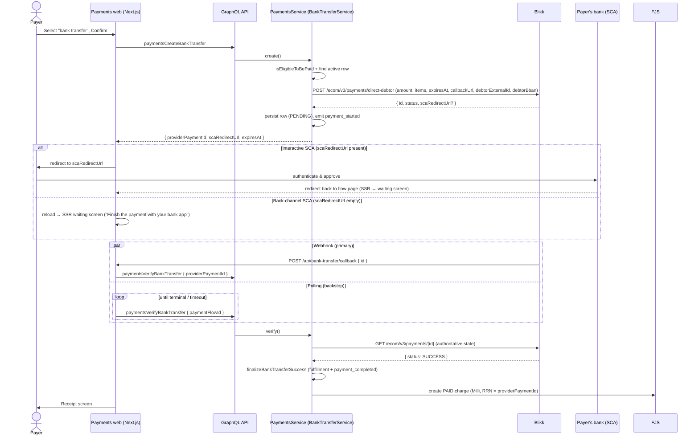
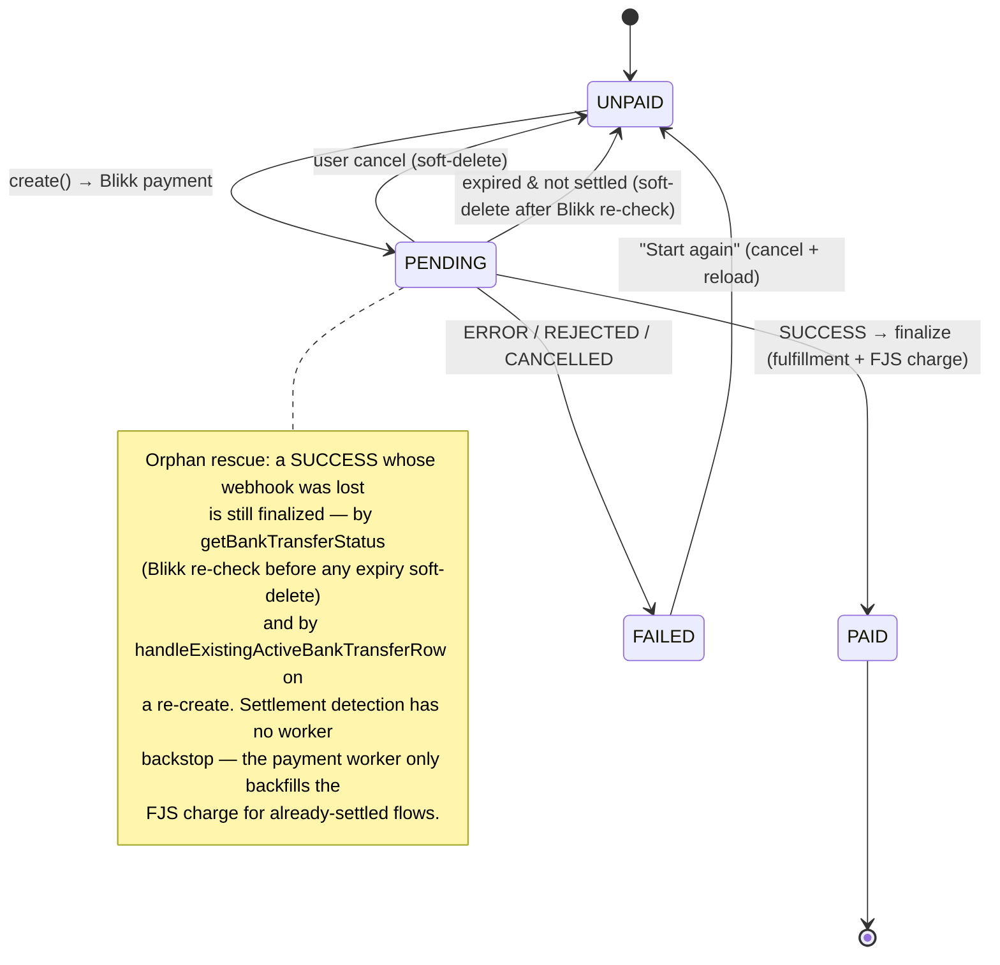

# Bank transfer payment method

The bank-transfer method lets a payer settle a payment flow by initiating a direct
bank-to-bank transfer, authenticated with their bank's Strong Customer Authentication (SCA).
**[Blikk](https://blikk.tech) is the current (v1) provider**.

The feature is gated behind two feature flags (see [Feature flags & access](#feature-flags--access)).

## Contents

- [Data model](#data-model)
- [End-to-end flow](#end-to-end-flow)
- [Blikk status model](#blikk-status-model)
- [Status → action → screen](#status--action--screen)
- [Frontend screens](#frontend-screens)
- [Lifecycle state diagram](#lifecycle-state-diagram)
- [Settlement & FJS charge](#settlement--fjs-charge)
- [Polling & webhooks (dual settlement)](#polling--webhooks-dual-settlement)
- [TTL, expiry & orphan recovery](#ttl-expiry--orphan-recovery)
- [Cancel semantics](#cancel-semantics)
- [Refund](#refund)
- [Feature flags & access](#feature-flags--access)
- [Configuration](#configuration)

## Data model

`bank_transfer_payment` ([model](./models/bankTransferPayment.model.ts), [migration](../../../migrations/20260527000000-create-bank-transfer-payment.js)):

| Column                 | Notes                                                                                                                                                                                                       |
| ---------------------- | ----------------------------------------------------------------------------------------------------------------------------------------------------------------------------------------------------------- |
| `id` (PK, UUID)        | Also the per-attempt **`correlationId`** and **`sourceReferenceId`** — the idempotency key sent to the provider on create. Distinct from `payment_flow_id` so a flow can have multiple historical attempts. |
| `payment_flow_id` (FK) | The flow being paid. `ON DELETE CASCADE`.                                                                                                                                                                   |
| `provider`             | Provider name, e.g. `'blikk'`. Plain string for provider-neutrality.                                                                                                                                        |
| `provider_payment_id`  | Provider-side payment id. Used to look the row up from a webhook and carried into FJS as the `RRN`.                                                                                                         |
| `amount`               | Amount sent to the provider (ISK).                                                                                                                                                                          |
| `last_known_status`    | **Raw** provider status string (e.g. `SCA_REQUIRED`), persisted verbatim. Normalized on read.                                                                                                               |
| `sca_redirect_url`     | Interactive-SCA URL. Empty/null = back-channel SCA (no redirect).                                                                                                                                           |
| `expires_at`           | TTL; mirrors the `expiresAt` we sent the provider. Drives expiry + the FE polling hard timeout.                                                                                                             |
| `is_deleted`           | Soft-delete flag.                                                                                                                                                                                           |

**One active attempt per flow** is enforced by a partial unique index:
`bank_transfer_payment_one_active_per_payment_flow_id ON (payment_flow_id) WHERE is_deleted = false`.
A `(provider, provider_payment_id)` unique key prevents cross-flow id collisions.

## End-to-end flow

The webhook and the FE polling loop are **two independent paths to the same idempotent
`verify`**. Either one settles the flow; the other becomes a no-op.

## Blikk status model

Blikk reports one of these raw statuses ([`BLIKK_STATUSES`](./bankTransfer.utils.ts)):
`DRAFT`, `PENDING`, `SCA_REQUIRED`, `SCA_COMPLETE`, `SUCCESS`, `ERROR`, `REJECTED`, `CANCELLED`.

We persist the raw value and normalize on read into `BankTransferStatus`
([`mapBlikkStatusToBankTransferStatus`](./bankTransfer.utils.ts)):

| Raw Blikk status                                   | Normalized `BankTransferStatus`                     |
| -------------------------------------------------- | --------------------------------------------------- |
| `SUCCESS`                                          | `success`                                           |
| `ERROR`                                            | `error`                                             |
| `REJECTED`                                         | `rejected`                                          |
| `CANCELLED`                                        | `cancelled`                                         |
| `DRAFT`, `PENDING`, `SCA_REQUIRED`, `SCA_COMPLETE` | `pending`                                           |
| _anything unknown_                                 | `pending` (fail-safe — keep polling, log a warning) |

`success` + the three failure values are terminal; `pending` is the only non-terminal state.

## Status → action → screen

What happens for each **normalized** status when it is observed (via `verify`, the status
overlay, or a refresh):

| Normalized status       | Backend action                                                                                                                                           | Flow event emitted                     | Overlay `paymentStatus`                            | Payer-facing screen                                                                                         |
| ----------------------- | -------------------------------------------------------------------------------------------------------------------------------------------------------- | -------------------------------------- | -------------------------------------------------- | ----------------------------------------------------------------------------------------------------------- |
| `pending`               | Keep the row. Persist raw-status drift (race-guarded). On `create` only, the row is inserted.                                                            | `payment_started` (on create)          | `BANK_TRANSFER_PENDING`                            | **Waiting screen** — waiting banner, optional **Continue payment** (re-open SCA) button, **Cancel** button. |
| `success`               | [`finalizeBankTransferSuccess`](./bankTransfer.service.ts): create fulfillment + **PAID** FJS charge (`Milli`, `RRN` = `providerPaymentId`). Idempotent. | `payment_completed`                    | overlay returns `null` → base flow flips to `PAID` | **Receipt screen**.                                                                                         |
| `error`                 | [`finalizeBankTransferFailure`](./bankTransfer.service.ts) (race-guarded persist)                                                                        | `payment_failed`                       | `BANK_TRANSFER_FAILED` (reason `error`)            | **Error screen** → "Start again" cancels the row and reloads.                                               |
| `rejected`              | same as `error`                                                                                                                                          | `payment_failed`                       | `BANK_TRANSFER_FAILED` (reason `rejected`)         | **Error screen**.                                                                                           |
| `cancelled`             | same as `error`; the **user-initiated** cancel path emits `payment_cancelled` instead                                                                    | `payment_failed` / `payment_cancelled` | `BANK_TRANSFER_FAILED` (reason `cancelled`)        | **Error screen**.                                                                                           |
| expired & not `success` | Re-check Blikk once, then **soft-delete** the row if still not settled                                                                                   | —                                      | overlay returns `null` → `UNPAID`                  | Back to **method selection**.                                                                               |

The `BANK_TRANSFER_PENDING` / `BANK_TRANSFER_FAILED` values are **overlay-only** statuses
returned from `getPaymentFlow` ([`BankTransferStatusOverlay`](./bankTransfer.types.ts)); they
are not persisted on the flow. The overlay is only computed when the base flow status is
`UNPAID` — a `PAID` or `INVOICE_PENDING` flow short-circuits.

## Frontend screens

All rendering lives in [`index.tsx`](../../../../../../apps/payments/pages/[locale]/[paymentFlowId]/index.tsx).
The flow status that drives it comes from `getPaymentFlow` (with the overlay folded in) plus
local hook state.

1. **Method selection / main form.** When `bank_transfer` is selected, the
   [`BankTransferPayment`](../../../../../../apps/payments/components/BankTransferPayment/BankTransferPayment.tsx)
   body renders between the selector and the submit button. It shows an **`info` disclaimer**
   banner normally, swapping to a **`default` waiting** banner while polling is in flight
   (`isWaiting`). Submit button label is `bankTransfer.confirm`; it is disabled/loading while
   polling so the payer can't double-submit.
2. **Interactive SCA redirect.** On submit, if `create` returned a non-empty `scaRedirectUrl`,
   the FE does `window.location.assign(scaRedirectUrl)`. An empty URL means back-channel SCA
   (approve in the bank app) — the FE `router.reload()`s so SSR lands on the waiting screen.
3. **Waiting screen** (`paymentStatus === bank_transfer_pending`). A dedicated page-card with a
   waiting alert and a **Cancel** button. The FE polls `verify` in the background and reloads on a
   terminal result. The alert depends on whether a redirect URL is present:

   - **Interactive** (`bankTransferScaRedirectUrl` present): `default` alert + a **Continue payment**
     button that re-opens the SCA URL (for a payer who bounced).
   - **Back-channel** (no redirect URL): `warning` alert "Finish the payment with your bank app",
     **no** Continue button — only Cancel.

   This screen is reached via **SSR**: returning from an interactive SCA redirect, or — for
   back-channel — the `router.reload()` the FE issues right after a redirect-less `create`.

4. **Error screen** (`paymentError` set to a bank-transfer code). Title/message come from
   [`paymentErrorToTitleAndMessage`](../../../../../../apps/payments/utils/error/error.ts). The
   primary action ("Start again" / Back) runs `onErrorBack` → cancels the failed row and reloads
   so SSR flips back to `UNPAID`. If the cancel races a concurrent settlement and returns
   `PaymentFlowAlreadyPaid`, the FE reloads to the receipt instead.
5. **Receipt screen** (`paymentStatus === paid`). The shared paid/receipt view.

The error screen's initial state is seeded server-side: if SSR returns
`bank_transfer_failed`, `deriveInitialBankTransferError` maps the `lastBankTransferFailure`
reason to the right error code so a returning payer lands directly on the failure screen.

## Lifecycle state diagram

## Settlement & FJS charge

[`finalizeBankTransferSuccess`](./bankTransfer.service.ts) records the settled state, then
[`createBankTransferFulfillment`](./bankTransfer.service.ts):

1. If a fulfillment already exists **and** is linked to an FJS charge → no-op (already done).
2. Otherwise create the `payment_fulfillment` row (unique-constraint races are tolerated).
3. Create the FJS charge via `paymentFlowService.createFjsCharge`, wrapped in `retry`. The
   charge is **PAID** (`payInfo` present) with `paymentMeans = Milli` and `RRN = providerPaymentId`
   ([`generateBankTransferChargeFJSPayload`](./bankTransfer.utils.ts)).
4. If FJS reports `AlreadyCreatedCharge`, [`reconcileExistingFjsCharge`](../paymentFlow/paymentFlow.service.ts)
   adopts the already-persisted local charge row and links it. If the charge keeps failing after
   retries, the fulfillment is kept (we don't un-settle) and a warning is logged — the payment
   worker retries the charge on its next run.

> **Worker backstop (FJS charge only).** The payment worker sweeps paid flows without an FJS
> charge (`paymentMethod: 'card' | 'bank_transfer'`,
> [`findPaidFlowsWithoutFjsCharge`](../paymentFlow/paymentFlow.service.ts)) and rebuilds the PAID
> charge from the persisted `bank_transfer_payment` row — using its settled `amount`, not the
> live catalog price. Settlement detection itself is still inline-only — hence the dual
> webhook/poll paths, the inline FJS retry, and the orphan-recovery checks below.

## Polling & webhooks (dual settlement)

**Webhook** ([`callback.ts`](../../../../../../apps/payments/pages/api/bank-transfer/callback.ts)):
Blikk POSTs status changes to the FE, which proxies a `paymentsVerifyBankTransfer` by
`providerPaymentId`. The handler **always returns 200** (so Blikk never retries), and the
webhook body's `status` is **ignored** — `verify` fetches the authoritative state from Blikk
itself. A forged callback can therefore only trigger a (harmless, idempotent) refresh.

**Polling** ([`useBankTransferStatusPolling`](../../../../../../apps/payments/hooks/useBankTransferStatusPolling.ts)):
the FE polls `verify` by `paymentFlowId` with backoff `[1s, 2s, 4s, 8s, 15s]`, capped by a hard
timeout derived from `expiresAt` (+30s grace; 10-min fallback if absent). Polling runs only on the
waiting screen (`paymentStatus === bank_transfer_pending`), which is where both SCA paths land via
SSR. It exits silently on `BankTransferNotFound`.

## TTL, expiry & orphan recovery

On `create` we compute `expiresAt = now + BLIKK_PAYMENT_TTL_SECONDS`, send it to Blikk, and
mirror it on the row. After this point the attempt is considered stale.

Because settlement detection has no worker backstop (the worker only backfills FJS charges for
already-settled flows), a SUCCESS whose webhook was lost must not be silently discarded. Two
paths guard against it:

- [`getBankTransferStatus`](./bankTransfer.service.ts) refreshes any `pending` row from Blikk —
  **including an expired one** — _before_ soft-deleting it. Only a confirmed non-success is
  discarded; a settled-but-uncallbacked row is finalized.
- [`handleExistingActiveBankTransferRow`](./bankTransfer.service.ts) does the same when a payer
  re-runs `create` on a flow with a stale row: it re-checks Blikk and, on SUCCESS, finalizes and
  throws `PaymentFlowAlreadyPaid` rather than starting a second payment.

**Persist failure after provider create.** In `create`, the Blikk payment is created before the
local row is inserted. If that insert throws (e.g. the one-active-per-flow unique race on a
concurrent double-submit), the provider payment is left as an orphaned **DRAFT**. This is benign and
needs no reconciliation: the request throws before returning, so the payer never receives the
`scaRedirectUrl` and the payment **cannot settle** (no money moves, no double-charge), and it
**auto-expires** via the `expiresAt` TTL we sent Blikk. _Optional monitoring:_ alert on Blikk DRAFT
payments with no matching `bank_transfer_payment` row that outlive the TTL.

## Cancel semantics

[`cancel`](./bankTransfer.service.ts) drives the "Cancel" (pending screen) and "Start again"
(failed screen) buttons.

- A **settled** attempt cannot be cancelled → `PaymentFlowAlreadyPaid`.
- For a still-`pending`, non-expired attempt we ask Blikk to cancel **first**. Blikk only honours
  a cancel while the payment is in `DRAFT`; a payment the payer already took to the bank (past
  `DRAFT`) makes the Blikk cancel throw, and we **refuse to soft-delete** rather than orphan a
  possibly-live settlement. A `404` from Blikk is tolerated (nothing live to orphan).
- The local soft-delete is conditional on `lastKnownStatus`, so a concurrent finalize that flips
  the row to SUCCESS wins the race (and we surface `PaymentFlowAlreadyPaid`).
- `payment_cancelled` is emitted **only** for an active-`pending` user cancel; terminal-failed
  rows already emitted their event when they were finalized. The cancel is idempotent.

## Refund

Bank-transfer refunds reuse the FJS-charge deletion mechanism, orchestrated by the saga in
[`bankTransferRefund.saga.ts`](../refund/bankTransferRefund.saga.ts) (dispatched from
`RefundController.handleBankTransferRefund`):

1. **VALIDATE_REFUND** — if the fulfillment already has an `fjsChargeId`, refund proceeds
   directly. If not (the inline FJS create failed at settlement), look up the original
   `providerPaymentId` via `getRefundableProviderPaymentId`; `needsFjsCreate = true`.
2. **DELETE_BANK_TRANSFER_FULFILLMENT** — soft-delete the fulfillment to prevent double refunds
   (compensatable: restored on rollback).
3. **ENSURE_FJS_CHARGE** _(only when `needsFjsCreate`)_ — create the missing FJS charge so there
   is something to delete/refund.
4. **DELETE_FJS_CHARGE** — delete the FJS charge (the actual refund); emits `refund_started`.
5. **LOG_REFUND_SUCCESS** — emits `refund_completed`.

## Feature flags & access

| Flag                                          | Scope                |
| --------------------------------------------- | -------------------- |
| `isIslandisBankTransferPaymentEnabled`        | Global               |
| `isIslandisBankTransferPaymentAllowedForUser` | Per-user (ConfigCat) |

Both are defined in [`features.ts`](../../../../../../libs/feature-flags/src/lib/features.ts).

- **`isIslandisBankTransferPaymentEnabled`** — the offer kill-switch. Two effects:
  1. Guards the bank-transfer REST controller via `FeatureFlagGuard` — off → `create` / `verify` / `cancel` reject.
  2. Gates inclusion of `bank_transfer` in a flow's `availablePaymentMethods` at flow creation (see [`paymentFlow.service.ts`](../paymentFlow/paymentFlow.service.ts)) — off → the method is never listed, so the selector never shows a method whose endpoints are also closed. Combined with the individuals-only `isPerson` check.
- **`isIslandisBankTransferPaymentAllowedForUser`** — frontend-only. Evaluated in the FE `getServerSideProps` to force-surface `bank_transfer` in the selector during rollout/testing, on top of whatever the backend already lists. Independent of the global flag and does **not** unlock the endpoints.

> The GraphQL mutations (`paymentsCreateBankTransfer` / `…Verify…` / `…Cancel…`) are not guarded by these flags directly — the whole payments resolver sits behind `isIslandisPaymentEnabled`. The bank-transfer global flag bites one layer down, on the `services-payments` REST controller the resolver proxies to.

## Configuration

Env vars (values from [`infra/payments.ts`](../../../infra/payments.ts), schemas in
[`bankTransfer.config.ts`](./bankTransfer.config.ts) and
[`blikkClient.config.ts`](../../../../../../libs/clients/blikk/src/lib/blikkClient.config.ts)):

| Env var                     | Default / per-env                                                         | Description                                                           |
| --------------------------- | ------------------------------------------------------------------------- | --------------------------------------------------------------------- |
| `BLIKK_API_KEY`             | secret (`/k8s/services-payments/BLIKK_API_KEY`)                           | Provider API key. Read by the Blikk client.                           |
| `BLIKK_API_BASE_URL`        | `https://stage.blikk.tech` (dev/staging), `https://api.blikk.tech` (prod) | Provider base URL.                                                    |
| `BLIKK_PAYMENT_TTL_SECONDS` | `300` (dev/staging), `600` (prod)                                         | Attempt TTL; sent to Blikk as `expiresAt` and mirrored on the row.    |
| `BLIKK_FETCH_TIMEOUT`       | `10000`                                                                   | Per-request timeout (ms), enforced by the enhanced fetch.             |
