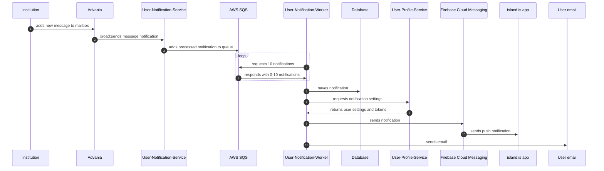

# User Notification

## About

This service handles queuing, storing, and sending notifications via push and email.

## Sequence Diagram



## Running the Project

### Initial Setup

1. Sign into AWS:

   ```sh
   aws sso login
   ```

2. Retrieve secrets:

   ```sh
   yarn get-secrets user-notification
   ```

3. Initialize dependencies:

   ```sh
   yarn dev-init services-user-notification
   ```

### Start User Notification Service

```sh
yarn dev services-user-notification
```

### User Notification Worker

The worker processes messages, saves them in the database, and sends them via push and email. Start it with:

```sh
yarn nx run services-user-notification:worker
```

### User Notification Cleanup Worker

This worker removes old messages from the database. Start it with:

```sh
yarn nx run services-user-notification:cleanup
```