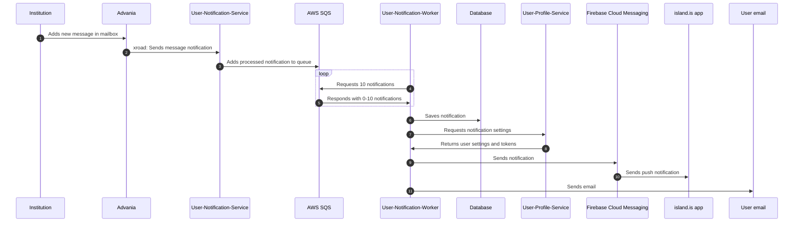

# User Notification

## About

This service is responsible for queuing notifications, storing them in a database, and sending push notifications and emails.

## Sequence Diagram



## Running the Project

### Initial Setup

1. Sign into AWS:

   ```sh
   aws sso login
   ```

2. Get secrets:

   ```sh
   yarn get-secrets user-notification
   ```

3. Initialize dependencies:

   ```sh
   yarn dev-init services-user-notification
   ```

### Start User Notification Service

Start the service with the following command:

```sh
yarn dev services-user-notification
```

### User Notification Worker

The worker retrieves messages from the queue, saves them to the database, and sends notifications via push and email. Start a worker with this command:

```sh
yarn nx run services-user-notification:worker
```

### User Notification Cleanup Worker

The cleanup worker deletes old messages from the database. Start a cleanup worker with this command:

```sh
yarn nx run services-user-notification:cleanup
```