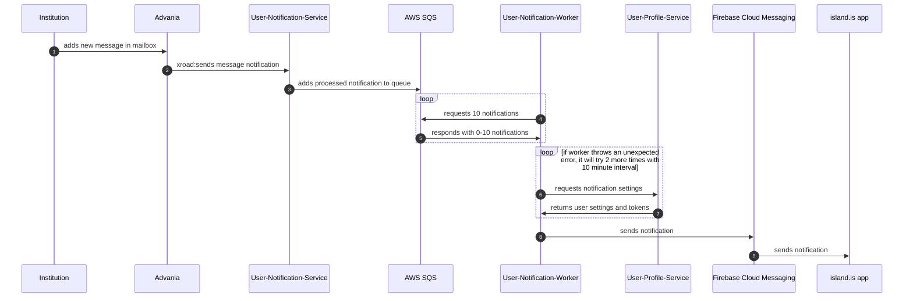

# User Notification



## About

This service manages queueing up messages to send push notifications / sms / emails.

## running the project:

### Dev setup & running:

```sh
yarn dev-services services-user-notification
yarn start services-user-notification
```

### Starting a worker

```sh
yarn nx run services-user-notification:worker
```
