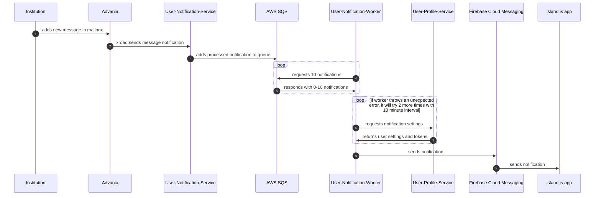

# User Notification

## Quickstart

```sh
yarn dev-init services-user-notification
yarn dev services-user-notification
```



## About

This service manages queueing up messages to send push notifications / sms / emails.

## running the project:

### Dev setup & running:

```sh
yarn dev-services services-user-notification
yarn start services-user-notification
```

### Starting a worker

TODO: Needs to actually start a worker
```sh
yarn nx run services-user-notification:worker
```

## Interacting

You can `POST` to the notification service at `localhost:3333/notifications` with the required parameters, e.g.

```sh
curl -X POST http://localhost:3333/notifications --json '{"type": "newDocumentMessage", "recipient": "1111111111", "organization": "My Cool Org", "documentId": "my-invalid-document-id"}'
```

Check `src/app/modules/notifications/dto/createNotification.dto.ts` for data required and other message types.
