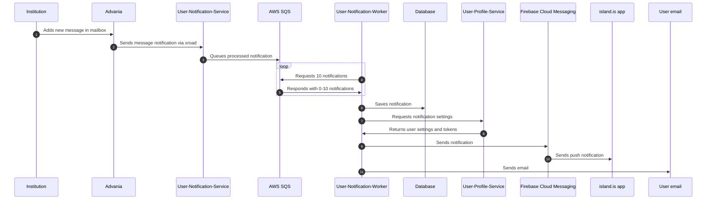

# User Notification

## About

This service queues notifications, stores them in a database, and sends push notifications and emails.

## Sequence Diagram



## Running the Project

### Initial Setup

Sign into AWS:

```sh
aws sso login
```

Retrieve secrets:

```sh
yarn get-secrets user-notification
```

Initialize dependencies:

```sh
yarn dev-init services-user-notification
```

### Start User Notification Service

```sh
yarn dev services-user-notification
```

### User Notification Worker

Processes queue messages, saves to the database, and sends via push and email. Start a worker:

```sh
yarn nx run services-user-notification:worker
```

### User Notification Cleanup Worker

Deletes old messages from the database. Start a cleanup worker:

```sh
yarn nx run services-user-notification:cleanup
```
