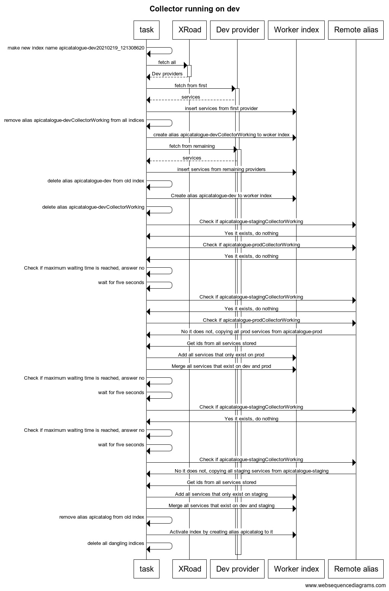

# Collection process of the X-Road Collector

The collection process of the X-Road collector is a scheduled task executed periodically on each of the three environments `dev`, `staging` and `prod`.

The _collection task_ here after, referred to as _the collector_, is responsible for providing information about existing services in X-Road. The three environments each have their own services, and the collector needs to collect information about services on all environments.

But the collector only has access to services in his own environment, so it will need to collect and store those he has access to, and get information on other environments from the other two collectors which are, or have been executed in their own environment.

## Collection process

The collector starts by fetching information about all providers from X-Road. Then he fetches information on all services from each provider and stores the information in a elastic worker index created by the task.

When the local collection process is done, the collector checks if collectors on other environments are running, waits for them to finish and finally copies their service information to it's own worker index.

After copying from other environments, the collector replaces the old worker index with the new one, that is makes the alias `apicatalogue` point to the new worker index.

Processes that need to query service information will query the alias `apicatalogue` which should always point to the newest worker index.

Finally a cleanup process is preformed to delete all unused indices which could exist because of failed executions.

### Sequence diagram

This diagram shows the order of tasks in the collection process when the collector is executed on the `dev` environment. In this scenario, we are assuming that all collectors were started at the same time, which will trigger a waiting period for the `dev` collector. We are not showing the collection process of the other environments on this sequence diagram. We are assuming that the `dev` collector finishes his local collection first, then the `prod` collector and finally the `staging` collector.

