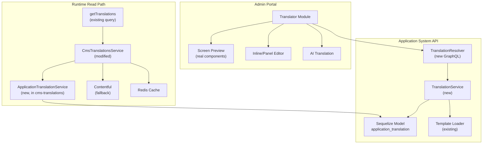
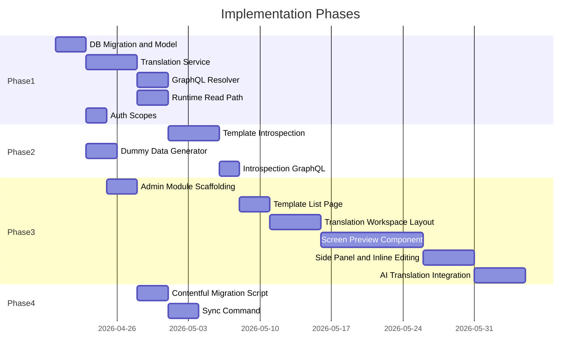

# Visual Application Translation Feature — Building Plan

> Replace Contentful-based translation workflow for application system templates with a visual translation tool in the admin portal. Translators see real rendered screens, edit strings inline or via side panel, and use AI translation. Translations are stored in Postgres (application-system DB) and served via a new GraphQL resolver, with CmsTranslationsService falling back for non-application namespaces.

---

## Architecture Overview



---

## Current State (What We're Replacing)

Today, translations flow through Contentful:

- **Write path:** Developers use `defineMessages()` in code with Icelandic `defaultMessage` values. Running `nx run <project>:extract-strings` invokes `libs/localization/scripts/extract.ts`, which uses FormatJS to extract all message descriptors, then pushes them to Contentful via the Management API as `namespace` entries.
- **Read path:** The `getTranslations` GraphQL query calls `CmsTranslationsService`, which fetches `namespace` entries from the Contentful Delivery API, caches in Redis, and returns a flat `Record<string, string>` to the frontend (`LocaleContext` / `useNamespaces`) and backend (`IntlService`).

Key files in the current system:

- `libs/localization/scripts/extract.ts` — the extract-strings script
- `libs/localization/scripts/formatter.js` — groups messages by namespace
- `libs/cms-translations/src/lib/cms-translations.service.ts` — runtime Contentful fetcher
- `libs/cms-translations/src/lib/cms-translations.resolver.ts` — GraphQL resolver
- `libs/cms-translations/src/lib/intl.service.ts` — backend IntlService
- `libs/localization/src/lib/LocaleContext.tsx` — frontend locale provider

---

## Design Decisions

| Decision          | Choice                                                             | Rationale                                                                                       |
| ----------------- | ------------------------------------------------------------------ | ----------------------------------------------------------------------------------------------- |
| Scope             | Application system templates only (~100 templates)                 | Focused scope; other namespaces can migrate later                                               |
| Screen preview    | Real React form components                                         | Translators see exact context                                                                   |
| Editing UX        | Both inline click and side panel                                   | Flexibility for different workflows                                                             |
| AI translation    | Both per-screen and per-template                                   | Convenience at different scales                                                                 |
| DB location       | Application-system API Postgres                                    | Co-located with application data, existing Sequelize infrastructure                             |
| Row model         | One row per message key, both `value_is` and `value_en` columns    | Simpler schema, both locales visible at a glance, easy to spot untranslated strings             |
| Runtime read path | New dedicated service + resolver                                   | Clean separation; CmsTranslationsService checks DB for app namespaces, falls back to Contentful |
| Icelandic storage | Store both locales; Icelandic pre-populated from code and editable | Single source of truth in DB, code defaults are fallback                                        |
| Auth              | Global translator scope + org-based access                         | Both central translators and org-specific translators supported                                 |

---

## Phase 1: Database and API

### 1.1 Database Schema

New Sequelize migration in `apps/application-system/api/migrations/`.

**Table: `application_translation`** — one row per translatable string (both locales in same row)

```sql
CREATE TABLE application_translation (
  id UUID PRIMARY KEY DEFAULT uuid_generate_v4(),
  namespace VARCHAR(255) NOT NULL,          -- e.g. 'hb.application'
  message_key VARCHAR(512) NOT NULL,        -- full ID e.g. 'hb.application:draft.title'
  value_is TEXT NOT NULL,                   -- Icelandic translation
  value_en TEXT,                            -- English translation (null = untranslated)
  default_message TEXT,                     -- original from defineMessages() in code
  is_reviewed BOOLEAN DEFAULT false,
  translated_by VARCHAR(20),               -- national ID of translator
  reviewed_by VARCHAR(20),                 -- national ID of reviewer
  created TIMESTAMPTZ DEFAULT NOW(),
  modified TIMESTAMPTZ DEFAULT NOW(),
  UNIQUE(namespace, message_key)
);

CREATE INDEX idx_translation_namespace ON application_translation(namespace);
```

**Table: `application_translation_log`** — audit trail for every change

```sql
CREATE TABLE application_translation_log (
  id UUID PRIMARY KEY DEFAULT uuid_generate_v4(),
  translation_id UUID REFERENCES application_translation(id) ON DELETE CASCADE,
  old_value TEXT,
  new_value TEXT,
  changed_by VARCHAR(20),
  action VARCHAR(50),  -- 'create', 'update', 'review'
  created TIMESTAMPTZ DEFAULT NOW()
);
```

**Why per-string rows instead of JSONB blobs:**

- Granular tracking of who translated each string
- Stale detection: `default_message` stores the code default; when a developer changes a string, the sync command updates it and the diff is visible
- Easy querying: "all unreviewed translations", "all untranslated English strings for namespace X" (`WHERE value_en IS NULL`)
- Clean audit log per string

**Example data:**

| namespace      | message_key                      | value_is                       | value_en                     | default_message                | is_reviewed |
| -------------- | -------------------------------- | ------------------------------ | ---------------------------- | ------------------------------ | ----------- |
| hb.application | hb.application:draft.title       | Umsokn um husnaedisbaetur      | Housing Benefits Application | Umsokn um husnaedisbaetur      | true        |
| hb.application | hb.application:draft.description | Upplysingar um husnaedisbaetur | null                         | Upplysingar um husnaedisbaetur | false       |

### 1.2 Sequelize Model

New file: `libs/application/api/core/src/lib/translation/application-translation.model.ts`

Register in `ApplicationApiCoreModule` alongside the existing `Application` model.

### 1.3 Translation Service (Write API)

New file: `libs/application/api/core/src/lib/translation/application-translation.service.ts`

Methods:

- `getTranslationsForNamespace(namespace, locale)` — returns `Record<string, string>` (reads `value_is` or `value_en` depending on locale)
- `getTranslationsForNamespaces(namespaces[], locale)` — returns merged `Record<string, string>`
- `upsertTranslation(namespace, key, { valueIs?, valueEn? }, translatedBy)` — creates or updates a single translation
- `bulkUpsertTranslations(translations[])` — for AI batch writes
- `markAsReviewed(id, reviewedBy)` — sets `is_reviewed = true`
- `getTranslationStatus(namespace)` — returns counts: total, translated (EN), untranslated (EN), reviewed
- `syncDefaultMessages(namespace, messages: Record<string, string>)` — updates `default_message` column from code, flags stale translations where code changed but translation hasn't been updated
- `getAllNamespacesWithStatus()` — for the admin UI template listing page

### 1.4 GraphQL Resolver (Admin Write API)

New resolver in `apps/application-system/api/src/app/modules/translation/`:

**Queries:**

- `applicationTranslations(namespace, locale)` — get all translations for a namespace
- `applicationTranslationStatus(namespace?)` — get translation completeness stats per namespace

**Mutations:**

- `updateApplicationTranslation(input: { namespace, messageKey, valueIs?, valueEn? })` — upsert single string
- `bulkUpdateApplicationTranslations(input: { translations[] })` — batch save (used after reviewing AI suggestions or manual batch edits)
- `reviewApplicationTranslation(id)` — mark as human-reviewed

**AI query (does not persist):**

- `aiTranslateStrings(input: { namespace, messageKeys[], sourceLocale, targetLocale })` — returns suggested translations without saving; the translator reviews and saves via the mutations above

Auth: require new `AdminPortalScope.applicationTranslation` + org-based filtering via `getTypeIdsForInstitution`.

### 1.5 Runtime Read Path

Modify `libs/cms-translations/src/lib/cms-translations.service.ts`:

```
getTranslations(namespaces, lang)
  → for each namespace:
    → is it an application namespace? (check ApplicationConfigurations)
      → YES: read from application_translation table via ApplicationTranslationReadService
      → NO: read from Contentful (existing path)
    → cache in Redis either way
  → merge all namespaces into Record<string, string>
  → return
```

This means **zero changes** to:

- `getTranslations` GraphQL query contract
- `LocaleContext` / `useNamespaces` in the frontend
- `IntlService` in the backend
- Any component that calls `formatMessage`

The only change is where the data comes from behind the scenes.

### 1.6 Auth Scopes

Add to `libs/auth/scopes/src/lib/admin-portal.scope.ts`:

- `applicationTranslation` — global translator access (can translate any template)

Add to `libs/auth/scopes/src/lib/clients/admin-portal-scopes.ts`:

- Register the new scope for BFF client configuration

Org-based filtering: reuse `getTypeIdsForInstitution` pattern from the existing admin controller (`apps/application-system/api/src/app/modules/application/admin.controller.ts`) to scope which templates an organization can translate.

---

## Phase 2: Template Introspection API

The admin UI needs to know the full form structure (all states, roles, forms, sections, screens) for any application template — without conditions filtering things out.

### 2.1 Template Introspection Service

New file: `libs/application/api/core/src/lib/translation/template-introspection.service.ts`

This service:

1. Loads a template via `getApplicationTemplateByTypeId(typeId)`
2. Reads `stateMachineConfig.states` to enumerate all states
3. For each state, reads `meta.roles[]` and calls each `formLoader()`
4. For each form, walks the tree (`Form` → `Section` → `SubSection` → `Field/MultiField/Repeater/ExternalDataProvider`) collecting:
   - The full tree structure (for the accordion navigation)
   - All `FormText` / `StaticText` values (titles, labels, descriptions, placeholders, tooltips, etc.)
   - Extracts `MessageDescriptor` objects (the ones with `id` and `defaultMessage`)
5. Returns a structured JSON:

```typescript
interface TemplateIntrospection {
  typeId: ApplicationTypes
  name: string
  slug: string
  translationNamespaces: string[]
  states: StateIntrospection[]
  allMessageDescriptors: MessageDescriptor[] // flat deduplicated list
}

interface StateIntrospection {
  stateKey: string
  stateName: string
  status: string // e.g. 'draft', 'inprogress', 'completed'
  roles: RoleIntrospection[]
}

interface RoleIntrospection {
  roleId: string
  form: FormIntrospection
}

interface FormIntrospection {
  id: string
  title: StaticText
  sections: SectionIntrospection[]
}

interface SectionIntrospection {
  id: string
  title: StaticText
  subSections: SubSectionIntrospection[]
  screens: ScreenIntrospection[] // direct children that are leaves
}

interface SubSectionIntrospection {
  id: string
  title: StaticText
  screens: ScreenIntrospection[]
}

interface ScreenIntrospection {
  id: string
  type: FormItemTypes
  title: StaticText
  messageDescriptors: MessageDescriptor[] // all translatable strings on this screen
  children?: ScreenIntrospection[] // for MultiField children
}
```

### 2.2 Condition Bypass

The introspection walks the full form tree ignoring all `condition` properties by default (does not call `shouldShowFormItem`). Every section, subsection, and field is included regardless of conditions.

The admin UI has a toggle: "Show all screens" (default, ignores conditions) vs "Apply conditions" (evaluates conditions against the dummy answers object).

### 2.3 Dummy Data Generation

New utility: `libs/application/api/core/src/lib/translation/dummy-data.util.ts`

Given a template's `dataSchema` (Zod schema), generate sample data that satisfies the schema. This is needed so:

- The overview screen (which reads from `answers`) can render meaningfully
- `FormText` functions that depend on `application.answers` can be resolved
- Condition evaluation works when conditions are enabled

Approach: walk the Zod schema tree and generate placeholder values per type:

- `ZodString` → `"Lorem ipsum"`
- `ZodNumber` → `12345`
- `ZodBoolean` → `true`
- `ZodEnum` → first enum value
- `ZodArray` → array with one generated item
- `ZodObject` → recursively generate children
- `ZodOptional` / `ZodNullable` → generate the inner type
- `ZodUnion` → generate for the first option

Consider using `@anatine/zod-mock` library or writing a lightweight custom walker.

### 2.4 GraphQL Endpoints

- `Query.applicationTemplateIntrospection(typeId: String!)` — returns the full `TemplateIntrospection` structure
- `Query.applicationTemplateList` — returns all `ApplicationTypes` with:
  - `typeId`, `name`, `slug`
  - `translationNamespaces`
  - `translationStatus` (counts per locale from Phase 1.3)

---

## Phase 3: Admin Portal UI

### 3.1 Add "Þýðingar" Tab to Existing Application System Admin

Instead of a separate module, the translation feature lives inside the existing application system admin page at `/stjornbord/umsoknakerfi` as a third tab alongside "Yfirlit" and "Tölfræði".

**Files to modify:**

- [`libs/portals/admin/application-system/src/lib/paths.ts`](libs/portals/admin/application-system/src/lib/paths.ts) — add `Translations = '/umsoknakerfi/thydingar'`
- [`libs/portals/admin/application-system/src/lib/messages.ts`](libs/portals/admin/application-system/src/lib/messages.ts) — add `translations` message (`id: 'admin.applicationSystem:translations'`, `defaultMessage: 'Þýðingar'`)
- [`libs/portals/admin/application-system/src/lib/navigation.ts`](libs/portals/admin/application-system/src/lib/navigation.ts) — add third child entry for the translations path
- [`libs/portals/admin/application-system/src/components/Layout/Layout.tsx`](libs/portals/admin/application-system/src/components/Layout/Layout.tsx) — add third tab object with `id: 'translations'`, `label: formatMessage(m.translations)`, `content: <Translations ... />`

**New files within the existing library:**

```
libs/portals/admin/application-system/src/
  screens/
    Translations/
      Translations.tsx            # template list (the tab content)
    TranslationWorkspace/
      TranslationWorkspace.tsx    # main translation workspace (separate route)
  components/
    ScreenSidebar/                # left accordion panel
    ScreenPreview/                # center preview area
    TranslationPanel/             # right side panel
    TranslatableText/             # inline editable text wrapper
    AITranslateButton/            # AI translation trigger
    LanguageToggle/               # IS/EN switcher
  hooks/
    useTemplateIntrospection.ts
    useTranslations.ts
    useAITranslate.ts
  graphql/
    translationQueries.ts
    translationMutations.ts
```

Tab visibility gated on: `userInfo.scopes.includes(AdminPortalScope.applicationTranslation)`

### 3.2 Translations Tab Content (Template List)

Shown inside the "Þýðingar" tab at `/stjornbord/umsoknakerfi/thydingar`.

Grid of cards, one per application template the user has access to:

- Template name (Icelandic)
- Template slug
- Translation completeness (progress bar: X/Y strings translated for English)
- Status indicators (number of unreviewed translations)
- Last modified date
- Click to open the translation workspace

Global translators see all templates. Org-scoped users see only templates associated with their organization.

### 3.3 Translation Workspace (PowerPoint-like UI)

Route: `/stjornbord/umsoknakerfi/thydingar/:typeId`

```
+----------------------------------------------------------+
| [< Back]  Template Name    [IS|EN]  [AI Screen] [AI All] |
+---------------+------------------------------------------+
| LEFT SIDEBAR  |  SCREEN PREVIEW              SIDE PANEL  |
|               |                             (togglable)  |
| [x] Ignore    |  +------------------------+ +---------+  |
|     conditions|  |                        | | key: val|  |
|               |  | Real form components   | | key: val|  |
| v State: Draft|  | rendered in preview    | | key: val|  |
|   v Applicant |  | mode with translations | | key: val|  |
|     > Section1|  | applied.               | |         |  |
|     * Section2|  |                        | | [Review]|  |
|     > Section3|  | Clickable text opens   | |         |  |
|   v Reviewer  |  | inline editor.         | |         |  |
|     > Section1|  |                        | |         |  |
| v State: Rev  |  +------------------------+ +---------+  |
|   v Assignee  |                                          |
|     > Section1|                                          |
+---------------+------------------------------------------+
```

**Left sidebar — Double accordion:**

- Top level: application states (Draft, In Review, Approved, etc.)
- Second level: roles/forms within each state (Applicant form, Reviewer form)
- Third level: sections → subsections → individual screens
- Each screen shows a completion dot:
  - Green: all strings translated and reviewed
  - Yellow: has translations pending review
  - Red: has untranslated strings
- Toggle at top: "Ignore conditions" (show all screens) vs "Apply conditions"

**Center area — Screen preview:**

- Renders actual form components from `@island.is/application/ui-fields`
- Uses dummy data from the Zod schema for `answers` and `externalData`
- Components in read-only/preview mode (no validation, no submission)
- Active locale's translations applied via custom `formatMessage`
- Every translatable string wrapped in `<TranslatableText>` — highlights on hover, opens inline editor on click

**Side panel (togglable):**

- Lists all `MessageDescriptor`s for the currently selected screen
- Columns: message key (truncated), source text (Icelandic default), translation (editable)
- Color coding per row: red (untranslated), yellow (unreviewed), green (reviewed)
- Editable in-place — changes auto-save on blur
- "Mark all reviewed" batch button
- "Copy from default" button for Icelandic strings

**Top bar:**

- Back button to template list
- Template name
- Language toggle (IS / EN) — swaps which locale the preview displays
- "AI Translate Screen" — translates all untranslated strings on current screen
- "AI Translate All" — translates all untranslated strings across entire template
- Save/sync indicator

### 3.4 Screen Preview Component

This is the most complex UI piece.

**Approach:**

1. Import form field components from `@island.is/application/ui-fields` (same `allFields` registry used by `FormField` in the real UI shell)

2. Create `TranslationPreviewShell` that mimics `FormShell` layout but:

   - Does **not** use `react-hook-form` for real validation
   - Does **not** connect to any API for form submission
   - Uses a dummy `Application` object with generated answers from the Zod schema
   - Provides a custom `formatMessage` via React context that:
     a. Looks up `MessageDescriptor.id` in the translations loaded from the DB
     b. Falls back to `defaultMessage` if no translation exists
     c. Wraps the result in `<TranslatableText>` for inline editing

3. Use existing `convertFormToScreens` logic from `libs/application/ui-shell/src/reducer/reducerUtils.ts` but with a modified version that bypasses conditions (replace `shouldShowFormItem` with a function that always returns `true`)

4. For `FormText` values that are **functions** (depend on `application`), call them with the dummy application object. If they throw or return null, show a placeholder like "[Dynamic text — cannot preview]"

**Key challenge:** Some form components may call APIs or depend on external data. The preview should gracefully handle missing data by:

- Providing empty/mock `externalData`
- Catching rendering errors per-component and showing a fallback
- Using React error boundaries around each field

### 3.5 AI Translation Integration

**Backend endpoint (query, not mutation — does not persist):**

New method in the translation service / resolver:

1. Receives: list of message keys + source locale strings + target locale
2. Builds a prompt for the LLM:
   > "You are translating UI text for an Icelandic government digital service. Translate the following strings from Icelandic to English. Preserve any ICU message format syntax ({variableName}, {count, plural, ...}, etc.). Return a JSON object mapping each key to its translation."
3. Calls the LLM API (OpenAI or whichever provider island.is uses)
4. Parses the response, validates it has all expected keys
5. Returns the suggested translations to the UI — **does not save to the database**

**Frontend integration:**

- "AI Translate Screen" button: collects all untranslated `messageKey`s for the current screen, calls the AI query, and populates the editable fields in the side panel / inline editor with the suggestions. The preview updates immediately so the translator can see the AI suggestions in context.
- "AI Translate All" button: same but for all untranslated strings in the template (may need progress indicator for large templates). Populates all fields with suggestions.
- AI suggestions are shown as unsaved changes (visually distinct, e.g. italic or highlighted border) — the translator reviews, edits as needed, and explicitly saves when satisfied.
- The translator saves via the normal save flow (blur auto-save per field, or a "Save all" button), which calls the existing `updateApplicationTranslation` / `bulkUpdateApplicationTranslations` mutations.
- Nothing is persisted to the database until the translator saves.

---

## Phase 4: Migration from Contentful

### 4.1 Migration Script

One-time script: `libs/application/api/core/src/lib/translation/migration/contentful-migration.ts`

Steps:

1. Read all application namespaces from `ApplicationConfigurations` (~100 entries)
2. For each namespace, fetch from Contentful Management API:
   - `fields.strings['is-IS']` — Icelandic translations
   - `fields.strings['en']` — English translations
   - `fields.defaults['is-IS']` — default messages metadata (includes `defaultMessage`, `description`)
3. For each message key found:
   - Insert a single row with `value_is` from `strings['is-IS']` (or fall back to `defaults` `defaultMessage`) and `value_en` from `strings['en']` (if exists, otherwise null)
   - Set `default_message` from the defaults object
   - Set `is_reviewed: true` (these were already human-approved in Contentful)
4. Log summary: namespaces processed, strings imported, any failures

### 4.2 Default Message Sync Command (Replaces extract-strings)

New Nx target `sync-translations` for each template project:

```json
{
  "sync-translations": {
    "executor": "nx:run-commands",
    "options": {
      "command": "yarn ts-node libs/localization/scripts/sync-to-db libs/application/templates/<name>/src/lib/messages.ts"
    }
  }
}
```

The new script (`libs/localization/scripts/sync-to-db.ts`):

1. Runs FormatJS extract (same as today) to get all `MessageDescriptor`s from source code
2. Groups by namespace (same formatter logic)
3. Instead of pushing to Contentful, calls an API endpoint or direct DB operation:
   - For each message: upsert `default_message` column with the current `defaultMessage` from code
   - If a new message key appears: create a row with `value_is = defaultMessage`, `value_en = NULL`
   - If `default_message` changed from what's in DB: flag the translation as potentially stale
   - If a message key was removed from code: mark as deprecated (soft delete or flag)
4. Output a summary of new/changed/deprecated strings

This can run in CI to keep the DB in sync with code changes.

---

## Implementation Order and Dependencies



---

## Key Files to Create

| File                                                                                              | Purpose                       |
| ------------------------------------------------------------------------------------------------- | ----------------------------- |
| `apps/application-system/api/migrations/YYYYMMDD-add-application-translation.js`                  | DB migration                  |
| `libs/application/api/core/src/lib/translation/application-translation.model.ts`                  | Sequelize model               |
| `libs/application/api/core/src/lib/translation/application-translation.service.ts`                | CRUD service                  |
| `libs/application/api/core/src/lib/translation/template-introspection.service.ts`                 | Form tree walker              |
| `libs/application/api/core/src/lib/translation/dummy-data.util.ts`                                | Zod schema → mock data        |
| `apps/application-system/api/src/app/modules/translation/`                                        | Resolver, DTOs, module        |
| `libs/portals/admin/application-system/src/screens/Translations/Translations.tsx`                 | Template list (tab content)   |
| `libs/portals/admin/application-system/src/screens/TranslationWorkspace/TranslationWorkspace.tsx` | Translation workspace         |
| `libs/portals/admin/application-system/src/components/ScreenSidebar/`                             | Sidebar, preview, panel, etc. |
| `libs/localization/scripts/sync-to-db.ts`                                                         | Replacement for extract.ts    |

## Key Files to Modify

| File                                                                     | Change                                      |
| ------------------------------------------------------------------------ | ------------------------------------------- |
| `libs/cms-translations/src/lib/cms-translations.service.ts`              | Add DB read path for application namespaces |
| `libs/portals/admin/application-system/src/lib/paths.ts`                 | Add `Translations` path                     |
| `libs/portals/admin/application-system/src/lib/messages.ts`              | Add `translations` message                  |
| `libs/portals/admin/application-system/src/lib/navigation.ts`            | Add third child entry                       |
| `libs/portals/admin/application-system/src/components/Layout/Layout.tsx` | Add third tab                               |
| `libs/portals/admin/application-system/src/module.tsx`                   | Add route for translation workspace         |
| `libs/auth/scopes/src/lib/admin-portal.scope.ts`                         | Add `applicationTranslation` scope          |
| `libs/auth/scopes/src/lib/clients/admin-portal-scopes.ts`                | Register scope for BFF                      |

---

## Risks and Open Questions

- **Form component isolation:** Some field components may have side effects (API calls, external data dependencies). The preview needs robust error boundaries. Components that fail to render should show graceful fallbacks.
- **Dynamic FormText:** `FormText` values that are functions receiving `application` may behave unexpectedly with dummy data. Need to handle errors gracefully and show "[Dynamic text]" placeholders.
- **Custom fields:** Templates can register custom field components via `getFields()`. The preview would need to load these too, or show a placeholder for unloadable custom components.
- **Scale:** ~100 templates with ~100-300 strings each = ~10,000-30,000 rows (one row per message key). This is comfortably within Postgres capabilities.
- **LLM provider:** Which AI service does island.is have access to? Need to confirm API availability and rate limits.
- **Cache invalidation:** When a translation is updated in the admin portal, the Redis cache for that namespace needs to be invalidated so runtime consumers get the new value promptly.
