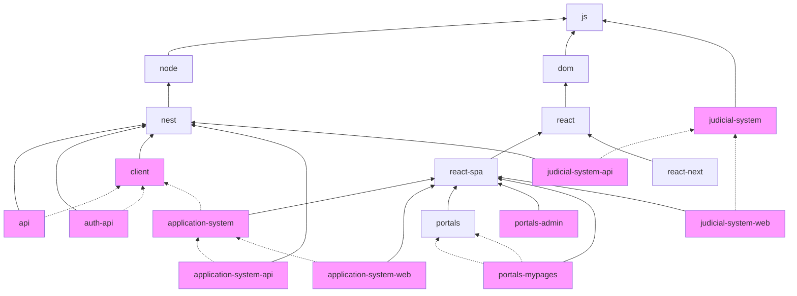

# Defining Monorepo Boundaries With Tags

Tags are a way to define boundaries in a monorepo. They are configured in the `project.json` file of each project, and they affect which projects can depend on each other.

The root `.eslintrc.json` file specifies our rules for each tag. We recommend reading this article [to get up to speed](https://blog.nrwl.io/mastering-the-project-boundaries-in-nx-f095852f5bf4).

## Our tag convention

Our tags are split in 2 categories. Generic tags and application tags.

### Generic tags

Generic tags are based on the frameworks we use and should be used for simple applications and shared libraries.

These are the generic tags ordered from the most generic to more specific.

| Tag          | Description                              | Can depend on                      | Can be depended on by              |
| ------------ | ---------------------------------------- | ---------------------------------- | ---------------------------------- |
| `js`         | Basic JS library.                        | `js`                               | Any project                        |
| `node`       | NodeJS server-side library.              | `js`, `node`                       | Any server-side projects.          |
| `dom`        | JS library designed to run in a browser. | `js`, `dom`                        | Any browser-based project.         |
| `react`      | React library.                           | `js`, `dom`, `react`               | Any react project.                 |
| `nest`       | NestJS library.                          | `js`, `node`, `nest`               | NestJS projects.                   |
| `react-next` | NextJS library.                          | `js`, `dom`, `react`, `react-next` | NextJS projects.                   |
| `react-spa`  | React library using react-router.        | `js`, `dom`, `react`, `react-spa`  | React projects using react-router. |

### Application tags

Simple applications can be tagged with the generic tags above, but applications which have one or more "private" library projects should define their own NX tags, extending one of the generic tags.

It can be one tag which is applied to both the application project and all the associated library projects (like "api"). Or there can be multiple application tags with different rules to segment the library projects (like the "judicial-system" tags).

| Tag                      | Description                     | Can depend on                                                                          | Can be depended on by                 |
| ------------------------ | ------------------------------- | -------------------------------------------------------------------------------------- | ------------------------------------- |
| `api`                    | API domain project.             | `js`, `node`, `nest`, `api`, `client`                                                  | Other API projects.                   |
| `application-system`     | Application system projects     | `js`, `dom`, `react`, `react-spa`, `react`, `application-system`, `client`             | Other application system projects     |
| `application-system-web` | Application system web projects | `js`, `dom`, `react`, `react-spa`, `application-system-web`, `application-system`,     | Other application system web projects |
| `application-system-api` | Application system api projects | `js`, `node`, `nest`, `client`, `application-system`, `application-system-api`, `api`, | Other application system api projects |
| `auth-api`               | Authentication api projects     | `js`, `node`, `nest`, `client`, `auth-api`                                             | Other auth APIs                       |
| `client`                 | Client projects.                | `js`, `node`, `nest`, `client`                                                         | Other clients and application-system  |
| `e2e`                    | Test projects                   | `js`, `client`, `application-system`                                                   | No one                                |
| `judicial-system`        | Judicial system projects        | `js`, `judicial-system`                                                                | Other judicial system projects        |
| `judicial-system-api`    | Judicial system web projects    | `js`, `node`, `nest`, `client`, `judicial-system`, `judicial-system-api`               | Other judicial system api projects    |
| `judicial-system-web`    | Judicial system api projects    | `js`, `dom`, `react`, `react-spa`, `judicial-system`, `judicial-system-web`            | Other judicial system web projects    |
| `portals`                | Portal project.                 | `js`, `dom`, `react`, `react-spa`, `portals`                                           | Other portal projects.                |
| `portals-mypages`        | My pages portal project.        | `js`, `dom`, `react`, `react-spa`, `portals`, `portals-mypages`                        | Other my pages portal projects.       |
| `portals-admin`          | Admin portal project.           | `js`, `dom`, `react`, `react-spa`, `portals`, `portals-admin`                          | Other admin portal projects.          |

Here is a chart that displays how these tags are connected. Each tag can depend on other tags with a full line arrow pointing to it. Dotted lines represents connections between application tags where a project can depend on the tag but not necessarily other tags further up.



## Tag prefixes

The above tags **must** be prefixed by one or both of the following prefixes to opt projects into "Can depend on" and "Can be depended on by" rules.

- `scope:` - by applying a scope tag to a project, you are saying that ESLint should enforce project boundaries for that project using the "Can depend on" rules documented above.
- `lib:` - lib tags describe what kind of project it is to enforce the "Can be depended on by" rules documented above.

All projects must have a "scope" tag and most libraries should have the same tag as "lib" and "scope".

Later we hope to get rid of the "lib" tags and just have "scope" tags. However, first we need to fix or refactor a few tricky projects.

### Examples

Generic NextJS application:

```json
{
  "tags": ["scope:react-next"]
}
```

React library which works for both NextJS and React SPA projects.

```json
{
  "tags": ["lib:react", "scope:react"]
}
```

NestJS library.

```json
{
  "tags": ["lib:nest", "scope:nest"]
}
```

## Fixing module boundary errors

> A project tagged with "scope:X" can only depend on libs tagged with "lib:Y", "lib:Z", ... - @nrwl/nx/enforce-module-boundaries

Check which file the code is importing and which tags are configured in the importing project and the imported library.

In some cases, your project should not be importing that library, e.g. it's a library belonging to another application, or you're accidentally importing a server side library from a web project. You should look for ways to refactor your code to not depend on that library. For example, you might move the things you need to another shared library which you are allowed to depend on.

If your project should be able to import that library, then there's some issue with the tags which you need to fix.

Either way, feel free to reach out to the core team and ask for guidance.

> External checks: Missing nx tags for project boundaries

Our CI checks that all projects have correct tags. If you get this error, it's likely that you forgot to add a "scope:" tag to a new `project.json` file. You can re-run the CI check locally by running `yarn check-tags`.
