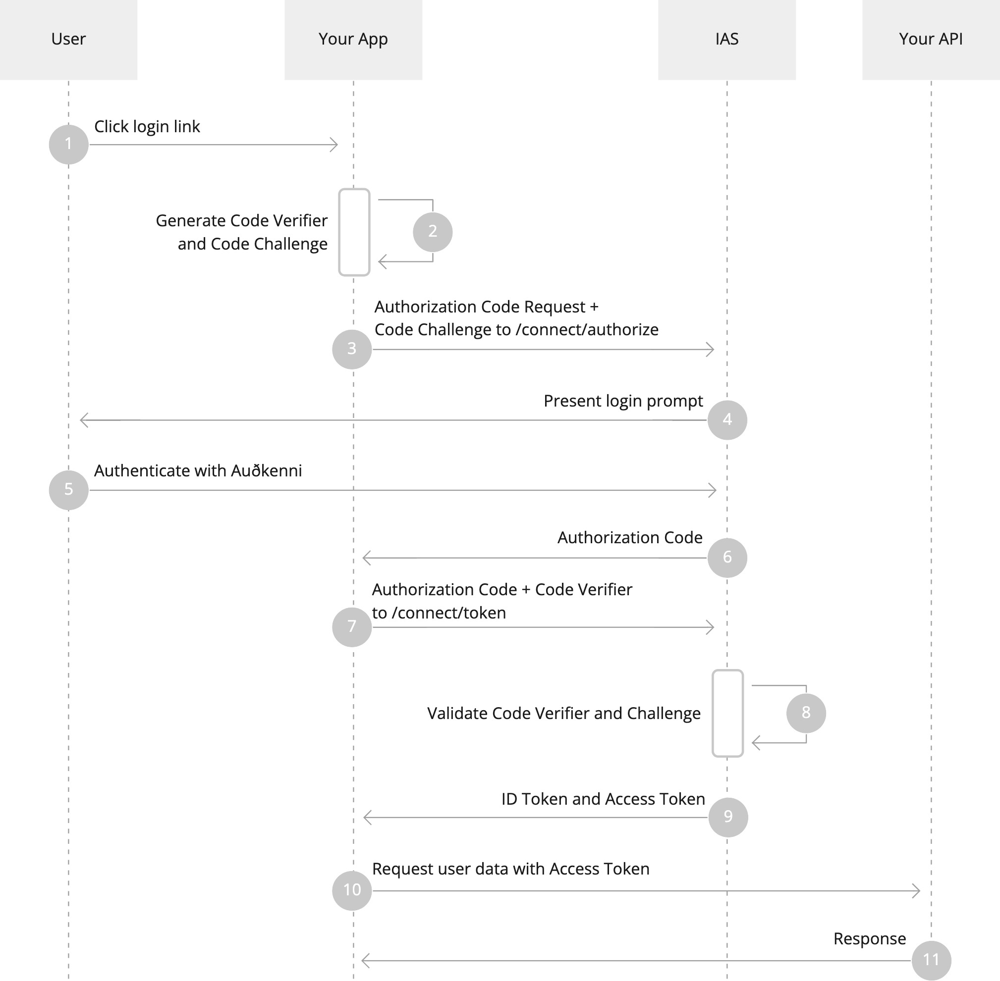
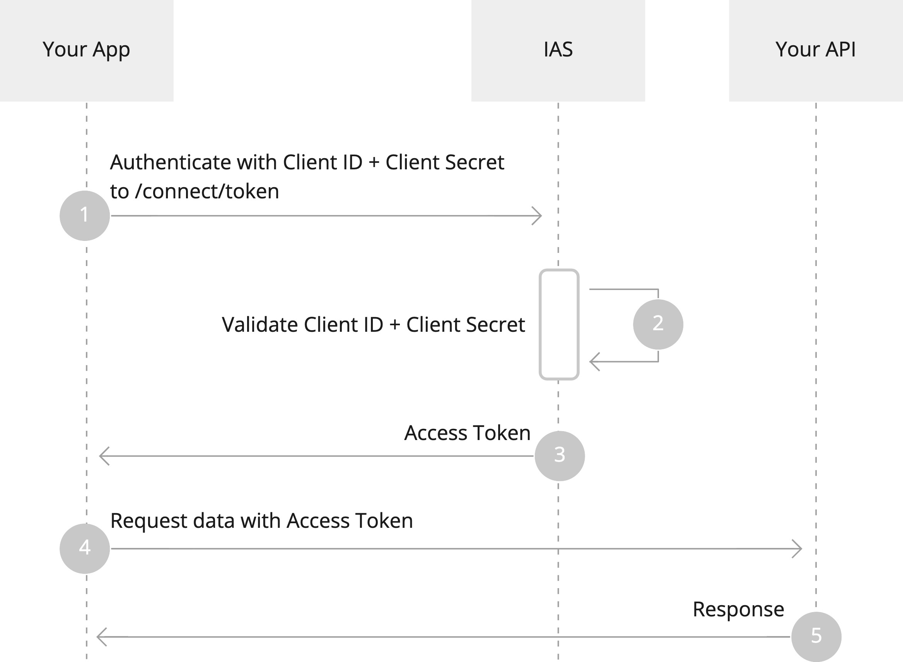

# Authentication Flows

Now that we’ve reviewed some of the ways you can integrate IAS, let’s dive into the supported authentication flows.

## Authorization Code + PKCE

If you are creating a Mobile App, Website or a Single Page App (SPA) you SHOULD authenticate using the Authorization Code flow with Proof Key for Code Exchange (PKCE).

This flow supports both confidential and public clients and is secure from multiple kinds of attacks when implemented correctly.

The Authorization Code + PKCE Flow goes through the following steps.

1. The user clicks the “Login” link in your application.
2. Your app creates a cryptographically-random Code Verifier which is used to generate a Code Challenge. These two values are needed for the PKCE validation.
3. Your app redirects the user to IAS’s `/connect/authorize` endpoint, with Response Type and Code Challenge parameters in the query string to indicate to the IAS the usage of Authorization Code + PKCE flow.
4. The IAS shows a login screen to the user.
5. The user authenticates to IAS using Auðkenni.
6. IAS stores the Code Challenge and redirects the user back to your application with a single-use Authorization Code.
7. Your app sends the Authorization Code and the Code Verifier to IAS’s `/connect/token` endpoint.
8. IAS verifies the Code Challenge and Code Verifier.
9. IAS returns an ID Token, an Access Token and optionally a Refresh Token.
10. The App can use the Access Token to call Your API to access information about the user.
11. Your API validates the Access Token and responds with requested data.

### Library Configuration

Using an OIDC library, you need the following parameters to perform a user authentication:

- `Client ID` to authenticate your client. You get this from IAS.
- `Client Secret` if your client is confidential. You get this from IAS.
- `Scope` is a space-separated list of scopes which grants access to specific APIs using the access token or claims in the ID token. You can only list scopes which your client has access to.
- `Redirect Uri` specifies where IAS should redirect to after authenticating the user. This MUST match your client configuration in IAS.
- If your library supports OIDC discovery:
  - `Issuer` or `Authority`, the base URL of IAS (see below).
- Otherwise:
  - `Authorization Endpoint`, for IAS this is `${Issuer}/connect/authorize`
  - `Token Endpoint`, for IAS this is `${Issuer}/connect/token`

## Client Credentials

With Client Credentials, the API only authenticates the client performing the request.

The Client Credentials Flow goes through the following steps.

1. Your app sends its Client ID and Client Secret to IAS’s `/connect/token` endpoint to authenticate.
2. IAS validates the Client ID and Client Secret.
3. IAS returns an Access Token.
4. The App can use the Access Token to call the API.
5. The API validates the Access Token and responds with requested data.

### Library Configuration

You need the following parameters to perform a client authentication:

- `Client ID` and `Client Secret` to authenticate your client. You get this from IAS.
- `Scope` is a space-separated list of scopes which grant access to specific APIs. You can only list scopes which your client has access to.
- If your library supports OIDC discovery:
  - `Issuer` or `Authority`, the base URL of IAS (see below).
- Otherwise:
  - `Token Endpoint`, for IAS this is `${Issuer}/connect/token`
