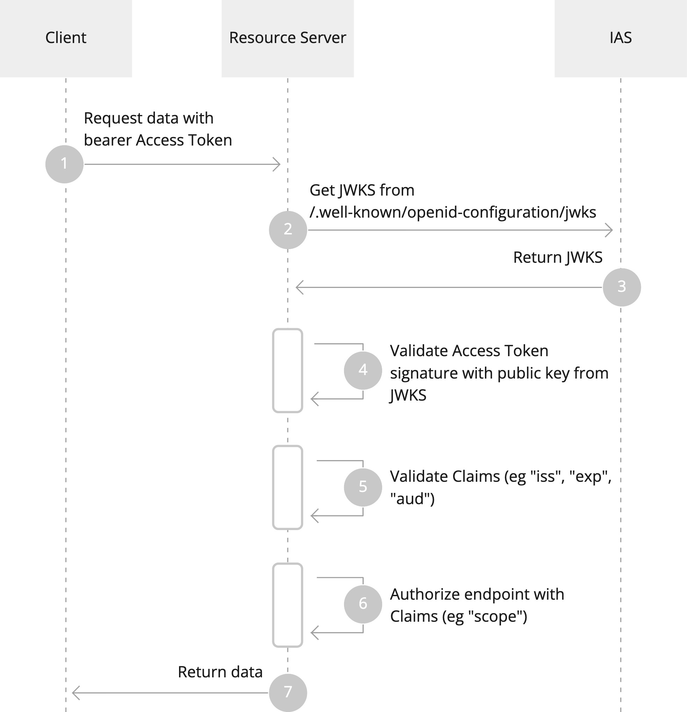

# Authorising API Endpoints

Tokens issued by IAS are [JSON Web Tokens (JWT)](https://datatracker.ietf.org/doc/html/rfc7519) which are cryptographically signed to prevent tampering.

If you are creating a Resource Server that accepts Access Tokens issued by IAS you MUST validate tokens properly:

1. The Client calls the Resource Server with an Authorization header containing a bearer JWT Access Token issued by IAS.
2. The Resource Server checks if it has a cached RSA public key matching the incoming Access Token. If not, it requests a JSON Web Key Set (JWKS) from IAS.
3. IAS returns all of the public keys for its tokens in a JWKS response.
4. The Resource Server MUST validate the signature of the Access Token JWT using the RSA public key from the JWKS.
5. The Resource Server MUST validate Access Token Claims to see if it was issued (”iss”) by IAS, that it is valid (”nbf” and ”exp”) and the Resource Server is specified as the token’s audience (”aud”).
6. The Resource Server MAY further authorize the requested resources based on Claims from the Access Token, eg “scope” and “nationalId”.
7. The Resource Server returns the requested Resources.

### Library Configuration

Authorisation libraries often support the following parameters to validate bearer tokens:

- `Audience` which audience the token should be for.
- `Scope` which scope is required to call the endpoint.
- `Issuer` or `Authority`, the base URL of IAS (see below).
- If your library does not supports OIDC discovery:
  - `JWKS Endpoint`, for IAS this is `${Issuer}/.well-known/openid-configuration/jwks`
