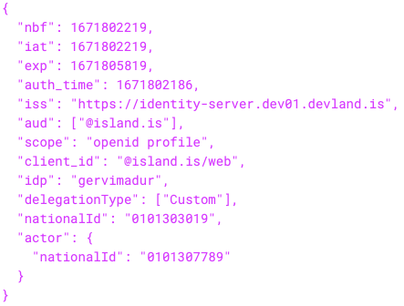

# Delegations (BETA)

IAS includes a delegation system which allows individuals and organisations to grant others access to digital services on their behalf. For example, guardians can sign in on behalf of their wards, and employees can sign in on behalf of the company they work for.

In addition to explicit delegation grants (where identity A creates delegation grants for user B), we support implicit delegation grants from external delegation registries. We currently support these kinds of implicit delegations:

- Legal guardians for underage users. (Source: Þjóðskrá)
- Procuring holders for companies. (Source: Fyrirtækjaskrá)
- Personal representatives for represented users. (Source: Talsmannagrunnur)

## Delegation configuration

Clients can configure what kinds of delegations they support. This controls which delegations the user can choose when authenticating with the client.

Scopes configure what kind of delegations the respective API supports. It affects which API scopes can be added to access tokens when acting in a delegation.

## Switching delegations

When a user signs into a client which supports delegations, IAS prompts the user with a choice to authenticate without a delegation, or authenticate with a specific delegation.

## Delegated tokens

Delegations are reflected in the ID and Access Tokens, where the chosen identity becomes the subject of the token and the authenticated user is the actor.

Example Access Token for a delegation (trimmed):



This design reduces the information shared with the client. The client only sees the delegations which the user chooses.

It also means resource servers can easily validate access tokens and return resources for the chosen delegation.

To prevent impersonation attacks, resource servers MUST validate the audience and scope claims. If they support delegations they SHOULD also audit both identities from the token.

## Audit Requirements

SPs which integrate with delegations SHOULD keep an audit log which tracks both subject and actor identities.

We RECOMMEND including these fields in your audit log:

- `subject` - The national id of the active identity from the access token. Can be the authenticated user, a company or another person. This can be `national_id` claim.
- `actor` - The national id of the authenticated user. This is the `actor.national_id` claim if the `actor` claim is defined, otherwise it is the root `national_id` claim, same as the subject.
- `client` - IAS clients involved with the request. This SHOULD be an array to audit a chain of clients using token exchange.

  - <details><summary>Example code to unwrap client chain from access token claims.</summary>

    ```jsx
    /**
     * Accepts a decoded access token JWT. Returns an array of client ids
     * in authentication order.
     */
    function getClients(auth) {
      const clients = []
      let act = auth.act
      while (act) {
        clients.unshift(act.client_id)
        act = act.act
      }
      clients.unshift(auth.client_id)
      return clients
    }
    ```

  </details>
