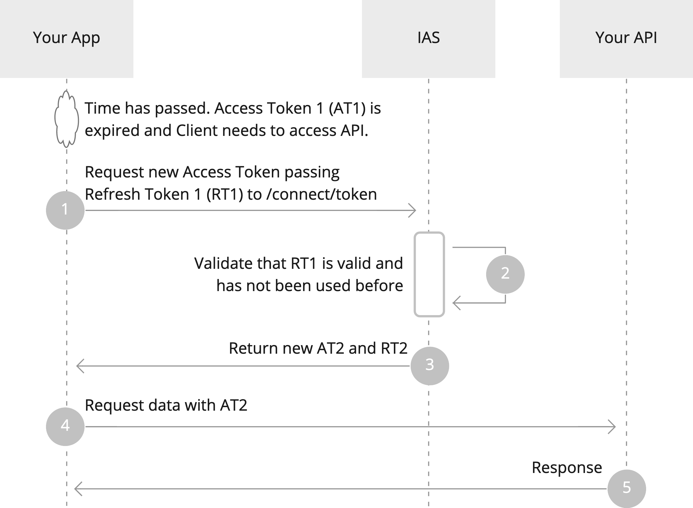
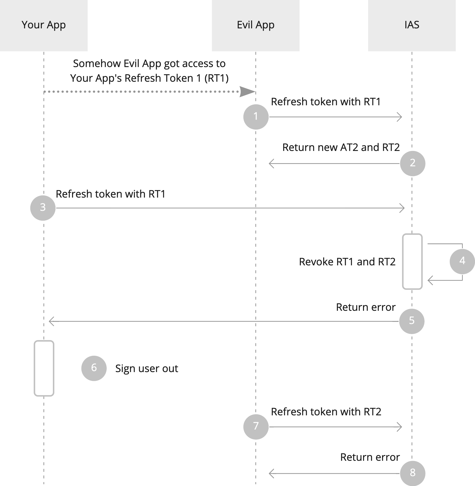
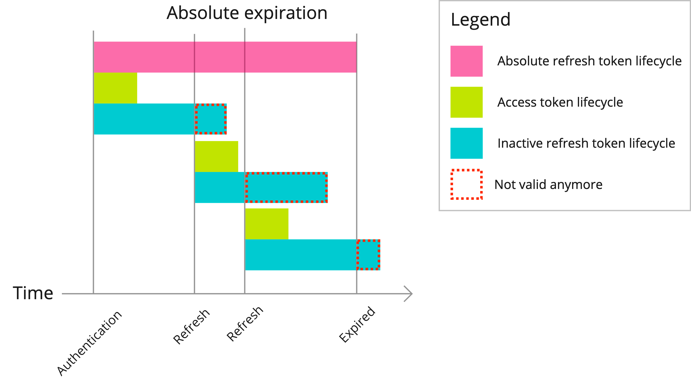
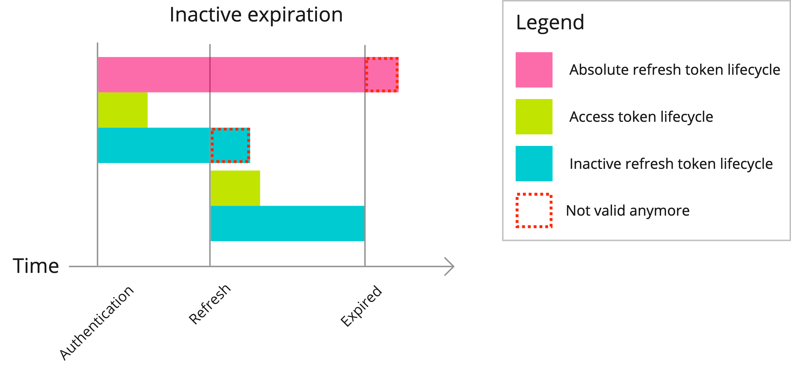

# Scopes and Tokens

## IAS Scopes

IAS has built-in scopes which provide access to user claims in the ID token and in the IAS userinfo endpoint.

### `openid`

Standard scope REQUIRED for user authentication with Open ID Connect. Returns the following claims:

- `sub` - Uniquely identifies the subject+actor+idp authentication.
  - I.e. when users A and B act as user C, they have different `sub` values from each other, which is also different from user A, B and C’s normal `sub` values.
  - The same user also has a different `sub` value based on their authentication method (sim, app or card). This may change in the future.
- `subjectType` - The user-type of the subject. Can contain values:
  - `person` - The subject is a person.
  - `legalEntity` - The subject is a legal entity.
- `nationalId` - The nationalId of the subject. If the user has chosen to act in a delegation, then this is the nationalId of the chosen delegation, otherwise it’s the nationalId of the authenticated user.
- `nat` - The nationality of the user. Specified as a [ISO 3166-1](https://en.wikipedia.org/wiki/ISO_3166-1_alpha-2) two-letter country code. Only applies to End-Users that are individuals.
- `idp` - The identity provider used to authenticate the user. Can contain values:
  - `gervimadur` - The authenticated user was authenticated as a Gervimaður using a special phone number.
  - `audkenni_sim` - The user was authenticated with an electronic ID stored in a mobile phone SIM card.
  - `audkenni_card` - The user was authenticated with an electronic ID stored on a card.
  - `audkenni_app` - The user was authenticated with an electronic ID stored in [Auðkennisappið](https://app.audkenni.is/).
- `actor` - Information about the authenticated user. Only available when a delegation is active. Contains nested claims:
  - `nationalId` - The nationalId of the authenticated user.
  - `name` - Full name of the authenticated user.

### `profile`

Request user profile-related information claims:

- `name` - Full name of the user.
  - For individuals, this comes from National Registry’s Einstaklingar API, falling back to the name saved on the Electronic ID used to authenticate.
  - For companies, this comes from Skattur’s Company Registry API.

### `offline_access`

Request a Refresh Token with other tokens, which can be used to request new Access Tokens. Note that your Client needs to be configured to allow offline access to receive Refresh Tokens.

## Access Tokens

Access Tokens issued by the IAS are JWT bearer tokens signed using RSA keys. This allows Resource Servers to validate Access Tokens and extract claims without calling the IAS introspection endpoint for every request.

This decentralised design has clear benefits when it comes to performance, scaling and reliability, but it also means that it’s impossible to revoke Access Tokens after they’ve been issued. When the user signs out, there might be an Access Token somewhere which can still be used.

To minimise the impact of this risk, IAS issues Access Tokens with an expiry of 5 minutes or less.

If your client needs to access Resource Servers for a longer time they can use Refresh Tokens to request new Access Tokens.

## Refresh Tokens

Refresh Tokens issued by IAS are configured with Refresh Token rotation. This means that each time you use your Refresh Token to request a new Access Token, you also get a new Refresh Token.

1. When a client needs to access an API and its Access Token is expired, it performs a Token Refresh to get a new Access Token. It sends its Refresh Token (RT1) to the IAS Token Endpoint with `grant_type=refresh_token`. Confidential clients also pass their Client ID and Client Secret to authenticate.
2. The IAS validates RT1, checks if it has expired, been used before or otherwise revoked.
3. If RT1 is valid, IAS issues a new tokens AT2 and RT2 and returns them to the client.
4. The client uses the new AT2 to request data from the API.
5. The API sees that AT2 is valid and returns resources.

Behind the scenes, each authentication forms a chain of Refresh Tokens. If the same Refresh Token is used to request an Access Token for a second time, that request will fail and IAS will revoke that complete chain of Refresh Tokens. The user is forced to re-authenticate.

This means that if an adversary gets access to a Refresh Token in any way, that access will be blocked, either immediately, or the next time the real Client refreshes its token. The real user will notice this by the fact that they’ve been signed out.

### Protecting Refresh Tokens

You MUST protect Refresh Tokens carefully since they can be used to generate new Access Tokens without user intervention. Refresh Tokens SHOULD never be accessible to client side code which is susceptible to Cross Site Scripting (XSS) attacks.

We RECOMMEND storing Refresh Tokens in secure database storage. If you need to store it in a cookie-based session, the cookie should be configured with HTTPOnly, Secure and SameSite flags to limit access to it, and its contents should ideally be encrypted.

### Refresh Token expiration

You can configure Refresh Token expiration settings based on the needs of your Client. These settings form the basis of how long a specific authentication can be used to access user resources from Resource Servers.

For interactive clients that depend on user data from Resource Servers, the lifetime of Refresh Tokens SHOULD decide the lifetime of the user session. If requesting a new Access Token using a Refresh Token fails because of an expired or revoked Refresh Token, you can clear the user session and sign the user out.

You can configure both absolute expiration and inactive expiration.

**Absolute Expiration** specifies the absolute lifetime of all Refresh Tokens from a single authentication event.

**Inactive Expiration** specifies the maximum lifetime of each individual Refresh Token in seconds. If the user is inactive and your client doesn’t use the latest Refresh Token for this amount of time, then the Refresh Token expires and can’t be used to issue new Access Tokens.

