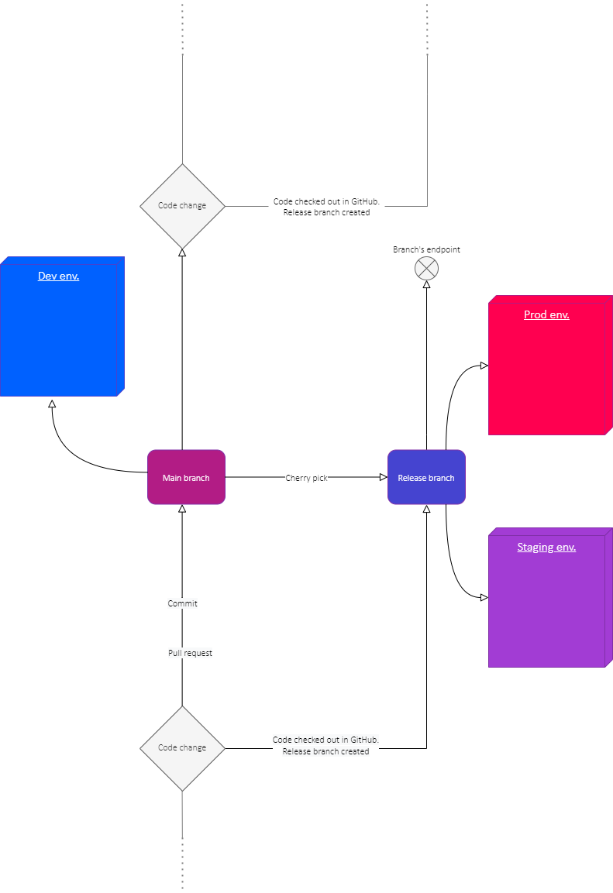

# Service Provision

[GitHub](https://github.com/) is used for source code management while [Amazon Web Service](https://aws.amazon.com/) is the hosting provider.
Further information regarding the development- and service provider-environments can be found following these links:

- [https://docs.devland.is/technical-overview/devops](https://docs.devland.is/technical-overview/devops)
- [https://docs.devland.is/apps/services/auth-api](https://docs.devland.is/apps/services/auth-api)
- [https://docs.devland.is/apps/services/auth-admin-api](https://docs.devland.is/apps/services/auth-admin-api)
- [https://github.com/island-is/identity-server.web](https://github.com/island-is/identity-server.web)

## IdentityServer

[IdentityServer](https://identityserver4.readthedocs.io/en/latest/) is an open source-solution in [.NetCore](https://en.wikipedia.org/wiki/.NET_Core). The system is an [OpenID Connect provider](https://openid.net/connect/), i.e. it implements the OpenID Connect and OAuth 2.0 protocols.

## Terminology

- ### User

  A human that is using a registered client to access resources.

- ### Client

  A software that requests tokens from [IdentityServer](https://identityserver4.readthedocs.io/en/latest/) - either for authenticating a user or for accessing a resource. A client must be first registered with [IdentityServer](https://identityserver4.readthedocs.io/en/latest/) before it can request tokens. Clients can for example be web applications, native mobile or desktop applications.

- ### Resources

  Resources are something you want to protect with [IdentityServer](https://identityserver4.readthedocs.io/en/latest/) - either identity data of your users, or APIs:

  - Identity data to identify users, for example names or e-mail addresses.
  - API is an interface which the clients communicate with.

- ### Identity token

  An identity token is created during the authentication procedure of [IdentityServer](https://identityserver4.readthedocs.io/en/latest/). It contains at a bare minimum an identifier for the user (called the _sub_ aka _subject claim_) and information about how and when the user authenticated.

- ### Access token

  An access token allows access to an API resource. Clients request access tokens and forward them to the API. Access tokens contain information about the client and the user which the API uses to authorize access to the resources.

## Authentication flow

1.  The service provider writes a code to connect with [Identity server](https://identityserver.io/)\‘s authentication service. The user’s identity is defined as a sub (_subject claim_) in the code.
2.  When the users’ clients request authentication then [IdentityServer](https://identityserver4.readthedocs.io/en/latest/) receives the _sub_. Accordingly, [IdentityServer](https://identityserver4.readthedocs.io/en/latest/) includes the _sub_ in the identity token which it creates to connect the clients with the resources. During the same procedure [IdentityServer](https://identityserver4.readthedocs.io/en/latest/) also creates the access token.
3.  [IdentityServer](https://identityserver4.readthedocs.io/en/latest/) sends the identity token and the access token to the client.
4.  The client forwards the access token to the API for validation.
5.  When the API has validated the access token then the client gets access to the user’s resources.

## Software development process

1. The service-provider’s code is source-controlled in [GitHub](https://github.com/).
2. When there are code changes then the developer commits the new code and pushes to GitHub.
3. The developer creates a ‘pull request’ for his code changes which another developer must accept in order for the code to be merged with the main development branch. This triggers a GitHub-action which builds the code and deploys to the Development-environment.
4. When code is to be released, a release-branch is created by a third party from the main-branch. This triggers a GitHub-action which deploys it to the Staging-environment.
5. When the deployment on Staging has been tested and approved then the code is deployed to the Production-environment by a third party.

