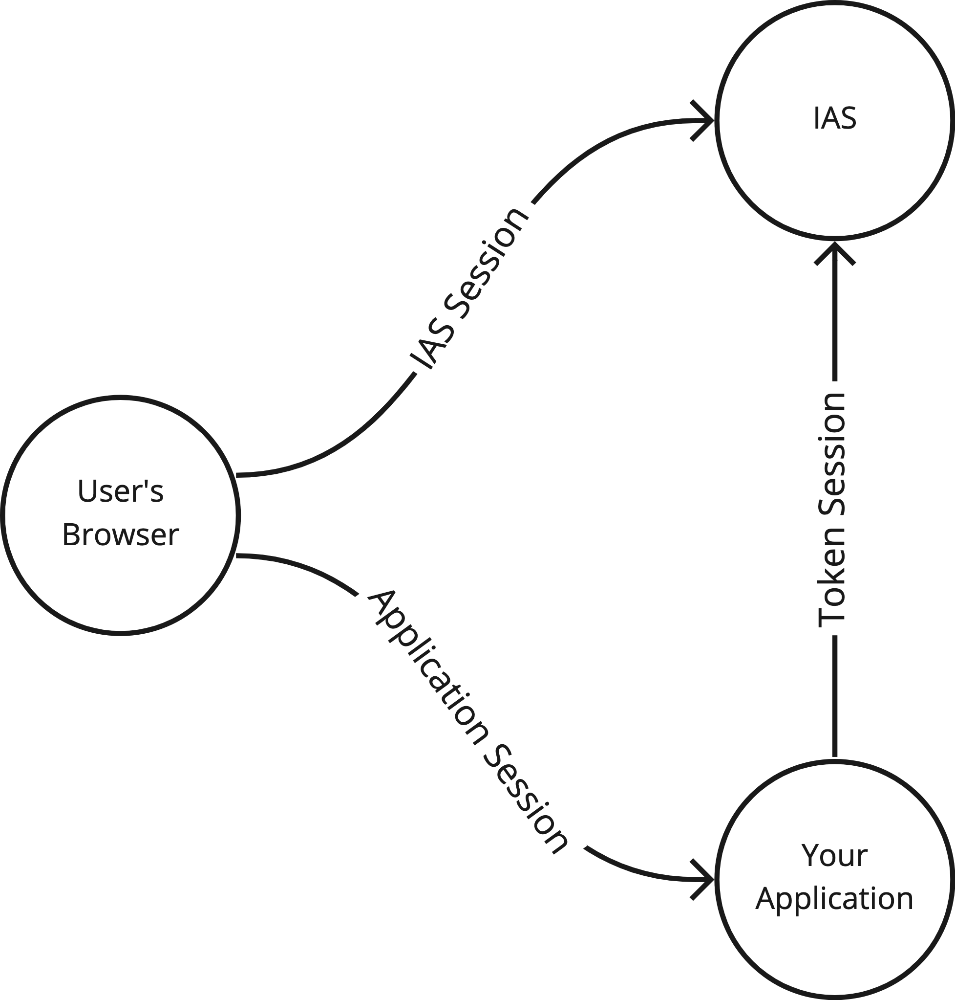

# Session Lifecycle

When users sign into applications there are up to 3 sessions to be aware of. These sessions are independent but this chapter explains some ways to keep them in sync.

## Token Session

For applications which use IAS Access Tokens, you need to consider the token lifecycle.

Access Tokens by default last 5 minutes. They can’t be invalidated, so care should be made to protect access tokens and remove them as soon as the user logs out.

With Refresh Tokens your app can get new Access Tokens as they expire. IAS supports both Inactive Expiration and Absolute Expiration for Refresh Tokens. These specify how much time can pass between the app refreshing tokens, as well as the total amount of time the app can refresh tokens.

For sensitive applications it makes sense to have the Refresh Token expirations fairly short (eg 30 minutes inactive, 8 hours absolute). For native applications or less sensitive applications these can be longer (weeks or months).

When the user logs out of your application, you should revoke the refresh tokens using IAS’s `revocation_endpoint` so the refresh tokens can’t be used again.

If a token refresh fails, it indicates that the Refresh Token has expired, been revoked or used elsewhere (stolen refresh token). In this case you should sign the user out of your application immediately.

## Application Session

Many application frameworks have their own session system, i.e. using cookies. These sessions have their own lifecycles separate from Tokens and IAS.

If your application logic depends on IAS Access Token, then you may want to configure your Application Session to outlive the Token Session and/or sync the two:

- If the user signs out, clear your application session in addition to revoking the Refresh Token.
- If the Token Session expires, then clear your Application Session cookie before signing the user out.

## IAS Session

IAS has its own session which provides a Single Sign-On experience so the user can quickly authenticate to different clients. The IAS Session lasts for 60 minutes after each authentication but no longer than 8 hours.

This means that if you link your user to another application which uses IAS, and it’s been less than 60 minutes since they first logged in, they won’t need to authenticate again. They’ll immediately be authenticated to the second application. Then if they go back to your application or a third application within 60 minutes of that, they still won’t see a sign-in screen.

If the user logs out of your application, you SHOULD perform an [RP Initiated Logout](https://openid.net/specs/openid-connect-rpinitiated-1_0.html#RPLogout) to terminate the IAS Session.

Even though the user signs out of another application and ends the IAS Session, your application might still have a valid Token Session for some time. IAS does not guarantee single sign-out.

However, if your application has server-stored sessions, you CAN implement [Back-Channel logout](https://openid.net/specs/openid-connect-backchannel-1_0.html) to clear your Application Session and/or Token Session when another application terminates the IDS Session. [Front-Channel logout](https://openid.net/specs/openid-connect-frontchannel-1_0.html) is unfortunately not available because modern browsers [block access to third-party content](https://openid.net/specs/openid-connect-frontchannel-1_0.html#ThirdPartyContent).
