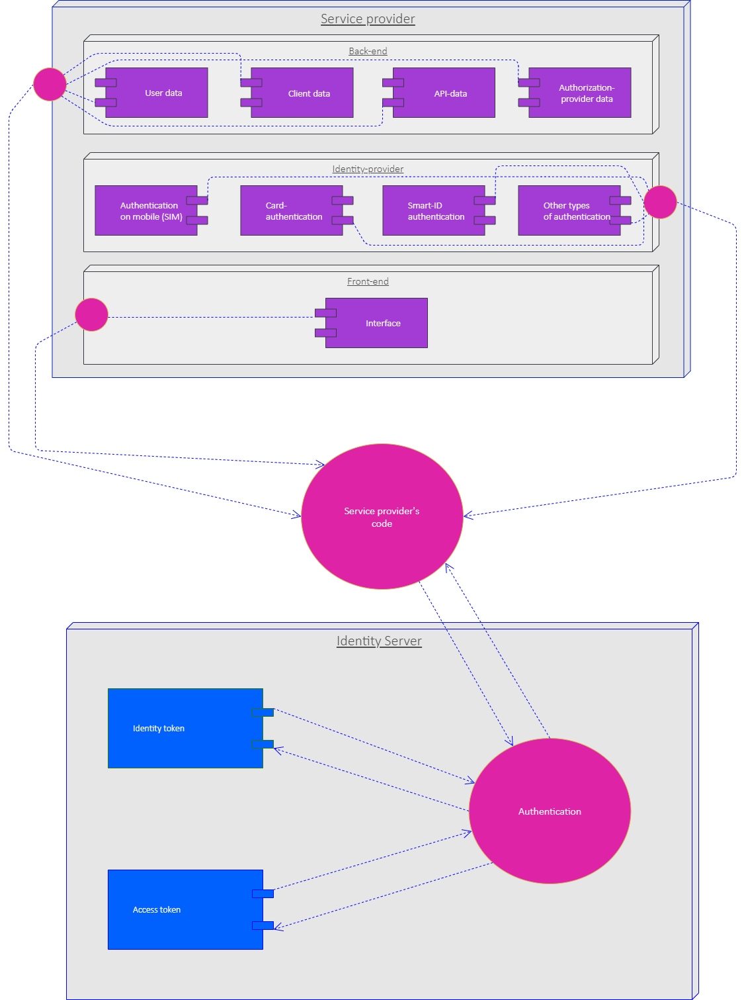

# Service Provider’s Role

The word _Service provider_ is used here for the Icelandic term _Rekstraraðili_.

## Authentication server

The authentication server is divided into three components:

- ### Back-end
  Database. Contains user-data, client-data, API-data and authorization-provider data.

- ### Identity provider
  The authentication-process. The authentication can be performed using various methods: with mobile, payment-card and Smart-ID amongst others.

- ### Front-end
  The interface which the customer uses to connect to the system.

The service provider’s role is to ensure that these components are functioning correctly and maintaining them.

## IdentityServer

- While developing the authentication the service provider uses [IdentityServer](https://identityserver4.readthedocs.io/en/latest/) as a middleware.
- [IdentityServer](https://identityserver4.readthedocs.io/en/latest/) is a standardized software solution which takes care of the authentication, cooperating with the service provider’s solution in connecting users’ data through their clients with the resources’ data through APIs.

