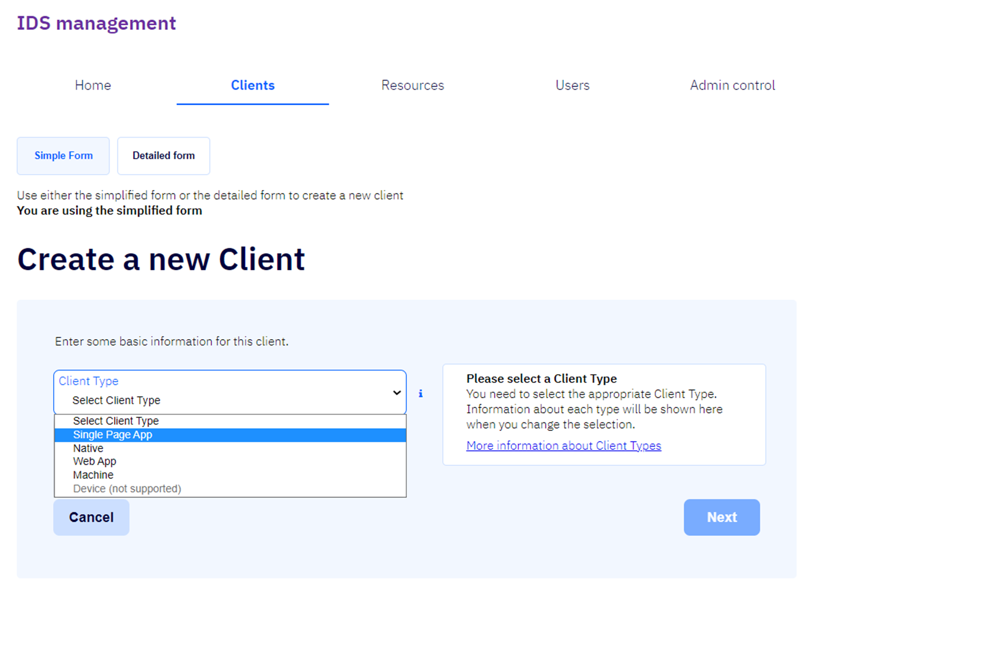

# Client

Það er hægt að velja á milli einfalds og flókins forms þegar búnir eru til nýir biðlarar / clients.

## Create new client - Simple form

- ### Client Type

  Sjá nánar um týpur biðlara [hér](types.md)

- ### National Id / Kennitala

  Skráð kennitala eiganda biðlarans

- ### Client Id

  Auðkenni biðlarans sem er verið að búa til

- ### Base uri

  Grunnvefslóð þessa biðlara.  
  Notað til að bæta við [Cors origin](edit/README.md#allowed-cors-origin), 
  [RedirectURI](edit/README.md#redirect-uri) og 
  [Post Logout URI](edit/README.md#post-logout-uris).  
   Út frá þessu gildi eer fyrsta Redirect Uri biðlarans búið til.

## Detailed form

Ítarlegt skráningarform býður notendum þjónustusíðnanna upp á fleiri möguleika við skráningu nýs biðlara.  
Lesa má nánar um það [hér](detailed-form.md)
