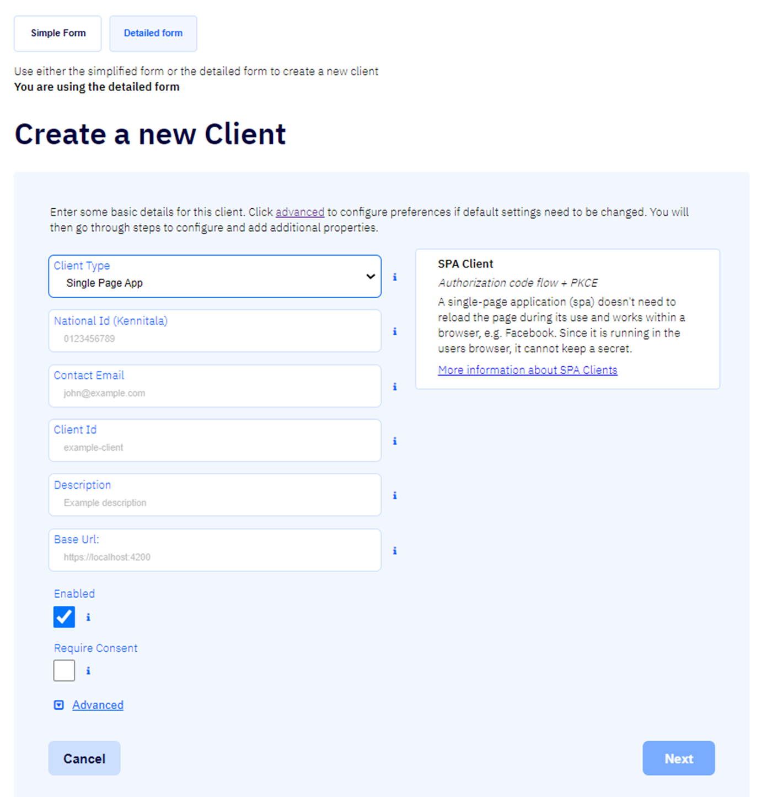
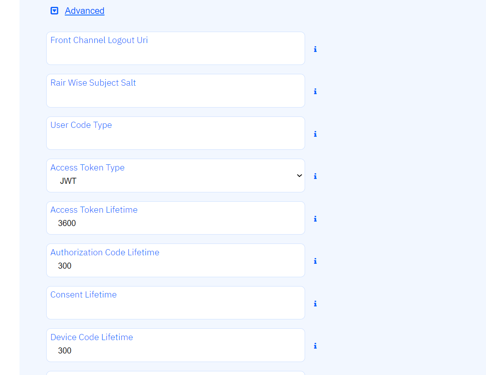
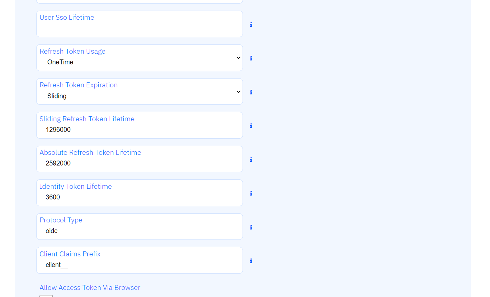
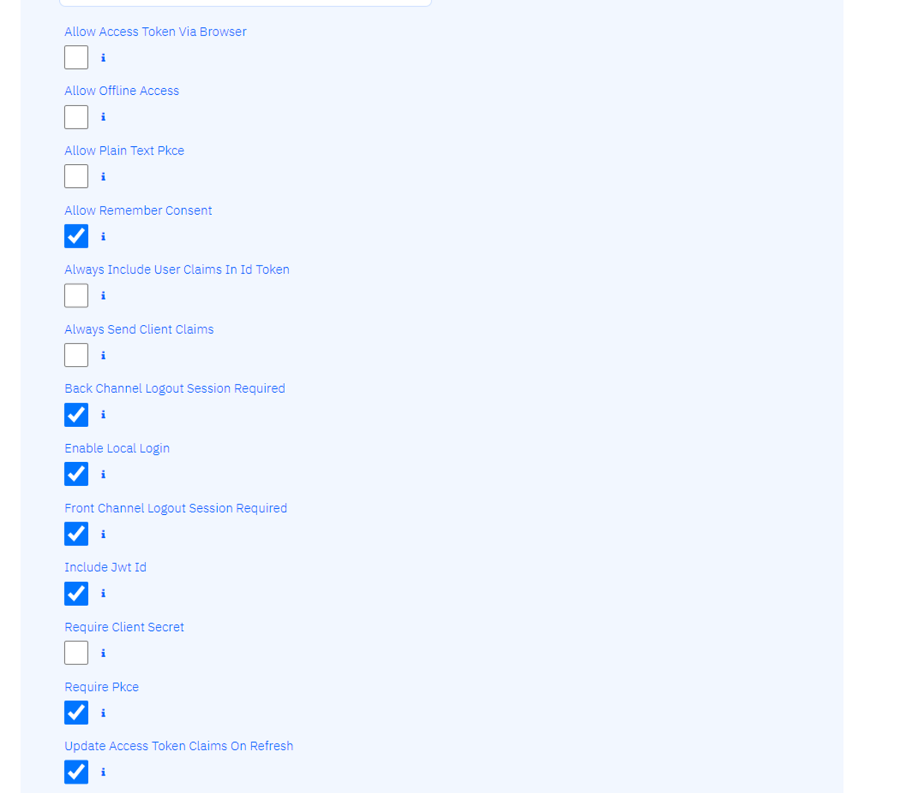

# Client Detailed Form

Hér verður lýst flókna ferlinu við að búa til biðlara og lýst vel hvað gildin gera.

- ### Client Type

  Sjá nánar um týpur biðlara [hér](types.md)

- ### National Id / Kennitala

  Skráð kennitala eiganda biðlarans

- ### Client Id

  Auðkenni biðlarans sem er verið að búa til

- ### Display Name

  Nafn biðlarans sem birtist í staðfestingarglugga (e. _consent screen_).

- ### Display URL

  Vefslóð (URI) biðlara sem sýnir nánari upplýsingar um hann og birtist í samþykkisglugganum.

- ### Description

  Lýsing á biðlara til að nota innan IDS-stýringar.

- ### Require Consent

  Ef hakað er við þennan reit er gert ráð fyrir samþykkisskjá (consent screen).

- ### Enabled

  Ef hakað er við þennan reit er biðlarinn heimilaður.  
  Sjálfgefið er að hakað sé við reitinn.

- ### Advanced

  Ef smellt er á örina  við hlið þessa texta opnast fleiri valmöguleikar:

- ### Front Channel Logout URI

  Velur útskrániningar-URI biðlara fyrir HTTP-byggða front-channel
  útskráningu.  
   [Sjá OIDC Connect Session Managment spec fyrir nánari umfjöllun](https://openid.net/specs/openid-connect-session-1_0.html).

- ### Rair Wise Subject Salt

  _Salt_-gildi sem er notað fyrir gerð tvíþætts [_subjectId_](../concepts.md#id-token) notenda viðkomandi biðlara.

- ### User Code Type

  Tilgreinir hvers konar notendakóða á að nota fyrir viðkomandi biðlara.  
   Ef ekkert gildi er skráð er farið aftur í sjálfgefna stillingu.

- ### Access Token Type

  Hér er tilgreint hvort [aðgangstókinn](../concepts.md#access-token) sé tilvísunartóki eða sjálfheldinn (self-contained) JWT-tóki (JWT er sjálfgefið val).

- ### Access Token LifeTime

  Gildistími [aðgangstóka](../concepts.md#access-token) í sekúndum talið (sjálfgefið val er 3600 sekúndur / 1 klst).

- ### Authorization Code Lifetime

  Gildistími [heimilunarkóða (_authorizationcode_)](../concepts.md#auth-code) í sekúndum talið
  (sjálfgefnar stillingar eru 300 sekúndur / 5 mínútur).

- ### Consent Lifetime

  Gildistími notendastaðfestingar í sekúndum talið.  
   Sjálfgefið val er 0 (óendanlegur gildistími).

- ### Device Code Lifetime

  Gildistími tækiskóða (_device code_) í sekúndum talið (sjálfgefið val er 300 sekúndur / 5 mínútur).

- ### User Sso Lifetime

  Hámarks gildistími frá því að notandi auðkenndi sig síðast í sekúndum
  talið.  
   Sjálfgefið val er 0.

- ### Refresh Token Usage

  Ef gildið _ReUse_ er valið mun haldfang endurnýjaðs tóka (_refresh token handle_) vera það sama þegar tóki er endurnýjaður.  
   Ef gildið _OneTime_ er valið mun haldfang endurnýjaða tókans uppfærast þegar tóki er endurnýjaður.  
   _OneTime_ er sjálfgefið val.

- ### Refresh Token Expiration

  Ef valið er gildið _Absolute_ mun endurnýjaði tókinn renna út á ákveðnum tímapunkti (tilgreindur í [Absolute Refresh Token Lifetime](#absolute-refresh-token-lifetime)).  
   Ef gildið _Sliding_ er valið mun gildistími endurnýjaða tókans endurnýjast (að því marki sem stillt er í [Sliding Refresh Token Lifetime](#sliding-refresh-token-lifetime)). Gildistíminn getur þó ekki verið lengri en [Absolute Refresh Token Lifetime](#absolute-refresh-token-lifetime).

- ### Sliding Refresh Token Lifetime

  Gildistími endurnýjaða tókans ef _Sliding_ var valið í [Refresh Token Expiration](#refresh-token-expiration).  
   Sjálfgefið gildi er 1296000 sekúndur / 15 dagar.

- ### Absolute Refresh Token Lifetime

  Hámarks gildistími endurnýjaða tókans í sekúndum talið.  
   Sjálfgefið gildi er 2592000 sekúndur / 30 dagar.

- ### Identity Token Lifetime

  Gildistími [auðkennistóka](../concepts.md#id-token) í sekúndum talið (sjálfgefið gildi er 300 sekúndur / 5 mínútur)

- ### Protocol type

  Dæmigert gildi er _oidc_

- ### Client Claims Prefix

  Ef gildi er skráð í þennan reit mun biðlarastaðhæfing af
  viðkomandi gerð fá skráð gildi sem forskeyti (_prefix_).  
   Sjálfgefið gildi er _client _ \_.  
   Tilgangurinn með þessu er að koma í veg fyrir að biðlarastaðhæfingar rekist saman við notendastaðhæfingar.

- ### Allow Access Token Via Browser

  Hakreitur sem segir til um hvort viðkomandi biðlari megi taka við
  [aðgangstókum](../concepts.md#access-token) frá vöfrum.  
   Þetta getur nýst við að skerpa á flæði sem heimila fjölþátta svörunargerðir (_response types_).  
   Það er gert með því að heimila ekki biðlara með blandað flæði (_hybrid flow_) sem á að nota _code id_token_ til að bæta við svörunargerðina og þannig leka [tókanum](../concepts.md#token) yfir í vafrann.

- ### Allow Offline Access

  Hakreitur sem segir til um hvort þessi biðlari megi biðja um að endurnýjaða
  [tóka](../concepts.md#token) (með því að sækja um _offline_access_ umfangið).  
  Svo að biðlarar geti notað _refresh token_ að þá verður þetta gildi að vera á.

- ### Allow Plain Text Pkce

  Hakreitur sem segir til um hvort [iðlarar sem nota PKCE geti notað _plain text code challenge_ (ekki mælt með þessu).

- ### Allow Remember Consent

  Hakreitur sem segir til um hvort notandi geti valið að geyma staðfestingar (_consent decisions_).

- ### Always Include User Claims In Id Token

  Ef hakað er við þennan reit eiga [auðkennistókar](../concepts.md#id-token) alltaf að innihalda
  notendastaðhæfingar (_user claims_ þegar sótt er bæði um [auðkennistóka](../concepts.md#id-token) og
  [aðgangstóka](../concepts.md#access-token).  
   Ef ekki er hakað við reitinn eiga biðlarar að nota endapunkt fyrir
  notendaupplýsingar (_userinfo endpoint_).  
   Sjálfgefið gildi er _false_.

- ### Always Send Client Claims

  Ef hakað er við þennan reit verður biðlarastaðhæfing (_client claim_) send fyrir hvert flæði (_flow_).  
   Ef ekki er hakað við þennan reit verða biðlarastaðhæfingar einungis sendar fyrir flæði biðlaraskírteina (_client credential flow_).  
   Sjálfgefið gildi er _false_.

- ### Back Channel Logout Session Required

  Ef hakað er við þennan reit verður _session id_ notanda sent með staðhæfingunni til _BackChannelLogoutUri_.

- ### Enable Local Login

  Ef hakað er við þennan reit getur viðkomandi biðlari einungis notað staðbundna reikninga eða
  ytri (_external_) IdP.

- ### Front Channel Logout Session Required

  Ef hakað er við þennan reit má senda _session id_ notanda á _FrontChannelLogoutUri_.

- ### Include Jwt Id

  Ef hakað er við þennan reit munu _JWT aðgangstókar_ vera með einstakt auðkenni
  (_unique ID_) innbyggt (í gegnum _jwt-claim_).

- ### Require Client Secret

  Ef hakað er við þennan reit þarf viðkomandi biðlari að vera með huldustreng (_secret_) til að geta sótt um
  [tóka](../concepts.md#token) frá endapunkti tókans (_token endpoint_).

- ### Require Pkce

  Ef hakað er við þennan reit verða biðlarar sem notast við
  [leyfistegund (_grant type_)](../concepts.md#grant-type) byggða á
  [heimilunarkóða (_authorization code_)](../concepts.md#access-token) að senda frá sér
  prófunarlykil (_proof key_).

- ### Update Access Token Claims On Refresh

  Ef hakað er við þennan reit er ákvarðað gildi sem segir til um hvort
  [aðgangstókinn](../concepts.md#access-token) og [gildi hans (_claims_)](../concepts.md#claims)
  verði uppfærðar þegar staðhæfing kemur um endurnýjun tókans.

- ### Cancel

  Ef smellt er á þennan hnapp er skráningu biðlarans hætt

- ### Next
  Ef smellt er á þennan hnapp er farið yfir í [annað þrep skráningar biðlarans: Redirect Uri](edit/README.md#redirect-uri)
