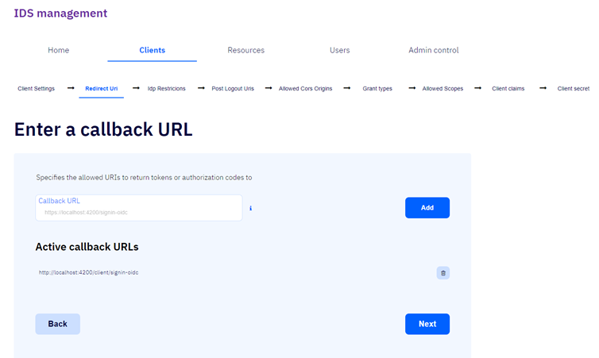
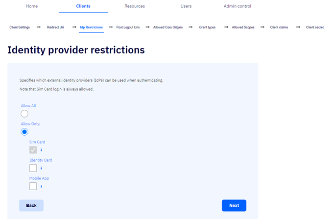
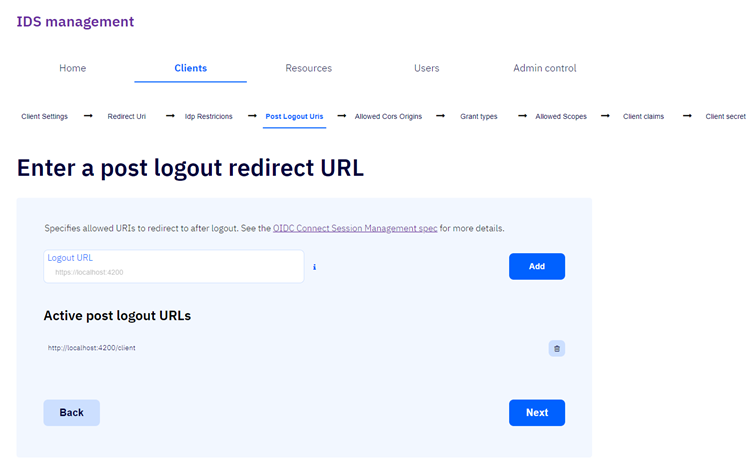
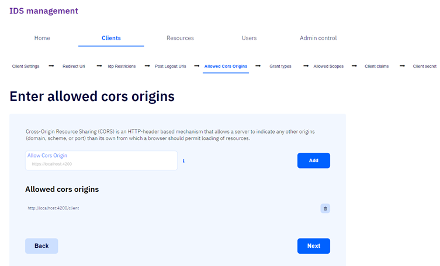
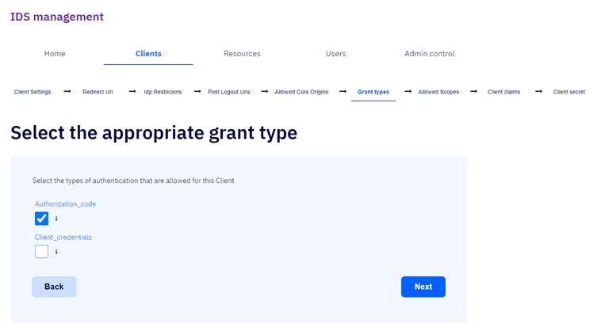
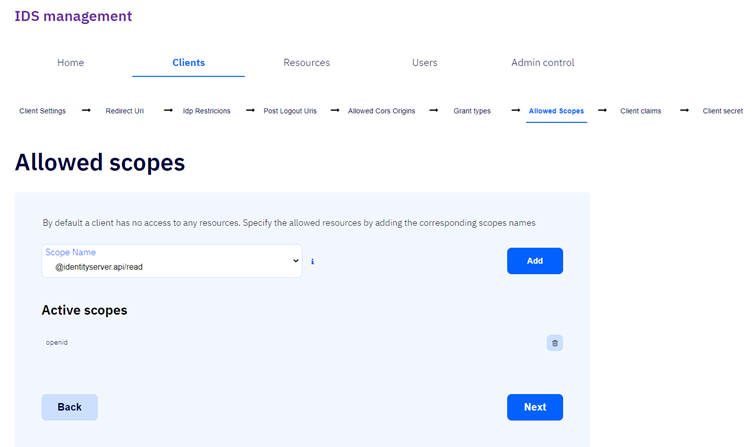
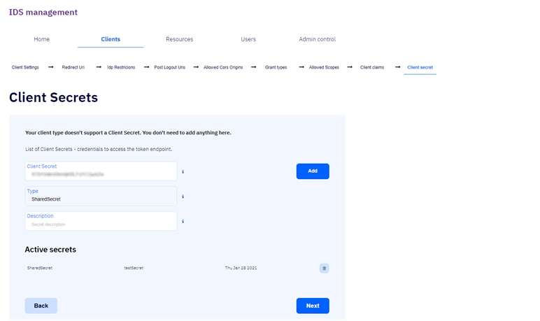
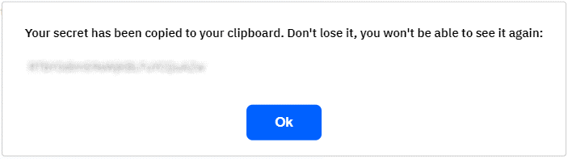
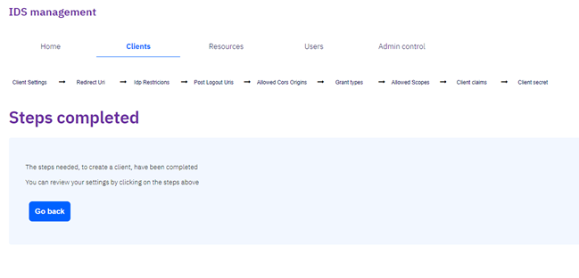

# Edit clients

Þegar búið er að búa til biðlara / client er hægt að breyta upplýsingunum um biðlarann með flipunum

[Client Settings](#client-settings)  
[Redirect URI](#redirect-uri)  
[Idp Restrictions](#idp-restrictions)  
[Post Logout Uris](#post-logout-uris)  
[Allowed cors origin](#allowed-cors-origin)  
[Grant types](#grant-types)  
[Allowed scopes](#allowed-scopes)  
[Client claims](#client-claims)  
[Client secret](#client-secret)

- ## Client Settings

  Hér er hægt að breyta upplýsingunum um biðlarana sem var sett upp með einfalda eða flókna forminu.\
  Hér má sjá frekari upplýsingar um [flókna formið](../detailed-form.md).

- ## Redirect Uri

  Hér eru þær vefslóðir, _URL_, tilgreindar sem skila má [tókum](../../concepts.md#token) eða
  [heimilunarkóðum (authorization codes)](../../concepts.md#auth-code) til.\
   Vefslóð er skráð í _Callback URL_ og smellt á hnappinn _Add_ til að staðfesta skráninguna.\
   Ef vefslóð er þegar skráð er það sama vefslóðin og skráð var í
  [Display URL í fyrsta skráningarþrepinu](../detailed-form.md#display-url).

  

  ### Callback Url

  Í þennan reit er vefslóðin sem vísað er aftur til skráð.\
   Þetta verkferli er háð _TLS_.

  ### Add

  Ef smellt er á þennan hnapp er skráð vefslóð staðfest.

  ### Back

  Ef smellt er á þennan hnapp er farið aftur í [fyrsta þrep skráningar biðlarans: Client Settings](#client-settings).

  ### Next

  Ef smellt er á þennan hnapp er haldið áfram yfir í [þriðja þrep skráningar biðlarans: Idp Restrictions](#idp-restrictions).

- ## Idp Restrictions

  Hér er tilgreint hvaða ytri auðkennisveitur (_Identity provider_) viðkomandi biðlari má nota.\
   Valið er hvort leyfa eigi allar ytri auðkennisveitur fyrir biðlara með því að smella á _Allow All_ eða hvort leyfa eigi einungis
  _Sim Card_ sem ytri auðkennisveitu með því að smella á _Allow Only_.\
   Ef svo er þarf að haka við viðeigandi ytri auðkennisveitur fyrir biðlarann, _Identity Card_ eða _MobileApp_.\
   _Sim Card_ er sjálfgefið val og ekki hægt að haka það út.

  

  ### Allow all

  Ef hakað er við þennan reit eru allar ytri auðkennisveitur fyrir biðlara leyfðar.

  ### Allow only

  Ef hakað er við þennan reit eru einungis valdar auðkennisveitur fyrir biðlara leyfðar:

  - #### Sim Card

  Ef hakað er við þennan reit geta notendur biðlarans skráð sig inn í gegnum [síma (_SIM-kort_)](https://www.audkenni.is/rafraen-skilriki/skilriki-i-farsima/).\
   _Sim Card_ er sjálfgefið val og ekki hægt að haka það út.

  - #### Identity Card

  Ef hakað er við þennan reit geta notendur biðlarans skráð sig inn í gegnum [auðkenniskort](https://www.audkenni.is/rafraen-skilriki/einkaskilriki/).

  - #### Mobile App

  Ef hakað er við þennan reit geta notendur biðlarans skráð sig inn í gegnum [farsímaapp auðkennis](https://app.audkenni.is/).

  ### Back

  Ef smellt er á þennan hnapp er farið aftur í [annað þrep skráningar biðlarans: Redirect Uri](#redirect-uri).

  ### Next

  Ef smellt er á þennan hnapp er farið yfir í [fjórða þrep skráningar biðlarans: Post Logout Uris](#post-logout-uris).

- ## Post Logout Uris

  Hér er tilgreint hvaða vefslóðir má vísa aftur á eftir útskráningu.\
   Vefslóð er skráð í _Logout URL_ og smellt á hnappinn _Add_ til að staðfesta valið.\
   Ef vefslóð er þegar fyrir hendi er það sama vefslóð og valin var í [Display URL í fyrsta þrepi skráningarinnar](../detailed-form.md#display-url).\

  

  ### Logout URL

  Í þennan reit er skráð vefslóðin sem vísað er aftur á eftir útskráningu.\
   Þetta verkferli er háð _TLS_.

  ### Add

  Ef smellt er á þennan hnapp er skráð vefslóð staðfest.

  ### Back

  Ef smellt er á þennan hnapp er farið aftur í [þriðja þrep skráningar biðlarans: Idp Restrictions](#idp-restrictions).

  ### Next

  Ef smellt er á þennan hnapp er haldið áfram yfir í [fimmta þrep skráningar biðlarans: Allowed Cors Origins](#allowed-cors-origin).

- ## Allowed Cors Origins

  Lesa má nánar um hvað CORS er með því að ýta [hér](../../concepts.md#cors).  
  _Cors-uppruni_ (_cors origin_) er skráður í _Allow Cors Origin_ og smellt á hnappinn _Add_ til að staðfesta skráninguna.

  

  ### Allow Cors Origin

  Í þennan reit er heimilaður _Cors-uppruni_ (_cors origin_) skráður.

  ### Add

  Ef smellt er á þennan hnapp er skráður _Cors-uppruni_ (_cors origin_)
  staðfestur.

  ### Back

  Ef smellt er á þennan hnapp er farið aftur [í fjórða þrep skráningarferlis biðlarans: Post Logout Uris](#post-logout-uris).

  ### Next

  Ef smellt er á þennan hnapp er haldið áfram yfir í [sjötta þrep skráningarferlis biðlarans: Grant types](#grant-types).

- ## Grant types

  Hér er hakað við þær tegundir vottunar (_authentication_) sem leyfðar eru þessum biðlara: _Authorization code_
  eða _Client credentials_.

  

  ### Authorization_code / Heimilunarkóði

  Ef hakað er við þennan reit verður viðkomandi biðlara leyft að nota
  [leyfistegundina (_grant type_)](../../concepts.md#grant-type)
  [heimilunarkóði (_Authorization code_)](../../concepts.md#auth-code).\
   Heimilunarkóðar er notaðir af biðlurum til að skipta þeim út í staðinn fyrir [aðgangstóka (_access token_)](../../concepts.md#token).

  ### Client_credentials / Biðlaraskírteini

  Ef hakað er við þennan reit fær viðkomandi biðlari að nota
  [leyfistegundina (_grant type_)](../../concepts.md#grant-type)
  [biðlaraskírteini (_client credentials_)](../../concepts.md#client-cred) til að öðlast
  [aðgangstóka (_access token_)](../../concepts.md#token) ótengt notendum.

  ### Back

  Ef smellt er á þennan hnapp er farið aftur [í fimmta þrep skráningarferlis biðlarans: Allowed Cors Origins](#allowed-cors-origin).

  ### Next

  Ef smellt er á þennan hnapp er haldið áfram yfir í [sjöunda þrep skráningarferlis biðlarans: Allowed Scopes](#allowed-scopes).

- ## Allowed scopes

  Hér eru þau [tilföng](../../resources/README.md) sem heimilað er viðkomandi biðlari hafi aðgang að
  (m.ö.o. [umfang þeirra (e. _scope_)](../../resources/api-scopes.md)) tilgreind í _Scope Name_ og smellt á hnappinn _Add_ til að staðfesta valið.\
   Sjálfgefið er að biðlarinn hafa ekki aðgang að neinum tilföngum.

  

  ### Scope Name

  Í þetta fellibox er umfang biðlarans valið

  ### Add

  Ef smellt er á þennan hnapp er valið umfang staðfest.

  ### Back

  Ef smellt er á þennan hnapp er farið aftur [í sjötta þrep skráningarferlis biðlarans: Grant Types](#grant-types).

  ### Next

  Ef smellt er á þennan hnapp er haldið áfram yfir í [áttunda þrep skráningarferlis biðlarans: Client claims](#client-claims).

- ## Client claims

  Hér eru staðhæfingar viðkomandi biðlara skilgreindar með því að skrá þær í _Claim Type (Key)_ og _Claim Value_.\
   Skráðar staðhæfingar eru síðan staðfestar með því að smella á hnappinn _Add_.

  

  - ### Claim Type (key)

  Hér er lykill (key) beiðnarinnar skráður

  - ### Claim Value

  Hér er gildi viðkomandi beiðnar skráð

  ### Add

  Ef smellt er á þennan hnapp er skráð biðlarastaðhæfing staðfest.

  ### Back

  Ef smellt er á þennan hnapp er farið aftur [í sjöunda þrep skráningarferlis biðlarans: Allowed Scopes](#allowed-scopes).

  ### Next

  Ef smellt er á þennan hnapp er haldið áfram yfir í [níunda þrep skráningarferlis biðlarans: Client secret](#client-secret).

- ## Client secret

  Huldustrengurinn er skráður í _Client Secret_, gerð
  huldustrengsins valin í _Type_ og lýsing á strengnum skráð _í Description_.\
   Smellt er á hnappinn _Add_ til að staðfesta skráðan huldustreng.

  

  ### Client Secret

  Hér birtist sjálfgefinn slembistrengur sem nota má sem huldustreng en
  einnig er hægt að mynda eigin streng.\
   Mælt er með að hafa strenginn flókinn.

  ### Type

  Týpa huldustrengsins. _SharedSecret_ er eina gerðin sem í boði er.

  ### Description

  Lýsing á huldustrengnum.

  ### Add

  Ef smellt er á þennan hnapp opnast aðvörunargluggi sem sýnir
  huldustrenginn og segir að hann hafi verið afritaður á klippiborðið.\
   Þegar búið er að smella á _Ok_ er valinn huldustrengur staðfestur.

  

  ### Back

  Ef smellt er á þennan hnapp er farið aftur í [áttunda þrep skráningarferlis biðlarans: Client claims](#client-claims).

  ### Next

  Ef smellt er á þennan hnapp er skráningu lokið og farið yfir í [lokaþrep skráningarferlis biðlarans: Steps completed](#steps-completed).

## Steps completed

Þetta er lokaþrep skráningarferlis biðlarans.\
Smellt er á _Go back_ til að fara aftur í upphafsþrep skráningarferlisins.

### Go back

Ef smellt er á þennan hnapp er farið aftur í upphafsþrep skráningarferlis 
biðlarans [Edit clients](#edit-client).
