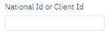
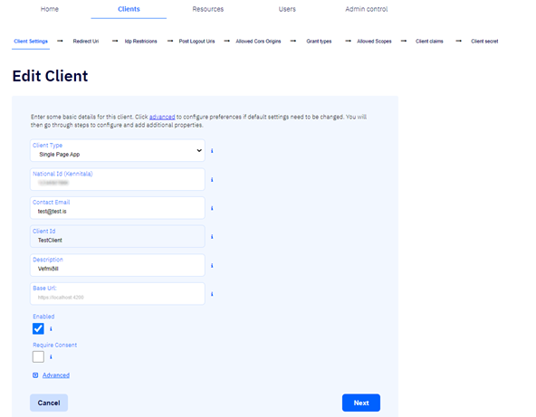
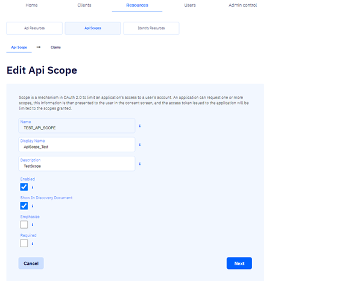
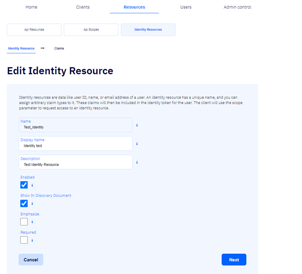
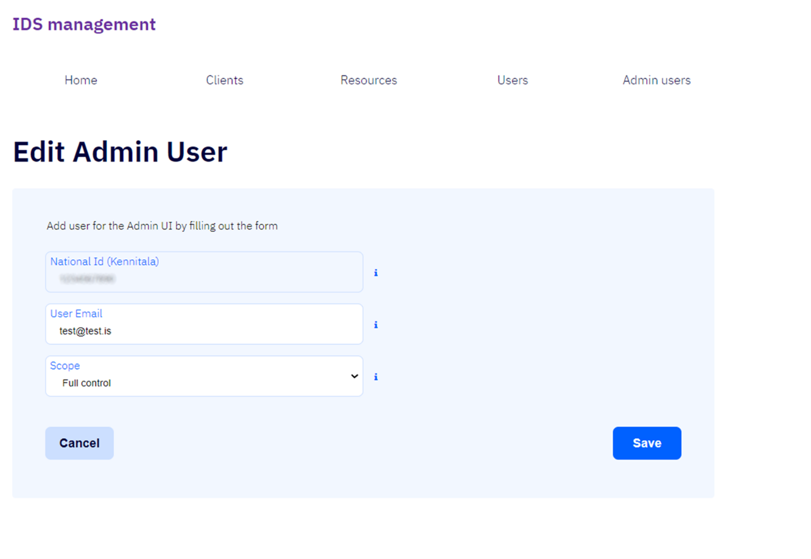
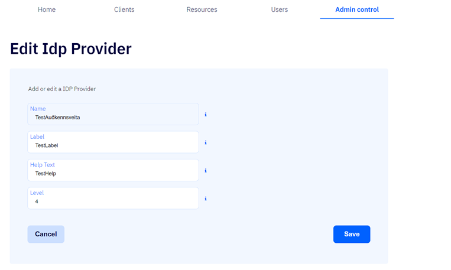

# Common features

## Leita að skráðum aðila

Hægt er að leita að skráðum aðila á upphafssíðu flipa þess aðila sem við á með því að slá inn kennitölu eða nafn viðkomandi aðila í leitarreitinn  og smella á hnappinn
  
Hægt er að leita að [biðlurum](client/README.md), [forritaskilatilföngum](resources/README.md) og [umsjónarmönnum](users/README.md) í viðkomandi flipum.

## Breyta skráðum aðila

Hægt er að breyta skráðum [biðlurum](client/README.md), [forritaskilatilföngum](resources/api-resources.md),
[forritaskilaumföngum](resources/api-scopes.md), [auðkennistilföngum](resources/identity-resources.md) 
og [umsjónarmönnum](users/system-users.md) með því að smella á pennamerki  þeirra hlutar sem á að breyta í viðkomandi lista.\
Við það er farið í upphafsþrep skráningar viðkomandi aðila þar sem hægt er að breyta skráningunni.

## Eyða skráningu

- ### Eyða skráðum aðila

  Hægt er að eyða skráðum [biðlurum](client/README.md), [forritaskilatilföngum](resources/api-resources.md),
  [forritaskilaumföngum](resources/api-scopes.md), [auðkennistilföngum](resources/identity-redsources.md) og
  [umsjónarmönnum](users/system-users.md) með því að smella á ruslatunnumerki 
   þeirra forritaskilatilfanga á listanum sem á að eyða.

- ### Eyða skráðum gildum
  Ef ruslatunnuhnappur  er við hlið skráðs gildis í einhverju þrepi skráningarinnar er hægt að smella á hann til að eyða viðkomandi gildi.\
  Þetta á við um allar tegundir skráningar: [biðlara](client/README.md), 
  [forritaskilatilföng](resources/api-resources.md), 
  [forritaskilaumföng](resources/api-scopes.md), 
  [auðkennistilföng](resources/identity-resources.md) og [umsjónarmenn](users/system-users.md).

## Keyra út / Export

Hægt er að keyra út lista yfir skráða aðila í Excel með því að smella á hnappinn  á viðeigandi lista.\
Bæði er hægt að keyra út lista yfir skráða [biðlara](client/README.md) og [forritaskilatilföng](resources/README.md).

## Útskráning / Logout

Efst í hægra horni þjónustusíðnanna, við hliðina á nafni viðkomandi kerfisnotanda, er hnappurinn \
Ef smellt er á hann skráir notandi sig út úr kerfinu.