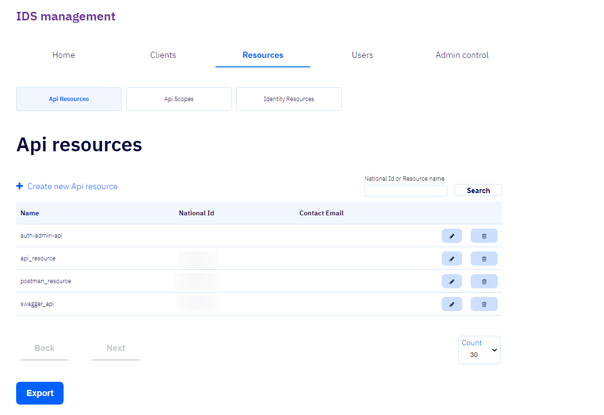
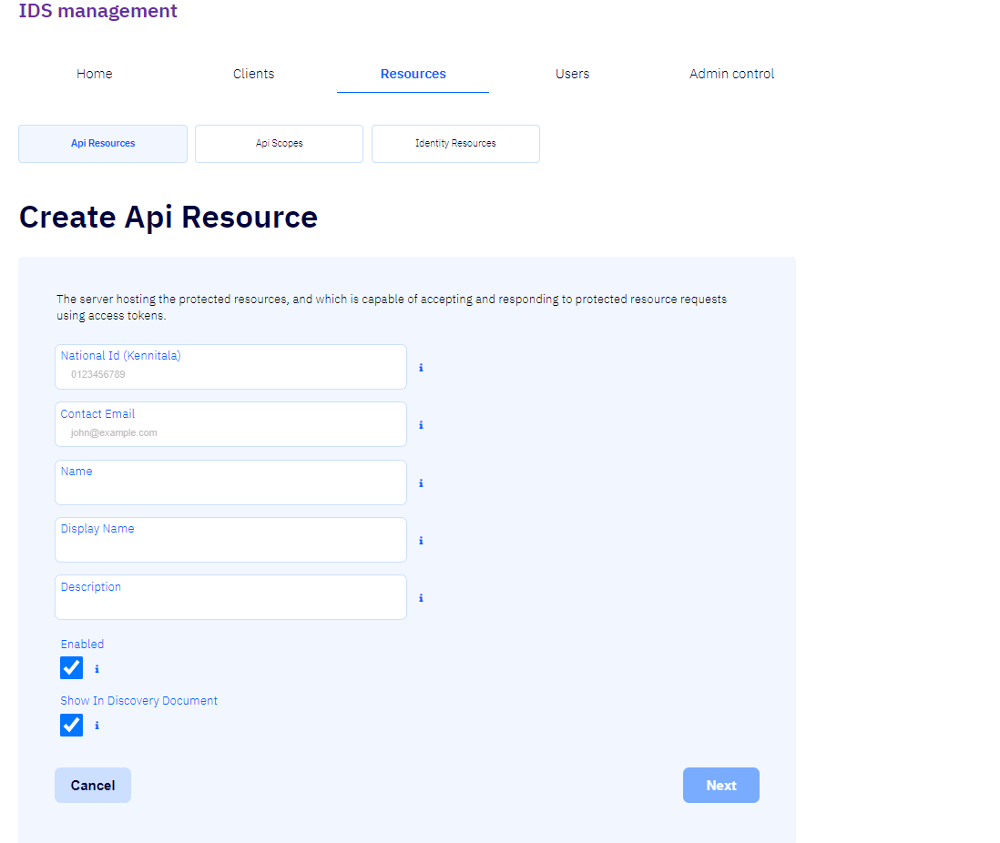
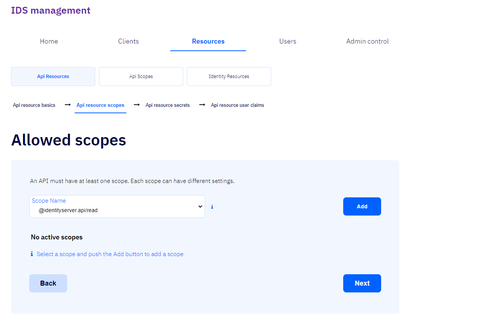
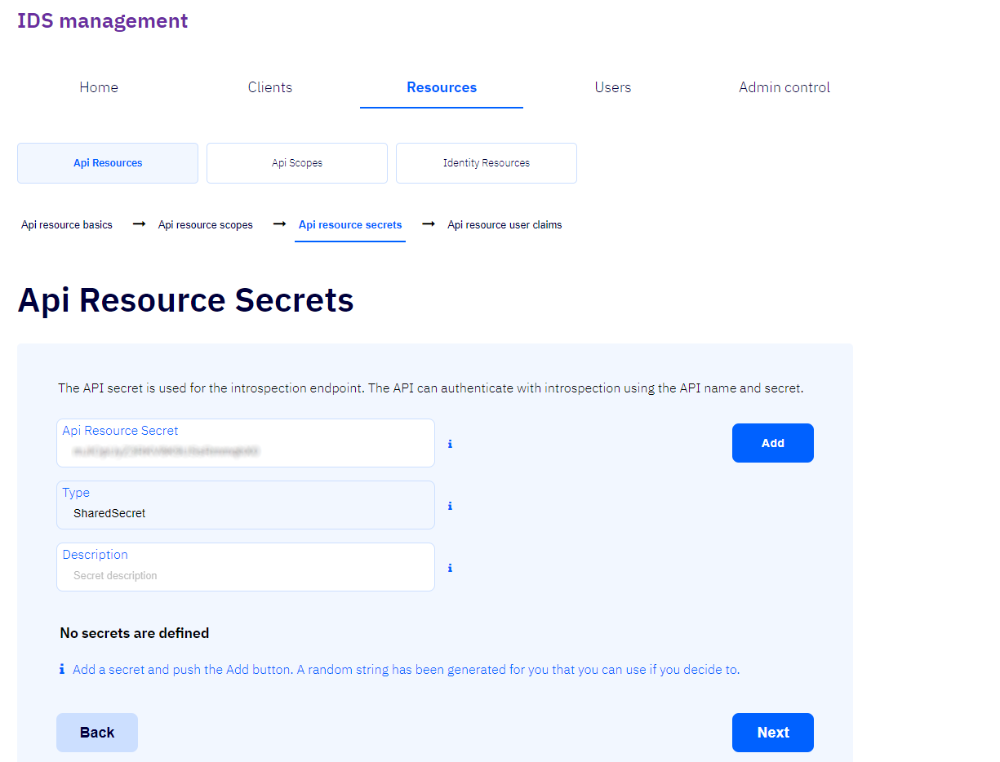
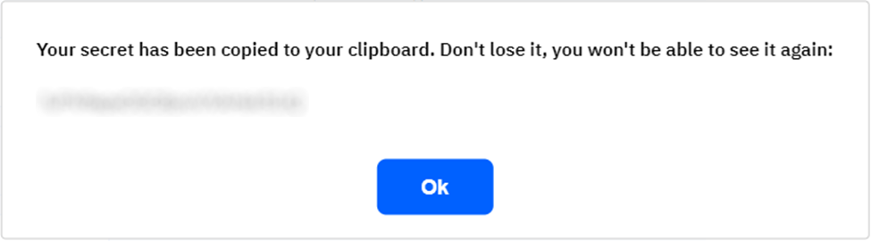
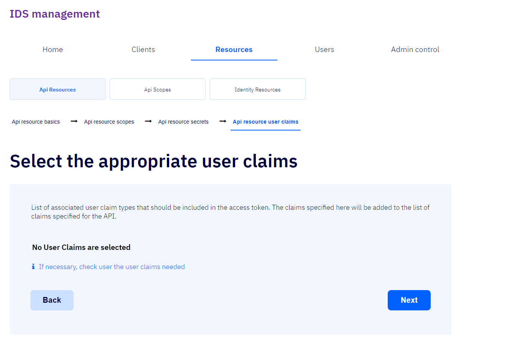
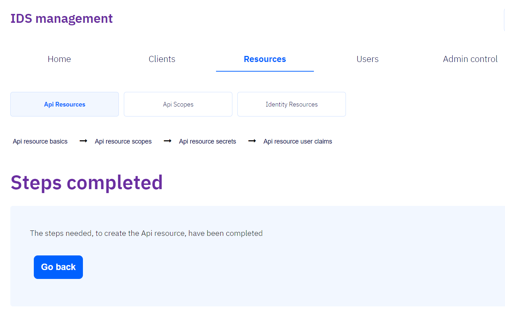

# Api Resources

Til að skrá ný forritaskilatilföng er smellt á [+ Create new Api resource](#create-api-resource).

## + Create Api Resource

Við skráningu nýrra forritaskilatilfanga er nauðsynlegt að fylla út reitina _National Id (Kennitala)_, _Name_ og _Display Name_ en skráning annarra reita er valfrjáls.

- ### National Id (Kennitala)

    Skráð kennitala forritaskilatilfanga.

- ### Name

    Nafn forritaskilatilfanga. Það er notað við auðkenningu og bætt við markhóp [aðgangstókans (e. _accesstoken_)](../concepts.md#access-token).

- ### Display Name

    Nafn forritaskiltilfanga sem birtist í staðfestingarglugga (e._consent screen_).

- ### Description

    Lýsing sem birtist í staðfestingarglugga (e. _consent screen_).

- ### Enabled

    Segir til um hvort tilföngin séu heimiluð og hvort sækja megi um þau.

- ### Show In Discovery Document

    Tilgreinir hvort þessi tilföng séu sýnd í _discovery document_.

- ### Cancel

    Ef smellt er á þennan hnapp er hætt við skráningu nýrra forritaskilatilfanga.

- ### Next

    Ef smellt er á þennan hnapp er farið í næsta þrep skráningarinnar [Api resource scopes](#api-resource-scopes).

## Api resource scopes

Forritaskil þurfa að hafa að minnsta kosti eitt umfang.
Hvert umfang getur haft mismunandi stillingar.
Veljið umfang úr felliboxi og smellið á hnappinn _Add_ til að staðfesta valið.

- ### Scope Name

    Það umfang sem heimilað er þessu forritaskilatilfangi.

- ### Add

    Ef smellt er á þennan hnapp er valið umfang staðfest.

- ### Back

    Ef smellt er á þennan hnapp er farið í fyrsta þrep skráningarinnar:
    [Api resource basic](#create-api-resource).

- ### Next

    Ef smellt er á þennan hnapp er farið í næsta þrep skráningarinnar:
    [Api Resource Secrets](#api-resource-secrets).

## Api Resource Secrets

Huldustrengurinn (e. _Api secret_) er notaður fyrir endapunkt innri skoðunar (e. _introspection_).
Forritaskilin nota nafnið og huldustrenginn við innri skoðun til að auðkenna þau.
Smella þarf á hnappinn _Add_ til þess að staðfesta valinn huldustreng.

- ### Api Resource Secret

    Huldustrengur tilfanganna.  
    Kerfið stingur upp á huldustreng en notandi getur þó breytt honum að vild.  
    Mælt er þó með að hafa huldustrenginn flókinn.

- ### Type

    Tegund huldustrengs.  
    Eina tegundin sem boðið er upp á er tegundin _SharedSecret_.

- ### Description

    Lýsing huldustrengsins.  
    Gera má lýsingu að eigin vali en þó verður að gera einhverja lýsingu þar sem reiturinn má ekki vera auður.

- ### Add

    Ef smellt er á þennan hnapp er huldustrengur staðfestur.  
    Þá birtist aðvörunargluggi sem sýnir huldustrenginn og segir að hann hafi verið afritaður á klippiborðið.

- ### Back

    Ef smellt er á þennan hnapp er farið aftur í annað þrep skráningarinnar [Api resource scopes](#api-resource-scopes).

- ### Next

    Ef smellt er á þennan hnapp er farið í næsta þrep skráningarinnar [Api resource user claims](#api-resource-user-claims).

## Api resource user claims

Hér birtist listi yfir [notendastaðhæfingar (_user claim types_)](../concepts.md#claims) 
sem [aðgangstóki (_access token_)](../concepts.md#access-token) þessara forritaskilatilfanga á að
innihalda.  
Notendastaðhæfingarnar sem hér eru tilgreindar verður bætt við þær notendastaðhæfingar sem ætlaðar eru þessum forritaskilum.

- ### Back

    Ef smellt er á þennan hnapp er farið aftur aftur á þriðja þrep skráningarinnar [Api Resource Secrets](#api-resource-secrets).

- ### Next

    Ef smellt er á þennan hnapp er skráningarferlinu lokið og farið í lokaþrep forritaskilatilfanganna [Steps completed](#steps-completed)

## Steps completed

Þetta er lokaþrep skráningar forritaskilatilfanganna.  
Ef smellt er á hnappinn _Go back_ er farið aftur á
[upphafsþrep skráningar forritaskilatilfanganna](#create-api-resource).

- ### Go back

    Ef smellt er á þennan hnapp er farið aftur á upphafsþrep skráningar forritaskilatilfanganna [Api resource](#resources).