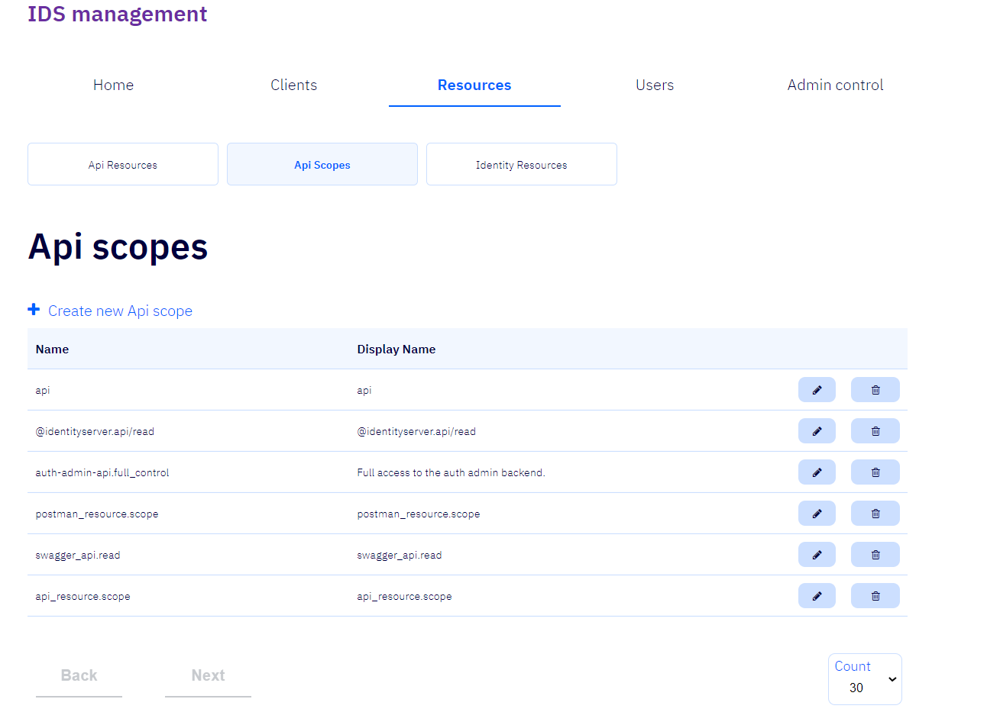
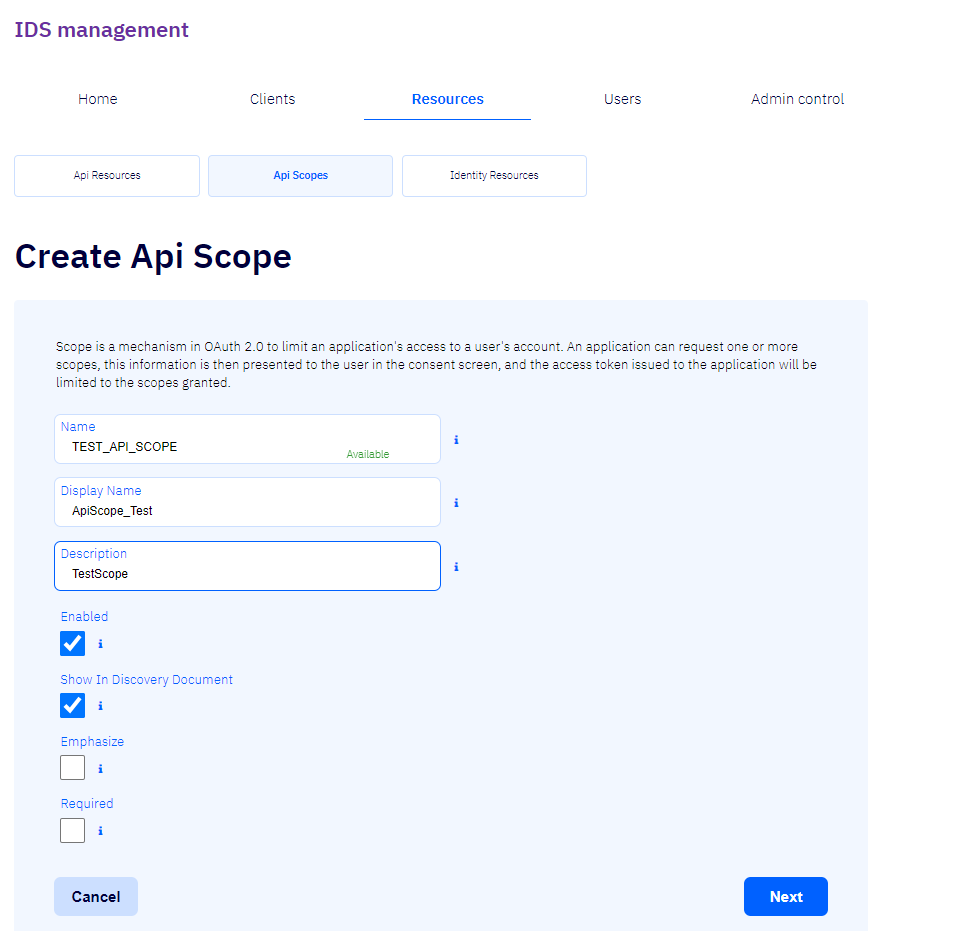
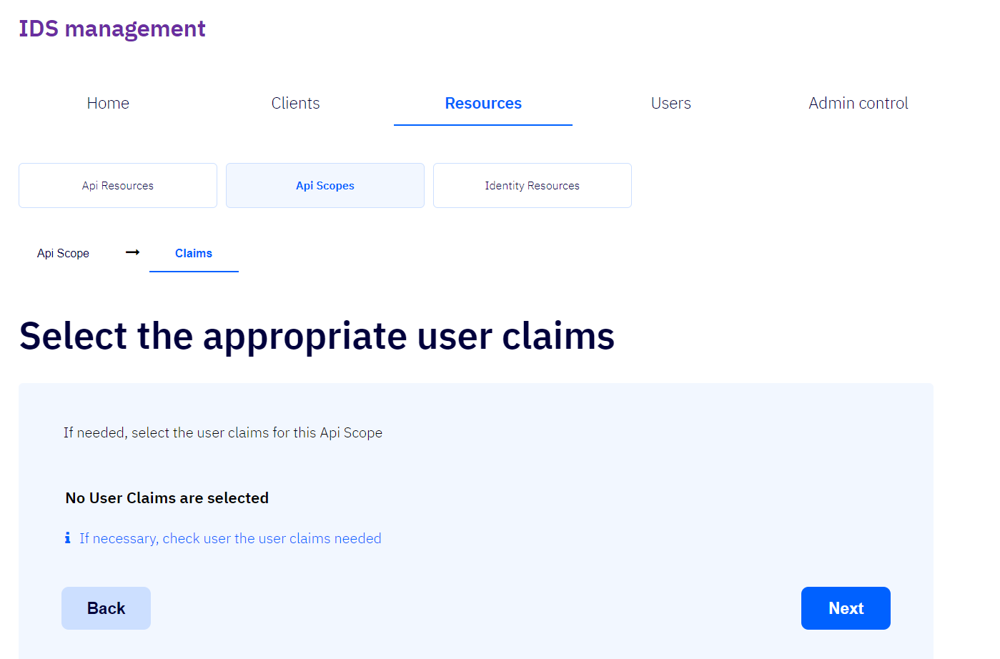
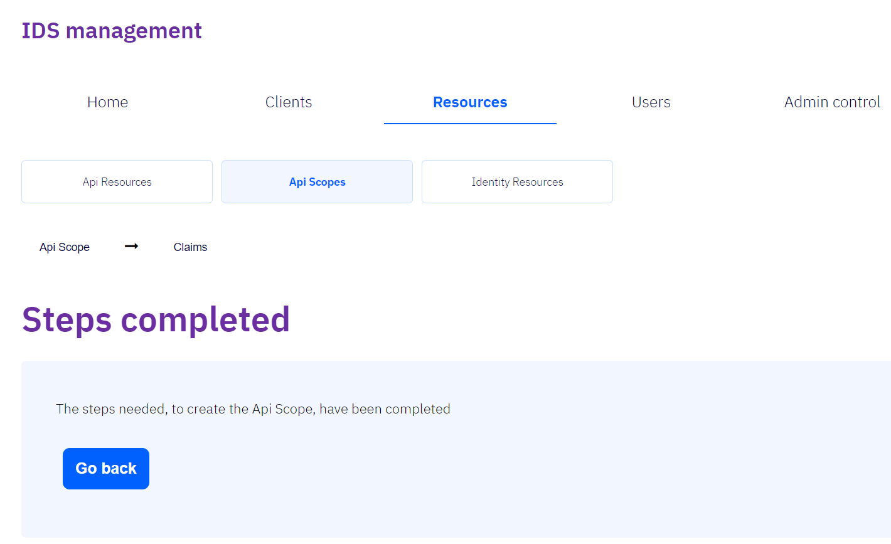

# API Scopes

Umfang eru virkni sem takmarkar aðgang biðlara að reikningum
notenda en biðlari getur sótt um eitt eða fleiri umfang.  
Til að skrá ný forritaskilaumfang er smellt á [+ Create new Api scope](#create-new-api-scope).

## + Create new Api scope

Fylla þarf út reitina _Name_ og _Display Name_, fylla má út reitinn _Description_ og haka má við reitina
_Enabled_, _Show in Discovery Document_, _Emphasize_ og _Required_.

- ### Name / Nafn

  Nafn umfangsins.  
   Biðlarinn mun nota þetta gildi í umfangsstika (_scope parameter_) sínum þegar hann biður um leyfistegund / tóka.

- ### Display name / Birtingarnafn

  Gildi birtingarnafnsins getur til dæmis verið notað í staðfestingarglugganum (_consent screen_).

- ### Description / Lýsing

  Gildi lýsingarinnar getur til dæmis verið notað í staðfestingarglugganum (_consent screen_).

- ### Enabled / Heimilað

  Ef hakað er við þennan reit er _umfang viðkomandi forritaskila_ heimilað.  
   Sjálfgefið er hakað við þennan reit.

- ### Show In Discovery Document

  Ef hakað er við þennan reit verður _umfang viðkomandi forritaskila_ sýnt í uppgötvunarskjalinu (_discovery document_).  
   Sjálfgefið er hakað við þennan reit.

- ### Emphasize

  Ef hakað er við þennan reit mun staðfestingarglugginn (_consent screen_) leggja áherslu (_emphasize_) á umfang þessara forritaskila (þ.e.a.s. ef staðfestingarglugginn notast á annað borð við slíkan eiginleika).  
   Mælt er með að nota þessa stillingu fyrir sérstaklega viðkvæm og mikilvæg umföng.

- ### Required

  Ef hakað er við þennan reit mun notandi geta afvalið viðkomandi forritaskilaumfang í staðfestingarglugganum (_consent screen_),
  þ.e.a.s. ef staðfestingarglugginn notast á annað borð við slíkan eiginleika.

- ### Cancel

  Ef smellt er á þennan hnapp er hætt við skráningu nýs _forritaskilaumfangs_.

- ### Next

  Ef smellt er á þennan hnapp er farið í annað þrep skráningarinnar [Claims](#claims).

## Claims

Hér er hægt að velja [notendastaðhæfingar (_user claims_)](../concepts.md#claims) viðkomandi umfangs.
Hakað er við þær notendastaðhæfingar sem þörf er á að nota.

- ### Back

  Ef smellt er á þennan hnapp er farið aftur aftur í upphafsþrep skráningarinnar
  [Api Scope](#create-new-api-scope).

- ### Next

  Ef smellt er á þennan hnapp er skráningarferlinu lokið og farið í lokþrep forritaskilatilfanganna
  [Steps completed](#steps-completed)

## Steps completed

Þetta er lokaþrep skráningar forritaskilatilfanganna.
Ef smellt er á hnappinn _Go back_ er farið aftur á
upphafsþrep skráningar forritaskilaumfangsins.

- ### Go back

  Ef smellt er á þennan hnapp er farið aftur á upphafsþrep skráningar forritaskilaumfangsins: [Api Scope](#create-new-api-scope).
