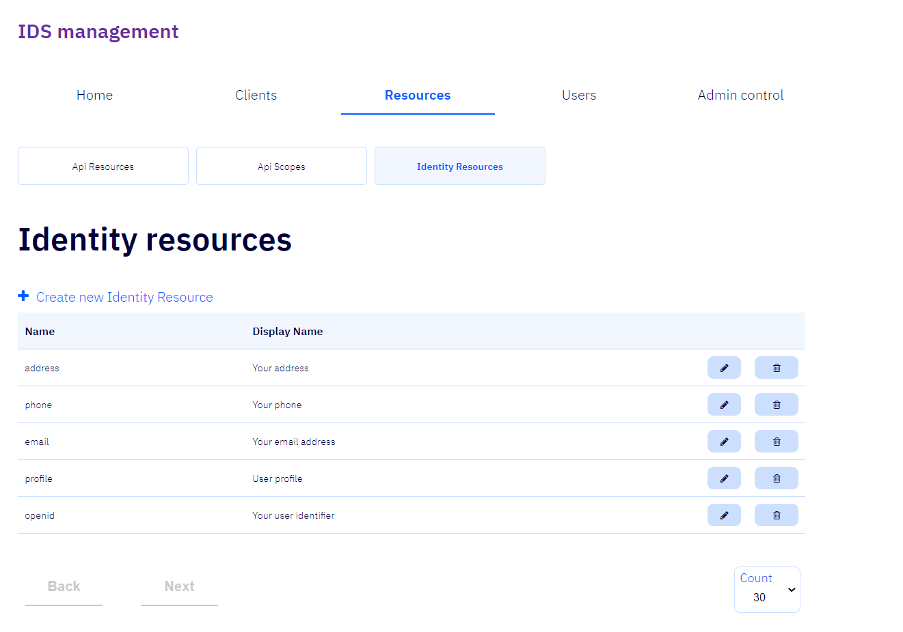
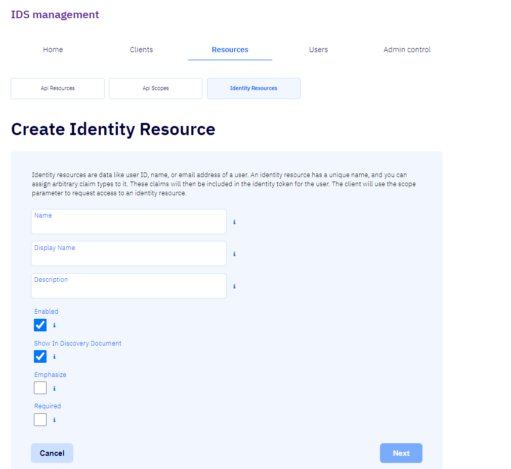
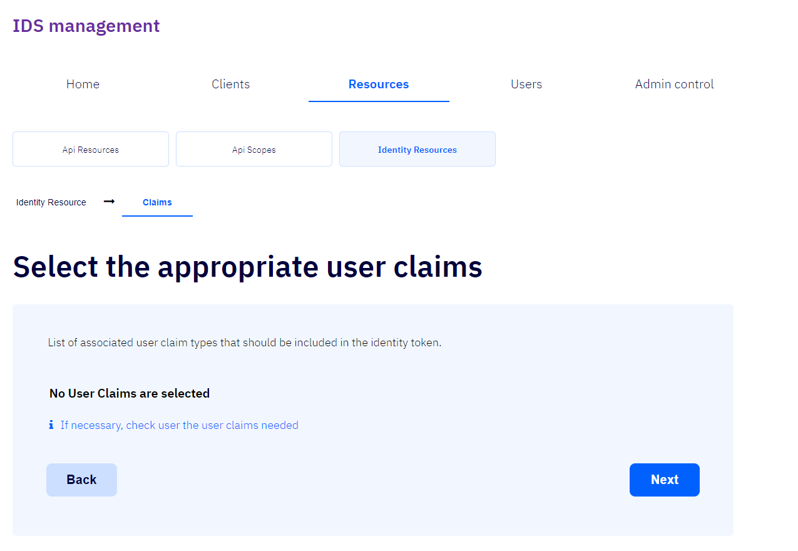
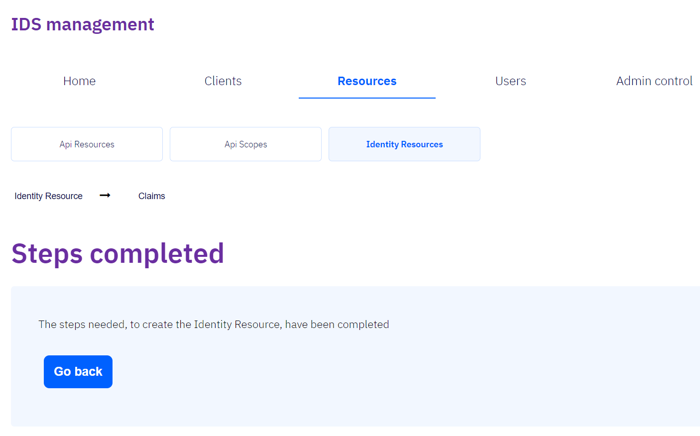

# Identity resources, auðkennistilföng

Auðkennistilföngin eru gögn sem auðkenna notendur, t.d. kennitölur, nöfn og netföng.  
Til að skrá ný auðkennistilföng er smellt á _+ Create new Identity resource_.

### + Create new Identity resource

Fylla þarf út reitina _Name_ og _Display Name_, fylla má út reitinn _Description_ og haka má við reitina
_Enabled_, _Show in Discovery Document_, _Emphasize_ og _Required_.

### Name / Nafn

Nafn auðkennistilfanganna.  
Biðlarinn mun nota þetta gildi í umfangsstika (_scope parameter_) sínum þegar hann biður um 
[leyfistegund](../concepts.md#grant-type).

### Display name / Birtingarnafn

Gildi birtingarnafnsins getur til dæmis verið notað í staðfestingarglugganum (_consent screen_).

### Description / Lýsing

Gildi lýsingarinnar getur til dæmis verið notað í staðfestingarglugganum (_consent screen_).

### Enabled / Heimilað

Ef hakað er við þennan reit eru _auðkennistilföng viðkomandi forritaskila_ heimiluð.  
Sjálfgefið er hakað við þennan reit.

### Show In Discovery Document

Ef hakað er við þennan reit verður [umfang viðkomandi forritaskila](api-scopes.md) sýnd í uppgötvunarskjalinu (_discovery document_).  
Sjálfgefið er hakað við þennan reit.

### Emphasize

Ef hakað er við þennan reit mun staðfestingarglugginn (_consent screen_) leggja áherslu (_emphasize_) á [umfang þessara forritaskila](api-scopes.md) 
(þ.e.a.s. ef staðfestingarglugginn notast á annað borð við slíkan eiginleika).
Mælt er með að nota þessa stillingu fyrir sérstaklega viðkvæm og mikilvæg umfang.

### Required

Ef hakað er við þennan reit mun notandi geta afvalið viðkomandi [umfang](api-scopes.md) í staðfestingarglugganum (_consent screen_), þ.e.a.s. ef staðfestingarglugginn notast á annað borð við slíkan eiginleika.

### Cancel

Ef smellt er á þennan hnapp er hætt við skráningu nýrra auðkennistilfanga.

### Next

Ef smellt er á þennan hnapp er farið í næsta þrep skráningarinnar [Claims](#claims).

## Claims

Hér er hægt að velja [notendastaðhæfingar (_user claims_)](../concepts.md#claims) viðkomandi auðkennistilfanga. Hakað er við þær notendastaðhæfingar sem þörf er á að nota.

### Back

Ef smellt er á þennan hnapp er farið aftur aftur í upphafsþrep skráningarinnar 
[Identity Resource](#identity-resources).

### Next

Ef smellt er á þennan hnapp er skráningarferlinu lokið og farið í lokþrep forritaskilatilfanganna 
[Steps completed](#steps-completed)

## Steps completed

Þetta er lokaþrep skráningar forritaskilatilfanganna.

### Go back

Ef smellt er á þennan hnapp er farið aftur á upphafsþrep skráningar auðkennistilfanganna: [Identity Resource](#identity-resources).
