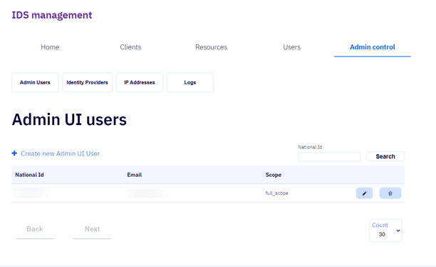
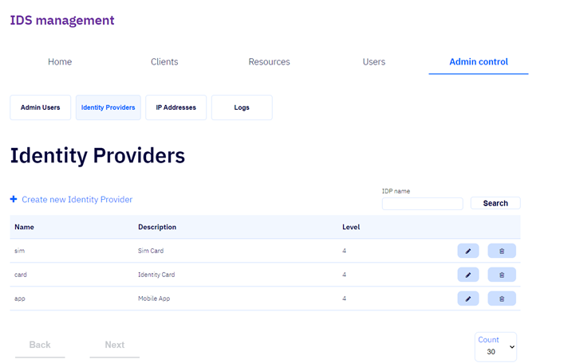
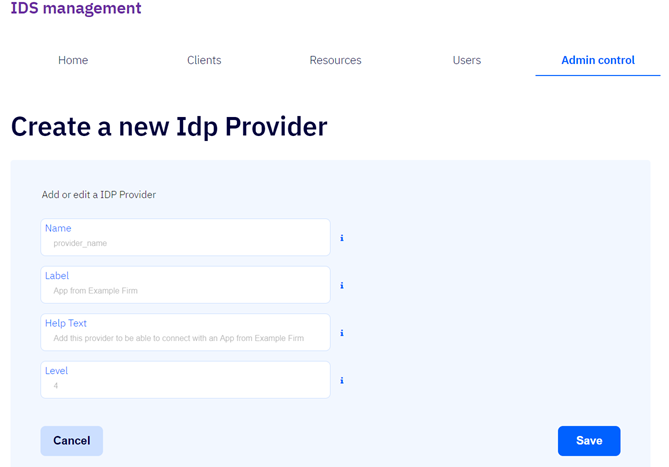

# Admin control

Umsjónarmenn þjónustusíðna eru þeir sem hafa aðgang að þjónustusíðunum.
Í þessum flipa er hægt að hafa stýra fjórum þáttum kerfisins  
[Admin Users](#admin-users)  
[Identity Providers](#identity-providers)  
[IP Addresses](#ip-adresses)  
[Logs](#logs)  

## Admin users / Umsjónarmenn þjónustsíðna

Í þessum flipa er hægt að sjá lista yfir skráða umsjónarmenn þjónustusíðnanna og skrá nýja umsjónarmenn með því að smella á
hnappinn _+ Create new Admin UI User_.

### + Create new Admin UI User

Fylla þarf út reitina _National Id (Kennitala)_ og User Email_ en
reiturinn _Scope_ er með sjálfgefið gildi sem ekki er hægt að
skipta um.

- #### National Id / Kennitala

  Skráð kennitala umsjónarmanns (e. admin user)

- #### User email

  Netfang umsjónarmanns

- #### Scope

  Umfang (e. scope) aðgangs umsjónarmannsins, m.ö.o. hversu mikinn aðgang
  tiltekinn umsjónarmaður hefur.
  Sjálfgefið gildi í þessum reit er _Full control_ og er hvorki hægt að
  eyða því né velja annað gildi.

- #### Cancel

  Ef smellt er á þennan hnapp er hætt við skráningu umsjónarmanns og
  farið aftur í flipann [Umsjónarmenn / Admin
  users](#admin-users).

- #### Save
  Ef smellt er á þennan hnapp er skráður umsjónarmaður vistaður og farið
  aftur í flipann [Umsjónarmenn / Admin users](#admin-users).

## Identity providers / Auðkennisveitur

Í þessum flipa er hægt að sjá lista yfir skráðar auðkennisveitur og skrá nýjar auðkennisveitur með því að smella á hnappinn _+ Create new Identity Provider_.

### + Create new Identity Provider

Fylla þarf út alla reitina: _Name_, _Label_, _HelpText_ og _Level_.

- #### Name

  Nafn auðkennisveitunnar.  
  Nafnið má hvorki innihalda stafabil né tákn

- #### Label

  Stutt lýsing á þessari auðkennisveitu.  
  Lýsingin mun birtast í [Idp restrictions](../client/edit/README.md#idp-restrictions).

- #### Help text

  Textinn sem hér er skráður inn mun birtast sem hjálpartexti fyrir þessa auðkennisveitu í [Idp restrictions](../client/edit/README.md#idp-restrictions).

- #### Level

  [Öryggisstig](../concepts.md#security-level) þessarar auðkennisveitu.  
  Skrá verður gildi frá 1 og upp í 4.
  4 er hæsta öryggisstigið og 1 það lægsta.

## Ip Adresses

Þessi flipi er enn í vinnslu

## Logs

Í þessum flipa er hægt að fá aðgang að loggum úr innskráningarkerfinu
frá loggunarkerfinu [Datadog](https://app.datadoghq.eu/logs?cols=core_host%2Ccore_service&from_ts=1603725071881&index=&live=true&messageDisplay=expanded-md&query=kube_namespace%3Aidentity-server%20service%3Aauth-admin-web&stream_sort=desc&to_ts=1603725971881)

