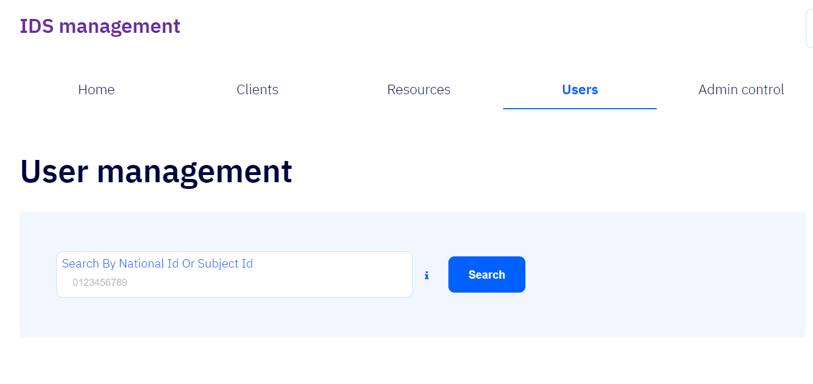
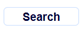

# System Users

Í þessum flipa er hægt að leita að skráðum notanda í kerfinu með því að fylla út reitinn _Search By National Id Or Subject Id_ og smella á hnappinn _Search_  

- ## Search By National Id Or Subject Id

  Í þennan reit er ýmist slegin kennitala notenda(_national  Id_) eða _notandaauðkenni notanda (_User Identity subject Id_)_.  
  Kennitala þarf að vera nákvæmlega 10 tölustafir.  
  Ef skráð gildi uppfyllir ekki skilyrði fyrir kennitölu leitar kerfið eftir notendaauðkenni notanda.  

  

- ## Search
  Þegar smellt er á þennan hnapp birtast niðurstöður leitarinnar  
  
  
