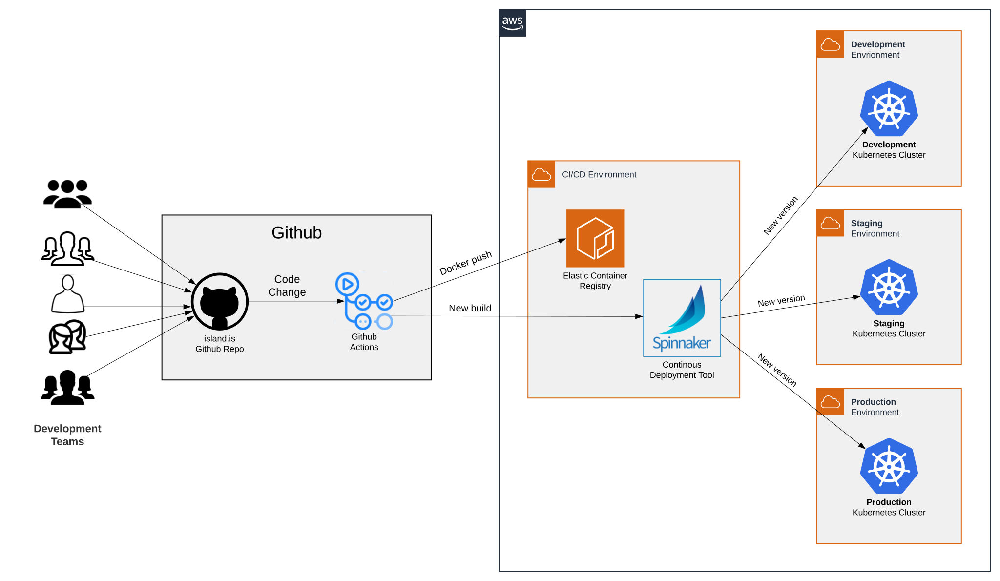

# Continuous Delivery

## What is Continuous Delivery(CD)

The first paragraph from [continuousdelivery.com](https://continuousdelivery.com/#main)


Continuous Delivery is the ability to get changes of all types—including new features, configuration changes, bug fixes and experiments—into production, or into the hands of users, _safely_ and _quickly_ in a _sustainable_ way.


## Why do CD

Top three reasons:

- Lower risk of changes - By delivering smaller changes to production and exercising the deployment process many times a day, we significantly lower the risk of quality regression or unexpected deployment hurdles.
- Faster time-to-market - We often have emergency applications that need to get deployed in production under quite tight deadlines. Having a safe delivery pipeline makes this possible.
- Higher quality - by running our ever-growing regression test suites after every change in the code, we make sure we do not take a step backwards quality-wise.

## Process overview

## Continuous Integration(CI)

CI is an integral part of the CD. It ensures the quality of the code and packages the assets, making them ready for deployment.

We trigger the CI process for all GitHub Pull Requests targeting the `main` branch without publishing assets. We trigger the CI process and publish the assets when making changes to `main` and `release/**` branches.

We lint the code, check the formatting of the code, perform Node modules vulnerability scan, run the unit and integration tests, run the end-to-end tests (results recorded to cypress.io: https://dashboard.cypress.io/projects/4q7jz8/) and finally, if successful, we package the code and assets. You can find a sample script to run the process for an app of your choosing [here](https://github.com/island-is/island.is/blob/main/scripts/ci). To find out more about the thinking around the CI process, please see the [ADR](../adr/0002-continuous-integration.md).

Code and assets from [island.is](https://github.com/island-is/island.is) are packaged in Docker containers and stored in a private Docker registry hosted in AWS [ECR](https://aws.amazon.com/ecr/). The [ECR](https://aws.amazon.com/ecr/) is configured to perform [vulnerability scanning](https://docs.aws.amazon.com/AmazonECR/latest/userguide/image-scanning.html) of all Docker images pushed to it.

When the CI process finishes successfully and has published assets, we trigger the Delivery pipeline to the Dev environment.

## Configuration

Our deployment platform is Kubernetes and our applications' deployment and configuration is specified using [Helm](https://helm.sh). Additionally, we have the configuration for our infrastructure in AWS specified using [Terraform](https://www.terraform.io). These two configuration sources are hosted in two separate git repositories with restricted access.

## Delivery pipeline

We use [Spinnaker](https://spinnaker.io) as a deployment tool for Kubernetes. We have a few application pipelines that are identical for the most part.

Each application has a pipeline per deployment environment. The pipeline prepares (aka `bakes`) the configuration for the concrete environment, waits for manual approval of the deployment and then performs the deployment with the freshly baked configuration.

The pipelines are defined and versioned in [our Helm repo](https://github.com/island-is/helm). The input to the pipelines is as follows:

- a Docker image tag - specifies which revision of the code/assets to be deployed.
- a Helm config tag - specifies which revision of the configuration to be deployed.

The [Helm](https://helm.sh) chart stored in our [Chartmuseum](https://chartmuseum.com) comes in as an asset as well as value files containing environmental specific values. Docker tag, value files and helm chart are baked together creating Kubernetes manifest, that can be deployed to a specific environment.

The CI process triggers the pipelines upon a successful build, which automatically deploys to our `Dev` environment. After manual approval, it is possible to deploy to `Staging` and then `Prod` as well.

Our Spinnaker is accessible [here](https://spinnaker.shared.devland.is). Note that to be able to log in, your membership to the island-is github organization must be set to public. You can change that [here](https://github.com/orgs/island-is/people).
