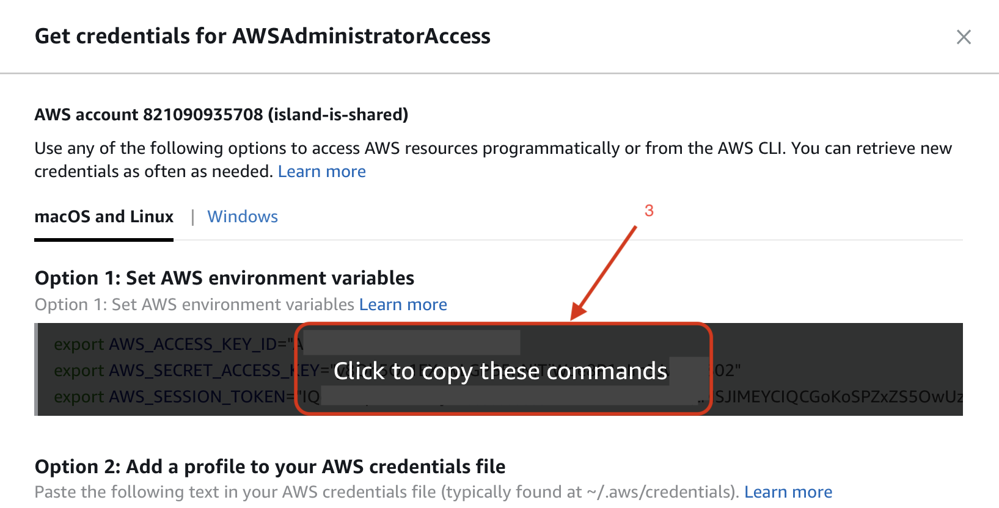

# Dockerizing

## General

The services that you are building need to be packaged as Docker container images. For that, you do not need to write a `Dockerfile` or anything like that. We already have pre-defined types of Docker image packaging that you should use.

## What should I do then?

You need to ask the [DevOps](technical-overview/devops/personas.md#devops) team to create a Docker repository for you, which has the same name your service has in NX. This is an important convention to make everyone's lives easier. Then you need to manually add to [workspace.json](https://github.com/island-is/island.is/blob/master/workspace.json) a target for your service that describes what kind of Docker packaging it needs. For example, adding this target

```json
  "docker-next": {}
```

means your service will be packaged as a NextJS Docker container image. We have support the following types of Docker containers: `docker-next`: suitable for [NextJS](https://nextjs.org/) services. `docker-express`, suitable for [ExpressJS](https://expressjs.com) as well as [NestJS](https://nestjs.com) services. `docker-static`, suitable for serving all types of static content. Suitable for pure HTML or React SPAs.

If you need help just search for "docker" in that file and you should find plenty of examples on how to do it.

That's it.

When you push this change to `master` your Docker image will get built and pushed to our private central Docker registry

## Troubleshooting

_Prerequisite_: Local Docker support

If you are having problems with your application running inside a Docker container you need to download the Docker container and run it locally.

To do that you need to follow this process:

1. Login to our **AWS Shared account** and get command line access settings

   
   

2. Open your terminal and paste the AWS creds from the clipboard
3. Run this to authenticate to our private Docker registry

   ```text
    aws ecr get-login-password --region eu-west-1 | docker login --username AWS --password-stdin 821090935708.dkr.ecr.eu-west-1.amazonaws.com
   ```

4. Now you can poke around in the Docker container like this (Docker image and tag can be retrieved from a few places, depending on where you are starting from - Spinnaker, GitHub CI, Kubenav/Kubernetes)

   ```text
    docker run --rm -it --entrypoint=sh 821090935708.dkr.ecr.eu-west-1.amazonaws.com/<image>:<tag>
   ```
