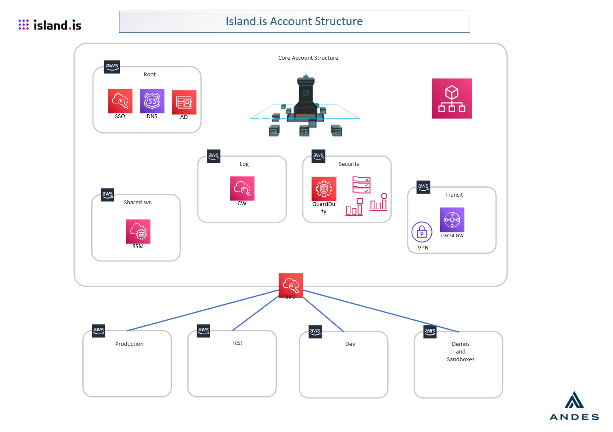

# Environment setup

1. Data center
2. Kubernetes
3. Databases
4. Queues
5. Applications

## Data center

### General info

We are currently running our operation in AWS exclusively. We utilize the [fully managed Kubernetes service](https://aws.amazon.com/eks/) as well as other database and messaging services that AWS provides.

We use the `eu-west-1` region (Ireland) for two reasons

- EU regulations regarding data co-location
- Network latency to Iceland

We provision all AWS resources in three Availability Zones so that failure in one of them does not impact our operations. This is also true for the Kubernetes cluster as well.

### Structure

This structure is based on the guidance coming from a service that helps us plan and control the AWS cloud structure - [AWS Control Tower](https://aws.amazon.com/controltower/).


If you’re an organization with multiple AWS accounts and teams, cloud setup and governance can be complex and time-consuming, slowing down the very innovation you’re trying to speed up. AWS Control Tower provides the easiest way to set up and govern a new, secure, multi-account AWS environment based on best practices established through AWS’ experience working with thousands of enterprises as they move to the cloud.

> 

A few notes about the diagram:

- Dedicated log account where all logs from all AWS accounts are streamed to. This is _append-only_ log so no one has the authority to change what has happened
- Shared services account - here we run the infrastructure that is common or needs access to the user-facing accounts(Production/Test/Dev/etc.).
- Transit account - used to control routing of network traffic between the different AWS accounts. Additionally we can add routing to VPN connections. VPN connections might come in handy if we need to connect our cloud setup with on-premise data centers.
- Security account - used for forensics and auditing.
- Production/Test/Dev/etc. accounts - used for deploying our applications. These are what we call our "environments" - "Dev environment", "Prod environment", etc. Here we provision the bulk of our workloads - Kubernetes, databases, queues, etc. Those are not shared between accounts.

## Kubernetes

We use [Kubernetes](https://kubernetes.io) to schedule and run containerized applications. It is the main pillar in our operations and as such it conforms to all of [our base principles](operations-base-principles.md).

A few notes here:

- Networking
  - public subnet - an Internet-facing network. There is very little that we provision here since this is a harsh place to be. Notably Load balancers and NAT Gateways are provisioned here.
  - private subnet - only accessible from the public subnet. This is where we run our Kubernetes cluster. Workloads running here have access to the Internet by means of a NAT Gateway.
  - database subnet - only accessible from the private subnet. No Internet access in or out.
- Security
  - AWS WAF
    - protection against [common web-based attacks](https://owasp.org/www-project-top-ten/)
    - IP-based filtering

## Databases

We use fully managed AWS database services. Although AWS offers a wide variety of databases we limit ourselves to a small subset of those where we have deeper expertise in managing and troubleshooting.

We use the following databases as of this writing:

| AWS service name  | OSS equivalent | Purpose                     | Application applicability  |
| ----------------- | -------------- | --------------------------- | -------------------------- |
| AWS Aurora        | Postgres       | Relational DB               | `critical`, `non-critical` |
| AWS ElastiCache   | Redis          | In-memory cache and pub/sub | `critical`, `non-critical` |
| AWS Elasticsearch | ElasticSearch  | Document searching          | `critical`, `non-critical` |

## Queues

We use [AWS SQS](https://aws.amazon.com/sqs/) which is a fully managed queue service. This is a proprietary service and protocol so it is not suitable for `critical` applications.

## Applications

We use the term `application` only for service stacks that we deploy to our Kubernetes cluster. These could be in-house developed applications or off-the-shelf ones. Each application needs to be classified in each of these dimensions:

- importance
  - `critical` - this application provides an essential service. Its design decisions must be reviewed by the DevOps team at the inception of the application. It cannot use proprietary tech.
  - `non-critical` - optional service that might take some time to bring on-line in case of a disaster or moving to on-premise
- SLA
  - `personal` - services for individuals. 9-5 and [MTTR](https://en.wikipedia.org/wiki/Mean_time_to_recovery)(mean time to recovery) 5 hours?
  - `business` - services for businesses. 9-5 and MTTR 2 hours?
  - `24/7` - critical service. 24/7 and MTTR 1 hour?
