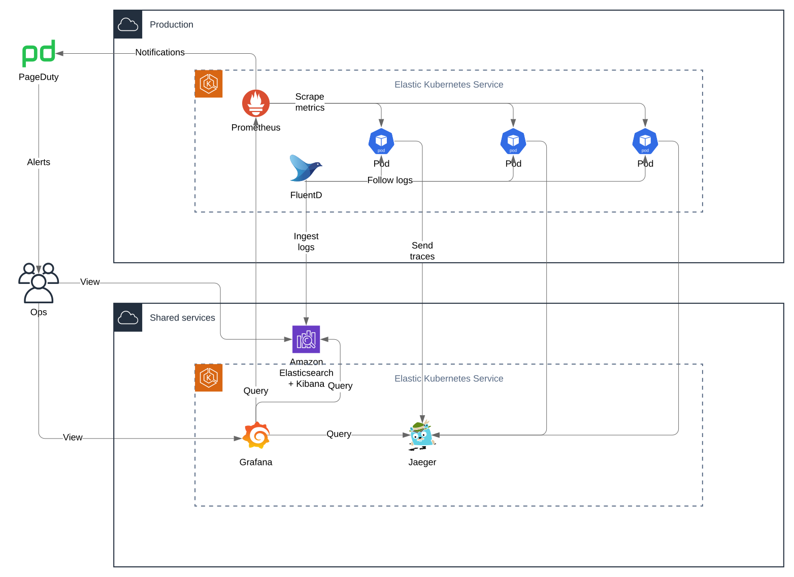

# Observability

## Intro

We need to ensure that the applications stay available and performant once they have been deployed to Production. For that to happen we need all of these things to happen:

- Provide observability into the applications
- Define the boundaries of expected behaviour
- Document applications' components and their maintenance operations
- Application recent change history
- Contact information for dev team emergency contact

### What is observability

Here is a [sample chapter from the book Distributed Systems Observability by Cindy Sridharan](https://www.oreilly.com/library/view/distributed-systems-observability/9781492033431/ch04.html) that talks about the three pillars of observability - logs, metrics and traces. We are starting with these basics and we are planning to add more - stack-trace collecting, deployment events, etc.

### Provide observability into the applications

#### Logs

All AWS services that we use send their logs to AWS CloudWatch. This is in addition to the copy of the logs stored in the AWS Logs account. Additionally, we have an AWS ElasticSearch instance running in our Shared AWS account where we store _all_ logs from _all_ applications running in _all_ our Kubernetes clusters. We have deployed FluentD which takes care of delivering automatically all logs to the central ElasticSearch.

#### Metrics

For storing and querying metrics we use [Prometheus](https://prometheus.io) which is deployed in each Kubernetes cluster and collects metrics from all applications running there. AWS services send their metrics to AWS CloudWatch.

#### Tracing

TBD.

#### Accessing logs, metrics and traces

To search through the logs we use [Kibana](https://kibana.shared.devland.is). It is a web-based UI for ElasticSearch and a powerful way to search logs across different apps running in different environments. But keep in mind that in our current configuration ElasticSearch is storing logs from Kubernetes workloads _only_.

Grafana - TBD.

### Define the boundaries of expected behaviour

When it comes to metrics we need to baseline the correct behaviour. That usually takes a few days, maybe even weeks. Together, the Ops and Dev team can decide the allowed deviation from the baseline behaviour.

### Document applications' components and their maintenance operations

[Ops](technical-overview/devops/personas.md#ops) need to know each application's components, how they interact together as well as interaction with any external services. For example the following information would be really useful:

- component type - web service, web frontend, message processor, etc.
- description - the purpose and responsibilities of this component.
- authentication - the auth model for the service - `user-token`, `service-token`, `none`, etc
- dependencies
  - local
  - external
- operations (routes/paths/etc) - the different entry points into this component. For each operation:
  - description - a short description of the operation
  - path - path, topic, etc. that identify the operation
  - parameters - a list of the parameters
    - name - string
    - type - string
    - required - boolean
  - type - `query`, `modify` or `query-modify` behaviour
  - verb - HTTP verb if applicable
  - examples - could be really helpful to have a few `curl` examples

### Application recent change history

Ops need to have access to the recent history of significant changes for each application. That can provide important clues, helpful for the resolution of an issue.

### Contact information for dev team emergency contact

In case Ops cannot resolve the issue in a timely manner with the available tools and information, they will seek for assistance from the development team that has worked on the application experiencing the issue. The process of handling an issue is described in Handling production issues (TODO missing document)
