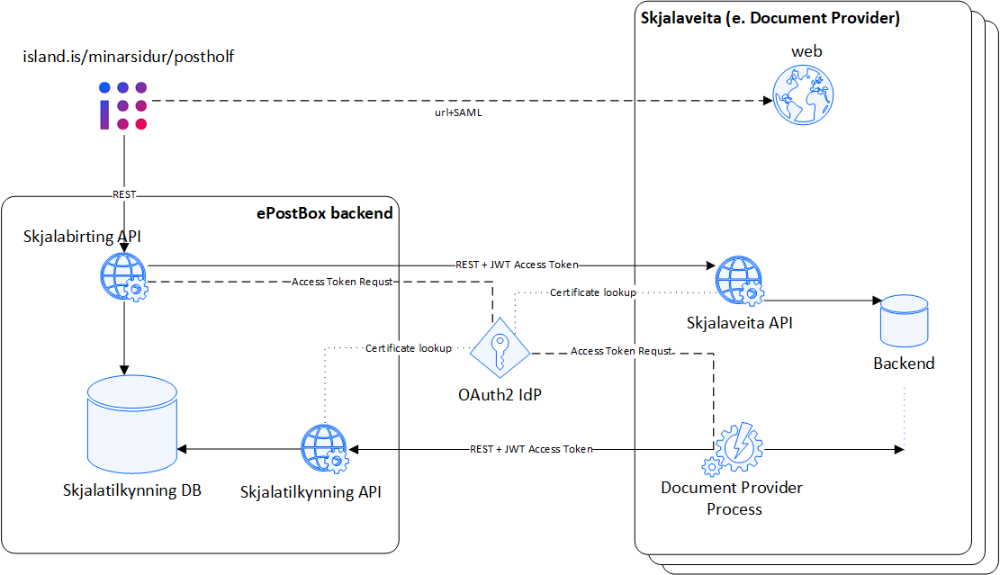

# Introduction

The mailbox (í. Pósthólfið) is a closed area on Ísland.is. It contains and stores documents from the public sector (Document providers) to individuals and companies. Individuals and companies with an Icelandic ID number have their own mailbox.

Communication between island.is and the document provider is through api (Rest). This communication is in both directions. Document providers will need to send island.is reference for new documents that are available for publication on island.is. References (also referred as index or documentindex) link individuals, public entities, and certain documents. The documents themselves are still stored by the documents provider they originate from. Users can then identify themselves on island.is and see a list of documents which belong to them. If the user wants to see the document itself, then the system retrieves the document from the document provider. In other words, the document is only retrieved on user request.

Document providers will therefore need to implement their service (api), which the system has access to. The service needs to be created according to pre-defined interface. Thus, the system will be able to make a homogeneous query on any document provider where the endpoint is just different for each document provider.

# Overview

Access Tokens are issued by the same idP for Skjalatilkynning API and Skjalabirting API (i.e., same idP for both directions).