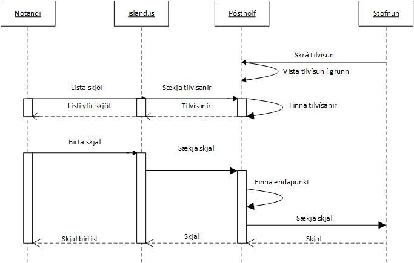

# Skjalaveita API

Service that document providers need to implement. All of the document providers need to implement the same interface. The backend system in island.is will call this service to retrieve document from document provider when a user wants to view the document.

Https communication is required. The backend system will identify itself with JWT in the Authorization header using the Bearer schema. The service MUST validate the signature, issuer, expiry dates, audience and scope

## Document

The operation returns a owner's document. The service should only return a document if the identifier (SkjalId) and owner kennitala matches in the document provider systems.

> GET \$BASE_URL\$/{kennitala}/documents/{documentId}?authenticationType={authenticationType}

Request Paramters:

| Variable           | Type   | Description                                                                                                                                                                                            |
| ------------------ | ------ | ------------------------------------------------------------------------------------------------------------------------------------------------------------------------------------------------------ |
| kennitala          | String | Owners/recipients kennitala.                                                                                                                                                                           |
| documentId         | String | A unique identifier for the reference within the document provider.                                                                                                                                    |
| authenticationType | String | Strength of authentication of the user/recipient of the document. <br />LOW = User/pass <br />SUBSTANTIAL = Two factor authentication (User/Pass and additionally SMS) <br />HIGH = Client Certificate |

Response:

```json
{
  "type": "string",
  "content": "string"
}
```

| Property name | Type                  | Description                                                                                                                                                           |
| ------------- | --------------------- | --------------------------------------------------------------------------------------------------------------------------------------------------------------------- |
| type          | String                | Document form (file ending). For example, pdf, xls, etc. If nothing is given, pdf is the default and recommended if there is not a special reason for something else. |
| content       | Base64Binary (String) | The document/file content base64 encoded.                                                                                                                             |
| **Or**        |                       |
| type          | String                | If set to “url”, island.is will redirect the user to a document delivery site. User is transferred between along with a signed SAML2 xml.                             |
| content       | String                | Url                                                                                                                                                                   |
| **Or**        |                       |
| type          |                       | If set to “html”, page with the html content will be displayed in new tab.                                                                                            |
| content       | String                | Html to display the user. The HTML must contain all "inline" to display. HTML must not contain javascript.                                                            |

# Sequence Diagram

Sequence diagram that describes how island.is retrieves a document and displays the user. This is valid when documents that are in the form of a non-external connection are required, such as pdf.



# Interfaces

4.1 Skjalatilkynning API Swagger

Test http://test-skjalatilkynning-island-is.azurewebsites.net/swagger/ui/index

Production: https://skjalatilkynning-island-is.azurewebsites.net/swagger/ui/index

> GET /api/v1/documentindexes/types

Response:

```json
["string"]
```

| Variable | Type   | Description                                                         |
| -------- | ------ | ------------------------------------------------------------------- |
| []       | String | Document type that can be used when registering document reference. |

## DocumentIndex

A document provider submits(registers) reference to documents. A reference consists of the name of the document, its identifier, owner kennitala (e. icelandic person/corp identity), along with other information. An organization may submit more than one reference that are referring to the same document, e.g. when a couple should see the same document. After the operation, the document becomes visible to the user of the web site(island.is).

> POST /api/v1/documentindexes

Request Body:

```json
[
  {
    "kennitala": "string",
    "documentId": "string",
    "senderKennitala": "string",
    "senderName": "string",
    "authorKennitala": "string",
    "caseId": "string",
    "category": "string",
    "type": "string",
    "subType": "string",
    "subject": "string",
    "documentDate": "datetime",
    "publicationDate": "datetime",
    "notifyOwner": "boolean",
    "minimumAuthenticationType": "string"
  }
]
```

Array of document references. It‘s possible to submit 1-200 references at a time

| Variable                  | Optional | Type       | Description                                                                                                                                                                                                                                                                  |
| ------------------------- | -------- | ---------- | ---------------------------------------------------------------------------------------------------------------------------------------------------------------------------------------------------------------------------------------------------------------------------- |
| kennitala                 | N        | String(10) | Kennitala of the document owner/recipient, that is the one who should see the document.                                                                                                                                                                                      |
| documentId                | N        | String(50) | A unique identifier within a document provider. Used to retrieve a document, when user requests it.                                                                                                                                                                          |
| senderKennitala           | N        | String(10) | Sender kennitala (usually some institution). (A document provider can represent and register documents for many senders)                                                                                                                                                     |
| senderName                | N        | String     | Name of the sender.                                                                                                                                                                                                                                                          |
| authorKennitala           | N        | String(10) | Author kennitala (Usually same as the Sender (KennitalaSendanda))                                                                                                                                                                                                            |
| caseId                    | Y        | String     | Case number within the institution (sender).                                                                                                                                                                                                                                 |
| category                  | N        | String(25) | Document category. Only allowed predefined document categories. The operation SaekjaFlokka (e. GetCategories) returns the types that are available.                                                                                                                          |
| type                      | N        | String(25) | Document type. Only allowed predefined document types. The operation SaekjaTegundir (e. GetTypes) returns the types that are available.                                                                                                                                      |
| subType                   | Y        | String     | Sub-type, selected by a document provider.                                                                                                                                                                                                                                   |
| subject                   | N        | String(80) | Document name or description, free text up to 80 characters.                                                                                                                                                                                                                 |
| documentDate              | N        | Datetime   | Date of document (not publication date).                                                                                                                                                                                                                                     |
| publicationDate           | Y        | Datetime   | Indicates when the document should appear to the user. For example, if the publisher wants to submit a reference tor a document to be published at the next month. If nothing is set, the document is displayed immediately. Date Display may not exceed 60 days in advance. |
| notifyOwner               | Y        | Boolean    | Optional parameter to request the recipient to be notified that he has a new unread document. Default value is false.                                                                                                                                                        |
| minimumAuthenticationType | Y        | String     | Minimum authentication type/strength to open/view the document. The default is LOW. <br />LOW = User/pass <br />SUBSTANTIAL = Two factor authentication (User/Pass and additionally an SMS) <br />HIGH = Client Certificate                                                  |

Response:

```json
[
  {
    "kennitala": "string",
    "documentId": "string",
    "success": true,
    "errors": ["string"]
  }
]
```

| Property   | Type    | Description                                                        |
| ---------- | ------- | ------------------------------------------------------------------ |
| kennitala  | String  | Kennitala of the document owner/recipient.                         |
| documentId | String  | A unique identifier for the reference within the document provider |
| success    | Boolean | Successful                                                         |
| errors[]   | String  | Error messages (only if success=false).                            |

## Withdrawn

Opereration to withdraw document that is no longer available for publication. For example if an error was in the document and the document provider therefore wants to disable the document. The reference to the document will not be removed from the user's list, but will be marked withdrawn. The user sees that it is no longer for display.

> POST /api/v1/documentindexes/withdraw

Request Body:

```json
[
  {
    "kennitala": "string",
    "documentId": "string",
    "reason": "string"
  }
]
```

Array of withdrawn references. It‘s possible to withdraw 1-200 references at a time

| Variable   | Type       | Description                                                                                                           |
| ---------- | ---------- | --------------------------------------------------------------------------------------------------------------------- |
| kennitala  | String(10) | Owner/recipient kennitala.                                                                                            |
| documentId | String     | A unique identifier which was used when the document was registered (for the reference within the document provider). |
| reason     | String     | Reason for withdrawal.                                                                                                |

Response:

```json
[
  {
    "kennitala": "string",
    "documentId": "string",
    "success": true,
    "errors": ["string"]
  }
]
```

| Property   | Type    | Description                                                        |
| ---------- | ------- | ------------------------------------------------------------------ |
| kennitala  | String  | Kennitala of the document owner/recipient.                         |
| documentId | String  | A unique identifier for the reference within the document provider |
| success    | Boolean | Successful                                                         |
| errors[]   | String  | Error messages (only if success=false).                            |

## Read

> POST /api/v1/documentindexes/withdraw

If a document provider has published a document in a location other than island.is, the document can be marked as read. Thus, the user can see that he has opened the document regardless of where he opened it.

Request Body:

```json
[
  {
    "kennitala": "string",
    "documentId": "string"
  }
]
```

It‘s possible to mark 1-200 references as read at a time

| Variable   | Type       | Description                                                                                                           |
| ---------- | ---------- | --------------------------------------------------------------------------------------------------------------------- |
| kennitala  | String(10) | Owner/recipient kennitala.                                                                                            |
| documentId | String     | A unique identifier which was used when the document was registered (for the reference within the document provider). |

Response:

```json
[
  {
    "kennitala": "string",
    "documentId": "string",
    "success": true,
    "errors": ["string"]
  }
]
```

| Property   | Type    | Description                                                        |
| ---------- | ------- | ------------------------------------------------------------------ |
| kennitala  | String  | Kennitala of the document owner/recipient.                         |
| documentId | String  | A unique identifier for the reference within the document provider |
| success    | Boolean | Successful                                                         |
| errors[]   | String  | Error messages (only if success=false).                            |
