# Straumurinn – Notkun Og Umsýsla

## Straumurinn – Notkun og umsýsla

### Hvað er Straumurinn og hvernig gagnast hann

Straumurinn byggir á X-Road, opinni útfærslu gagnaflutningslags sem gerir stofnunum og fyrirtækjum kleift að skiptast á upplýsingum yfir Internetið. X-Road er dreift kerfi, sem lýtur miðlægri stjórn, þar sem veiting og öflun þjónustu er gerð möguleg með stöðluðum og öruggum hætti.

Meðan miðlæg stjórn er höfð með samskipan, skráning þjónusta og sannvottun, þá reka þjónustuveitendur og -neytendur sína eigin öryggisþjóna sem þola truflanir í rekstri miðlægu þjónustanna. X-Road tryggir leynd, heilleika og samvirkni milli aðilia sem eiga í gagnasamskiptum.

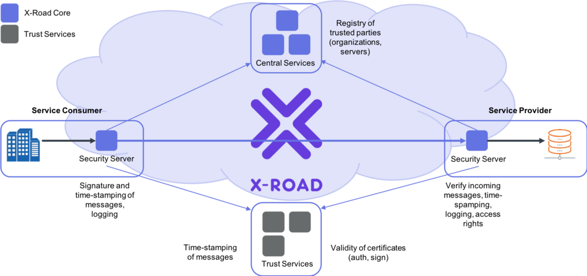

### Vistkerfi Straumsins

Umhverfi Straumsins samanstendur af stofnunum og fyrirtækjum sem hafa sameinast um að nýta sömu X-Road uppsetninguna til að veita og þiggja þjónustu. Umsjónaraðilar Straumsins stýra því hverjum er heimilt að tengjasta þessu samfélagi, ásamt því að setja reglur og viðmið.

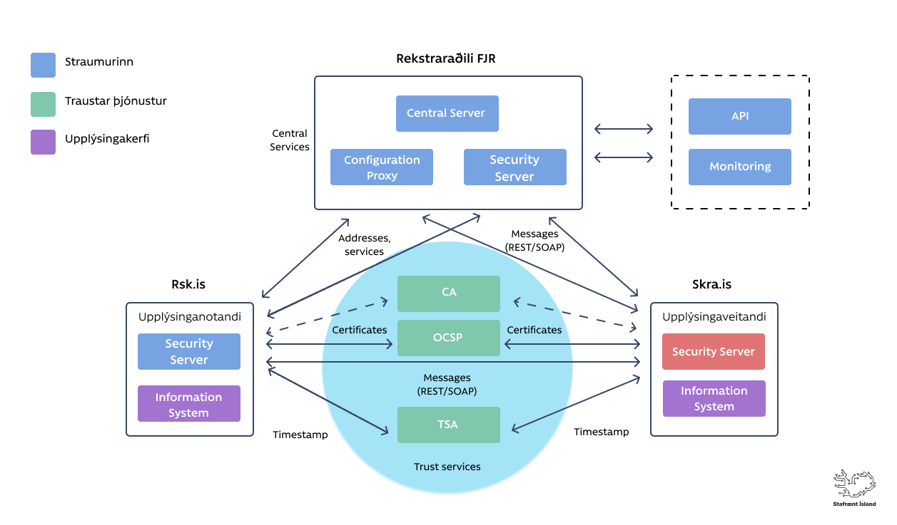

### Traust net

Þó X-Road sé opinn hugbúnaðar, þá er nauðsynlegt að fara í gegnum skráningarferli til að tengjast umhverfi Straumsins. Í þessu ferli er auðkenni hvers aðila og tæknilegir tengipunktar vottuð með skilríkjum sem eru gefin út af miðlægri vottunarstöð \(CA\). Haldið er utan um auðkennin miðlægt en samskipti eiga sér stað beint milli neytenda þjónustu og veitenda.

Beining samskipta byggir á auðkennum aðila og þjónusta, sem er varpað af X-Road yfir á raunverulega staðsetningu þjónustanna á neti. Öll skráning varðandi samskipti er geymd hjá hverjum aðila um sig og þriðju aðilar hafa ekki aðgang að þeim gögnum. Óhrekjanleiki samskipta yfir Strauminn er tryggður með tímastimplum og stafrænum undirskriftum. Samskiptaskrár X-Road er hægt að nota sem sönnunargagn fyrir rétti.


### Aðgangsheimildir

Með X-Road er hægt að stjórna aðgangi að þjónustum. Stjórn aðgangsheimilda byggir á auðkennum aðila og einstakra þjónusta.

Lykilatriði í Straumnum er að þjónustuveitandi eigi sín gögn og hafi stjórn á aðgangi að þeim. Þó þjónusta hafi verið gefin út á Straumnum er ekki þar með sagt að hún sé sjálfkrafa aðgengileg öllum meðlimum hans. Vanalega er aðgangur veittur á grundvelli upplýsingakerfis: Þjónustuveitandi heimilar tilteknu upplýsingakerfi aðgang að tiltekinni þjónustu.

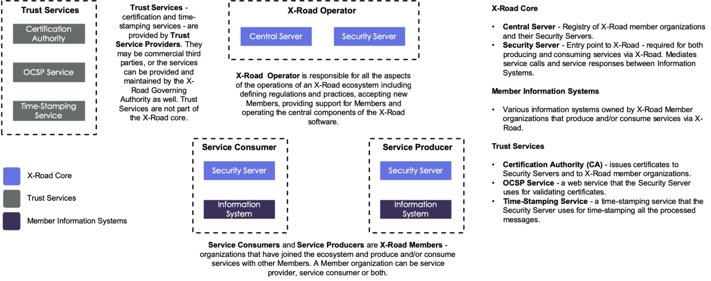

Hlutverk innan umhverfis Straumsins

- frá [https://www.niis.org/blog/2020/3/30/x-road-implementation-models](https://www.niis.org/blog/2020/3/30/x-road-implementation-models)

### Vöktun og skýrslugjöf

X-Road veitir möguleika á vöktun og skýrslugjöf sem er hægt að nýta til að safna gögnum um aðgerðir í umhverfi Straumsins. Upplýsingarnar er hægt að nota til að mæla notkun einstakra þjónusta, öðlast skilning á tengslum milli ólíkra upplýsingakerfa og þjónusta, fylgjast með heilsufari þjónusta, útgáfum X-Road hugbúnaðarins, o.s.frv. Hver aðili Straumsins getur fylgst með sínum gögnum, meðan umsjónaraðilar hafa aðgang að umhverfisgögnum allra aðila.

### Gagnaskipti þvert á landamæri

Í X-Road er innbyggður stuðningur við gagnaskipti yfir landamæri með samtengingu umhverfa. Meðlimir umhverfa sem hafa verið tengd saman geta gefið út og þegið þjónustur sín á milli eins og þeir tilheyri sama vistkerfinu. Þannig er til dæmis hægt að koma á gagnaskiptum milli landa.

## Vefþjónustur í Straumnum

Upplýsingaveitur tengjast Straumnum í formi vefþjónusta, REST eða SOAP, sem eru skráðar í öryggisþjón viðkomandi stofnunar / aðila. Innan öryggisþjóna eru skráð undirkerfi \(e. subsystem\) og vefþjónustur skráðar innan þeirra. Aðgangsheimildir að endapunktum vefþjónusta eru veittar X-Road undirkerfum annarra aðila.

Skráning vefþjónustu í Strauminn felst í því að finna henni stað í undirkerfi \(subsystem\) á vegum viðkomandi aðila / stofnunar. Vefþjónustan er skráð í undirkerfið og aðgangsheimildir veittar öðrum undirkerfum \(annarra aðila\).

### X-Road undirkerfi \(subsystem / client\)

Í umsjónarvefviðmóti X-Road öryggisþjóns er hægt að skrá undirkerfi og senda skráningu þeirra í miðlæga umsýsluhluta Straumsins. Þannig er miðlægt haldið utan um undirkerfi þeirra stofnana sem eru tengdar Straumnum. Uppfletting og leit í skráningu undirkerfa er möguleg frá öryggisþjóni hvers aðila.

Skráning undirkerfis felst í því að velja að bæta við undirkerfi í umsjónarvefviðmótinu: Undir _Clients_ flipanum er smellt á _Add Subsystem_:


Á skjánum sem þá birtist er undirkerfinu gefið nafn samkvæmt nafnavenju undirkerfa Straumsins, sem hefur áhrif á birtingu vefþjónusta undirkerfisins í Viskuausunni – sjá 2.2 _Nafnavenjur Straumsins og skráning vefþjónusta í Viskuausuna_.


Þá er séð til þess að hakað sé við _Register subsystem_ og smellt á hnappinn _Add Subsystem_. Gluggi birtist til staðfestingar skráningu undirkerfisins í miðlæga hluta Straumsins:


### Nafnavenjur Straumsins og skráning vefþjónusta í Viskuausuna

Tæknilega er mögulegt að notast við eitt undirkerfi \(subsystem\) fyrir allar aðgerðir á vegum stofnunar – það gæti þjónað sem bæði biðlari \(client\) og veitandi \(provider\) upplýsinga – en til aðgeiningar og stuðnings við vélræna úrvinnslu Viskuausunnar, þá styðst Straumurinn við nafnavenju í formi viðskeyta í nöfnum undirkerfa, sem gefa til kynna tilgang þeirra:

- &lt;stofnun / kerfisflokkur&gt;**-Protected** Almennar vefþjónustur sem er æskilegt að skráist inn í Viskuausuna, svo aðilar Straumsins geti flett upp á tilvist þeirra, ættu að vera skráðar í undirkerfi með heiti sem endar á „-Protected“.
- &lt;stofnun / kerfisflokkur&gt;**-Client** Þegar upplýsingakerfi stofnunar framkvæma fyrirspurnir yfir Strauminn í vefþjónustur annarra stofnana, þá þurfa þau að tilgreina eigið undirkerfi sem sendir fyrirspurnina fyrir þeirra hönd. Nafn þessa undirkerfis ætti að hafa viðskeytið „-Client“. Þegar aðilar Straumsins veita aðgangsheimildir að sínum vefþjónustum, þá er gefin heimild fyrir undirkerfi viðkomandi stofnunar sem hefur þetta viðskeyti. Engar vefþjónustur eru skráðar í þetta undirkerfi.

Fyrirsjáanlega mun vera algengast að sýsla með þau undirkerfi sem eru nefnd með viðskeytunum hér að ofan. Tvö önnur viðskeyti tilheyra nafnavenjum Straumsins:

- &lt;stofnun / kerfisflokkur&gt;**-Private** Vefþjónustur sem ekki er æskilegt að birtist í leitar- og uppflettingarviðmóti Viskuausunnar er hægt að skrá í undirkerfi nefnd með viðskeytinu „-Private“. Upplýsingaöflun Viskuausunnar mun sniðganga vefþjónustur sem eru skráðar í undirkerfi með þessu viðskeyti.
- &lt;stofnun / kerfisflokkur&gt;**-Public** Vefþjónustur sem hvort tveggja er æskilegt að birtist í uppflettingarviðmóti Viskuausunnar fyrir þjónustur aðgengilegar á Straumnum, sem og í lista yfir vefþjónustur aðgengilegar almenningi í vefþjónustugátt Stafræns Íslands, er hægt að skrá í undirkerfi með viðskeytið „-Public“ í nafni.

Stofnun getur haft fleiri en eitt undirkerfi með hverju viðskeyti: Ef til dæmis stofnun heldur utan um tvo ólíka flokka vefþjónusta, þá mætti velja að skrá vefþjónusturnar í tvö undirkerfi, hvort með viðskeytinu „-Protected“. Dæmi:

skatturinn-vsk-protected  
skatturinn-stadgreidsla-protected  
skattturinn-fyrirtaekjaskra-protected

Nafnavenjur Straumsins eru óháðar stafsetum \(e. case insensitive\). Undirkerfi getur til dæmis verið nefnt: island-is-client.

Ef ekkert af ofangreindum viðskeytum eru í nafni undirkerfis, þá fara vefþjónustur þess að sjálfgefnu í vörulista Viskuausunnar.

### Skráning vefþjónustu

Vefþjónustur eru skráðar innan undirkerfis með því að velja _Services_ flipann undir _Clients_ flipanum. Þar undir eru hnappar til að skrá annað hvort REST eða SOAP \(WSDL\) vefþjónustur:


Við skráningu á REST vefþjónustu þarf að gefa upp nafn vefþjónustunnar, eða endapunktsins, _Service Code_ \(nöfn endapunkta koma sjálfkrafa inn tilfelli SOAP þjónusta út frá WSDL skilgreiningu\). Nafnavenja er að Service Code endi á „-vN“ þar sem N er viðkomandi útgáfunúmer þjónustunnar, til dæmis: fasteignaskra-v1.


**Virkjun vefþjónustu**

Þegar vefþjónusta hefur verið skráð, þá þarf að virkja hana sérstaklega, með því að smella á rofa við skráningu vefþjónustunnar. Með þessum rofa er þá líka hægt að taka afvirkja vefþjónustur, t.d. vegna viðhalds, og þá svarar X-Road öryggisþjónnin með _Out of Order_ skilaboðum við beiðnum til vefþjónustunnar.

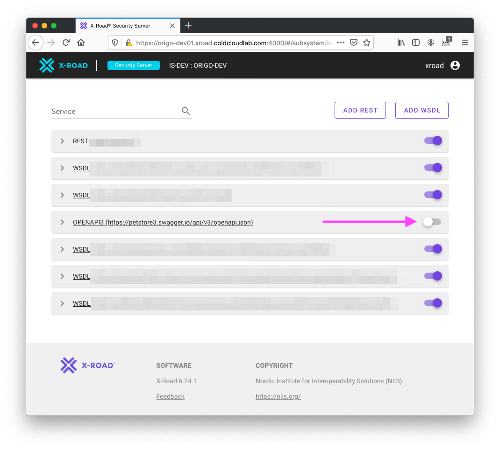

### Aðgangsheimildir að vefþjónustum eða stökum endapunktum

Aðgangsstýringu einstakra vefþjónusta er hægt að nálgast með því að smella á nafn vefþjónustu, _Service Code,_ undir _Services_ flipa viðkomandi undirkerfis:

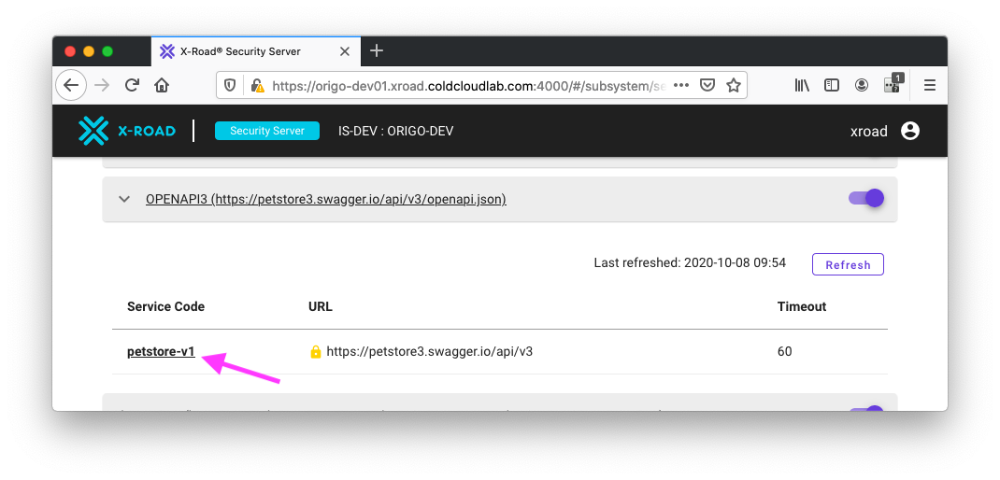

Á skráningarskjá vefþjónustunnar er að finna hnappinn _Add Subjects_:


_Add Subjects_ hnappurinn sprettir upp leitarglugga þar sem er hægt að finna þau undirkerfi sem skal veita aðgang að vefþjónustunni:

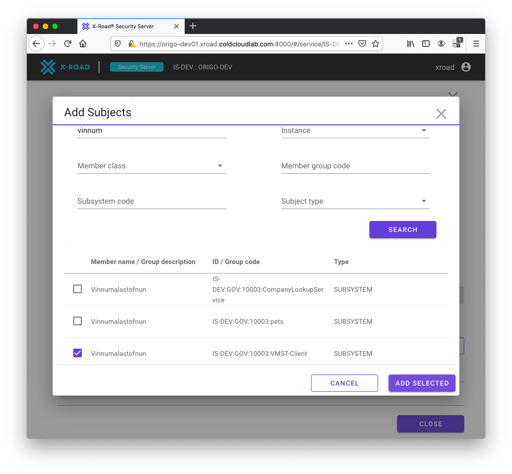

Á skráningarsíðu vefþjónustunnar, undir _Access Rights_, má sjá lista þeirra undirkerfa sem hefur verið veittur aðgangur:

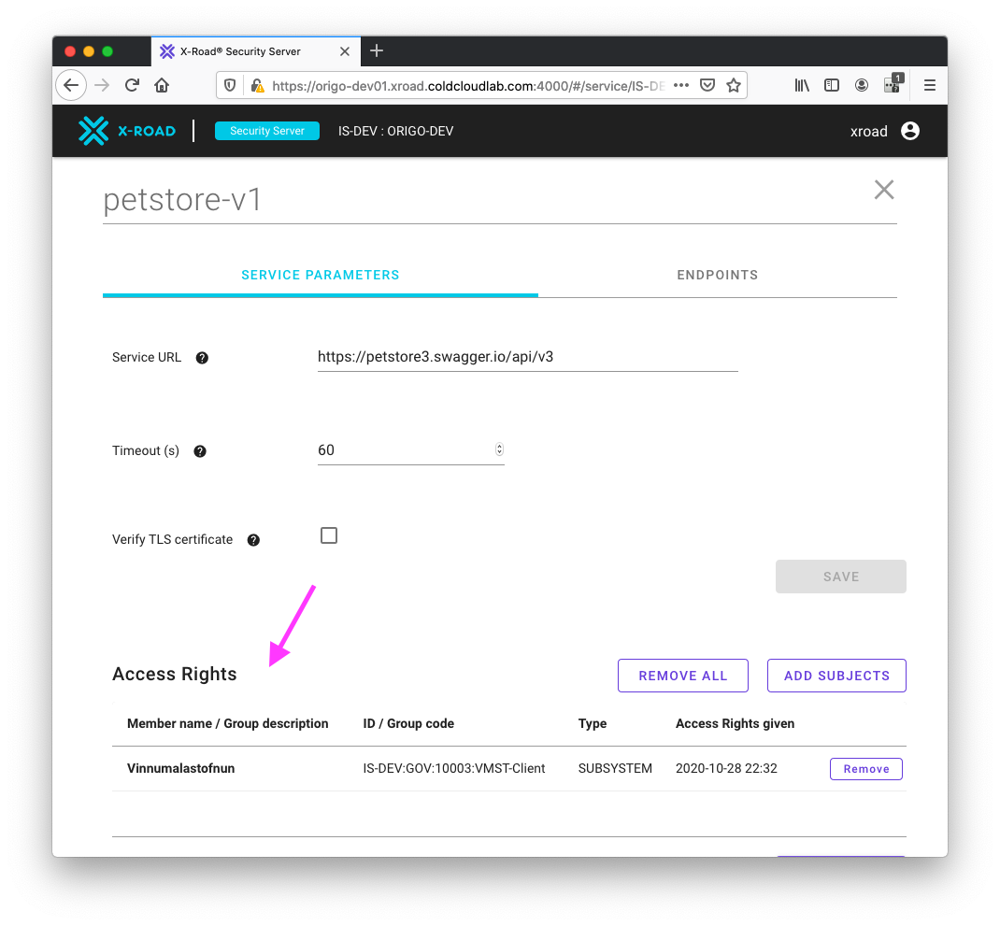

Í tilfelli REST vefþjónusta sem hafa verið skráðar með OpenAPI 3 skilgreiningu, þá er að finna _Endpoints_ flipa á skráningarsíðu þeirra, þar sem má sjá yfirlit yfir allar aðgerðir vefþjónustunnar ásamt möguleika á að skilgreina aðgangsheimildir hverrar aðgerðar fyrir sig, með sambærilegum hætti og er gert fyrir vefþjónustur í heild:


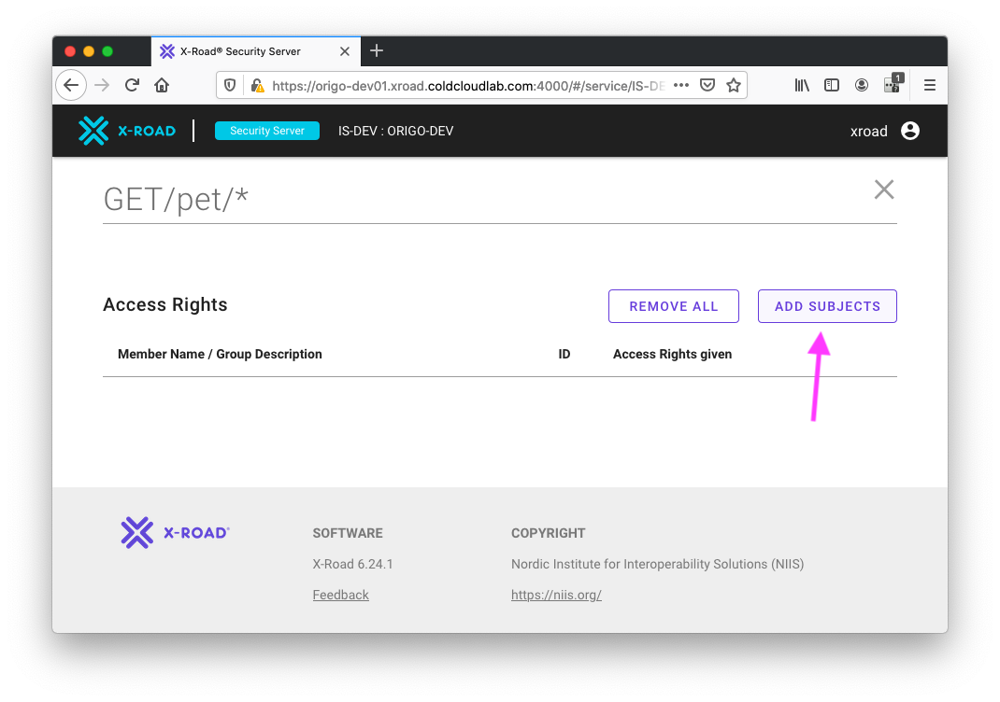

Yfirlit annarra undirkerfa sem hafa aðgang að vefþjónustum viðkomandi undirkerfis er hægt að sjá undir flipanum _Service Clients_ á upplýsingasíðu þess:


Þar er einnig að finna _Add Subject_ hnapp, sem má nota til að veita öðrum undirkerfum aðgangsheimild að vefþjónustuendapunktum þessa undirkerfis:


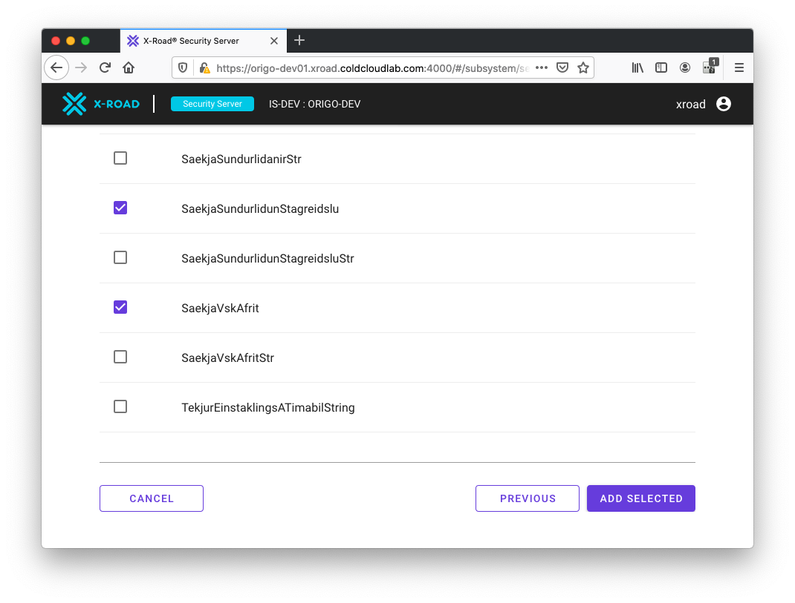

### Local Groups

Á upplýsingaskjá undirkerfis, undir _Clients_ flipanum, er að finna undirflipann _Local Groups_. Þar er hægt að safna saman í einn hóp þeim undirkerfum annarra aðila sem skal veita tilteknar aðgangsheimildir. Þannig er hægt að veita hópnum sem slíkum aðgangsheimild og öllum undirkerfum skráðum innan hans veitist þá heimildin. Þannig sparast vinna og flækjustig sem felst í því að veita hverju undirkerfi fyrir sig aðgangsheimildir.

Þegar hópur hefur verið búinn til:

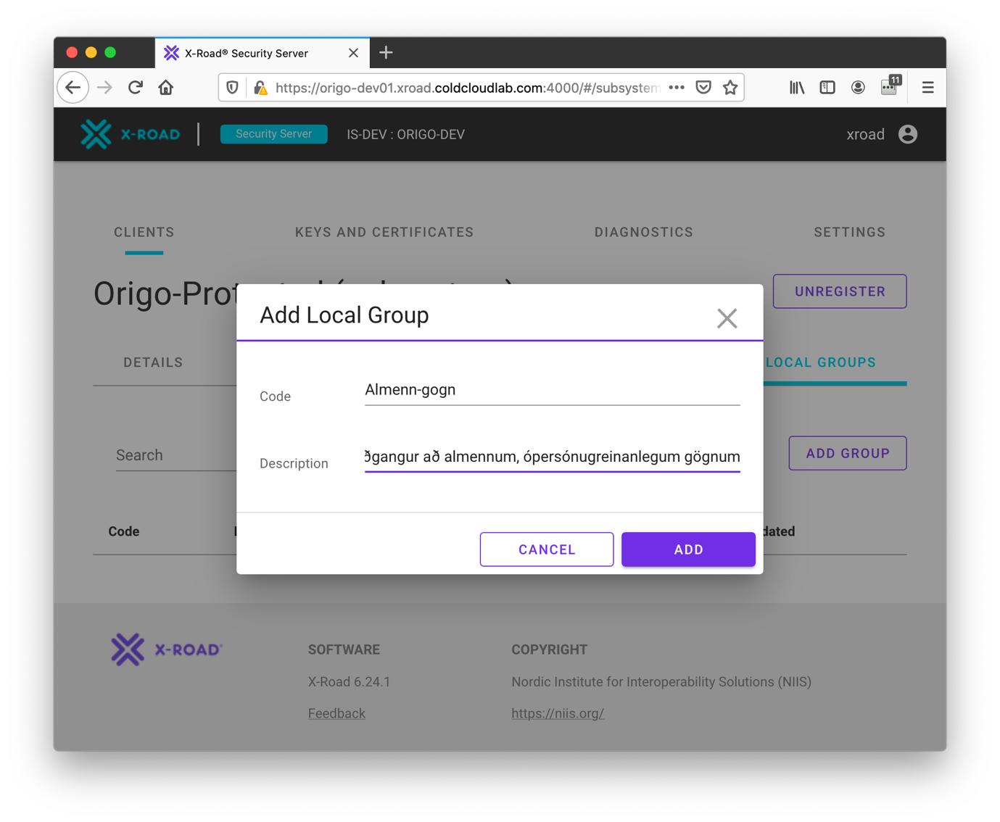

Þá er hægt að smella á nafn hópsins:

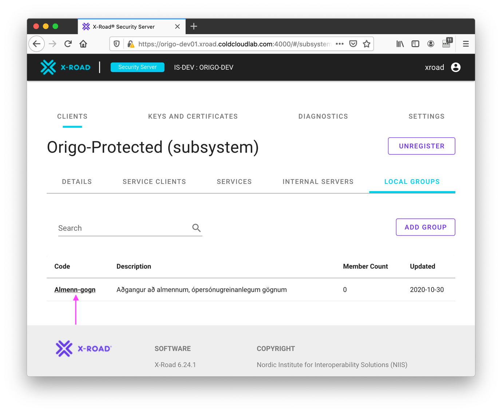

- til að opna skráningarskjá hópsins, þar er smellt á _Add Members_ hnappinn til að bæta við þeim undirkerfum sem skulu öðlast þær aðgangsheimildir sem verða veittar hópnum:


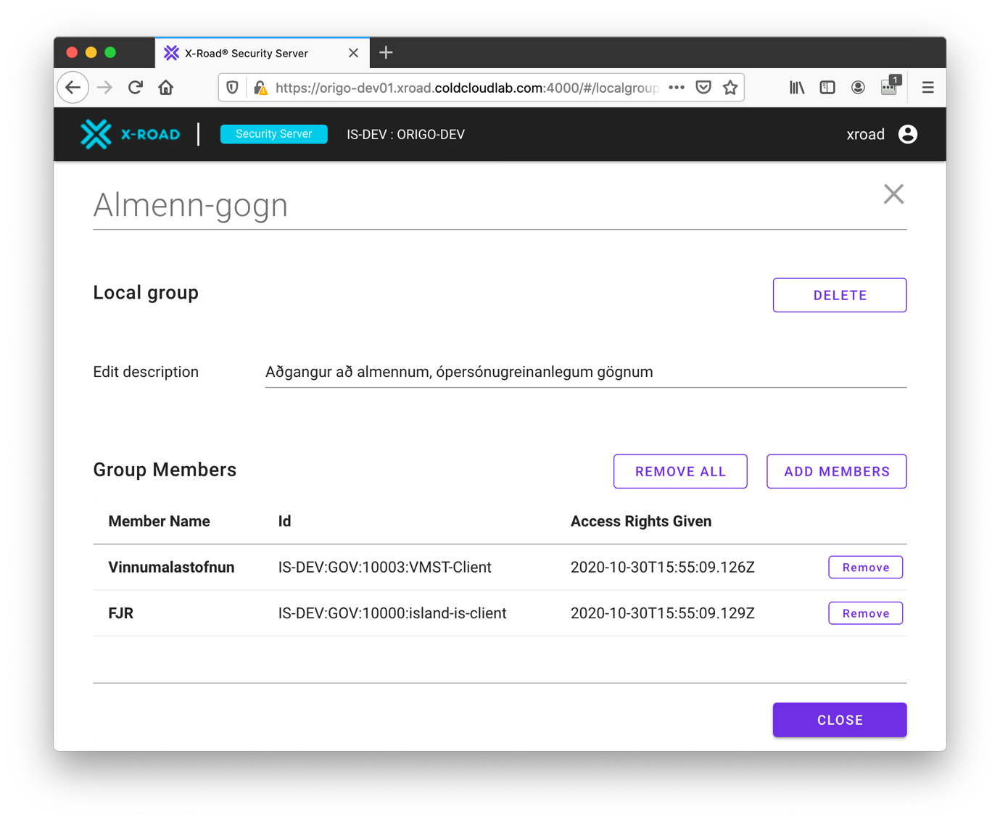

Þegar aðgangsheimildir eru veittar að undirkerfi, þá er hægt að velja hóp, eins og stök undirkerfi væru annars valin:


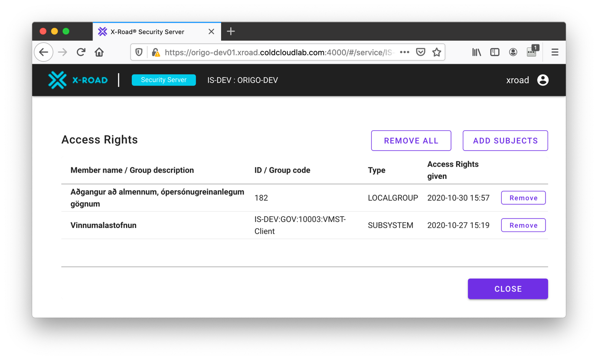

- Sjá nánar í [Local Access Right Groups](https://github.com/nordic-institute/X-Road/blob/develop/doc/Manuals/ug-ss_x-road_6_security_server_user_guide.md) kafla notendahandbókar X-Road.

### Management API

Allar aðgerðir sem er mögulegt að framkvæma í umsýsluviðmóti \(Admin UI\) X-Road öryggisþjóns er einnig hægt að framkvæma með köllum í umsýslu-vefþjónustuskil – X-Road Management REST APIs. Í raun nýtir umsýsluviðmótið sér þessi vefþjónustuskil.

- Sjá nánar í [Management REST APIs](https://github.com/nordic-institute/X-Road/blob/develop/doc/Manuals/ug-ss_x-road_6_security_server_user_guide.md) kafla í notendahandbók X-Road.

Hjá [Digital and Population Data Services Agency](https://dvv.fi/en) í Finnlandi er í þróun svokallað [X-Road toolkit](https://github.com/nordic-institute/X-Road-Security-Server-toolkit), sem er ætlað að auðvelda notkun þessara forritunar-skila við stillingu X-Road þjóna. Áætlað er að _X-Road toolkit_ verði aðgengilegt í janúar 2021.

- Sjá [kynningu á X-Road toolkit](https://vimeo.com/461279848) \(4:27:31\).

### Kröfur til vefþjónusta sem tengjast Straumnum

Samskipti við vefþjónustur yfir Strauminn með X-Road fara að flestu leyti fram með sama hætti og þegar um bein köll í vefþjónustur er að ræða. Þar er helst um eina undartekningu að ræða sem felst í að vefþjónustuköll þurfa að innihalda upplýsingar í haus um viðkomandi undirkerfi: Köll í REST þjónustur þurfa að innihalda upplýsingar um það undirkerfi sem á frumkvæði að samskiptunum \(_client\)_ í HTTP haus og köll í SOAP þjónustur þurfa að tiltaka bæði upplýsingar um undirkerfi biðlara og undirkerfi upplýsingaveitanda í SOAP haus, sem viðkomandi SOAP þjónusta þarf að skila óbreyttum til baka í svörum.

Nánar má lesa um samskiptastaðla milli upplýsingakerfa og X-Road öryggisþjóna í X-Road skjölun:

- X-Road: Message Protocol v4.0 [https://github.com/nordic-institute/X-Road/blob/develop/doc/Protocols/pr-mess_x-road_message_protocol.md](https://github.com/nordic-institute/X-Road/blob/develop/doc/Protocols/pr-mess_x-road_message_protocol.md)
- X-Road: Message Protocol for REST [https://github.com/nordic-institute/X-Road/blob/develop/doc/Protocols/pr-rest_x-road_message_protocol_for_rest.md](https://github.com/nordic-institute/X-Road/blob/develop/doc/Protocols/pr-rest_x-road_message_protocol_for_rest.md)

Nánar um þetta má lesa í kafla 3 - _Útfærsla og aðlögun vefþjónusta fyrir Strauminn_.

## Útfærsla og aðlögun vefþjónusta fyrir Strauminn

### Umhverfin þrjú: IS-DEV, IS-TEST og IS

Eitt umhverfi Straumsins samanstendur af miðlægum þjónustum X-Road – skilríkjamiðstöð, tímastimplun, skráning og eftirlit – og öllum þeim öryggisþjónum stofnana sem hafa verið skráðir í miðlægu þjónustuna. Eitt slíkt umhverfi er einnig kallað _X-Road instance_.

Umhverfi Straumsins eru þrjú: „IS-DEV“, fyrir þróun, „IS-TEST“, fyrir prófanir með raungögnum, og raunumhverfið heitir „IS“.


Innan hvers umhverfis er meðlimum skipt í flokka, eftir eðli stofnana:

- GOV fyrir opinberar stofnanir
- EDU fyrir menntastofnanir
- COM fyrir einkaaðila

Innan hvers flokks er meðlimum úthlutað kóða – _Member Code_ – sem í þróunarumhverfinu \(IS-DEV\) er raðtala en kennitala viðkomandi aðila í hinum umhverfunum tveimur \(IS-TEST og IS\). Hver meðlimur skráir svo sín undirkerfi – _Subsystem_ – eftir þörfum, fyrir biðlara \(\*-Client\) og upplýsingaveitur \(\*-Protected\), eins og áður hefur verið lýst \([2.2](https://app.gitbook.com/@origo/s/xroad-skjoelun/~/drafts/-MOk_6o9JK0bPAJLuFSB/untitled-2#nafnavenjur-straumsins-og-skraning-vefthjonusta-i-viskuausuna)\).

Samsetning flokksheita, kóða meðlima og nafna undirkerfa mynda einskonar stigveldistré eða slóðir innan X-Road umhverfis Straumsins. Það má líta á þessar slóðir sem heimilisföng innan Straumsins, sem X-Road notar til að finna viðkomandi öryggisþjóna, upplýsingaveitur og biðlara.


### Hverskonar gögn eiga heima í hverju umhverfi

IS-DEV umhverfi Straumsins er ætlað fyrir þjónustur í þróun og er eingöngu ætlað fyrir flutning þróunargagna.

IS-TEST umhverfið má nýta til prófana á vefþjónustum sem eru hæfar í rekstur, með raungögnum.

IS er svo raunumhverfið, þar sem opinber samsktipti eiga sér stað.

### Kröfur fyrir vefþjónustur sem tengjast Straumnum

Smíði vefþjónusta fyrir Strauminn skal fylgja [REST höguninni](https://en.wikipedia.org/wiki/Representational_state_transfer) og vera lýst með OpenAPI 3.0 skilum. Við útfærslu vefþjónusta má styðjast við [_API Design Guide_](https://github.com/island-is/handbook/blob/master/docs/api-design-guide/README.md) frá Stafrænu Íslandi.

Mikill fjöldi vefþjónusta er þegar til staðar hjá hinum ýmsu stofnunum og fyrirtækjum og eðlilega fylgja þær ekki nýtilkomnum hönnunar- og útfærsluleiðbeiningum frá Stafrænu Íslandi. Margar fyrirliggjandi vefþjónustur fylgja til dæmis SOAP samskiptareglunum. Lögð er áhersla á að þessar vefþjónustur nýtist í Straumnum, jafnvel án breytinga þar sem því verður við komið. Nánar er fjallað um möguleika í því samhengi í eftirfarandi undirköflum.

### Tenging og aðlögun REST vefþjónusta

Auðveldast er að skrá REST vefþjónustur í Strauminn, til dæmis með því að skrá inn slóð að OpenAPI 3.0 skilum, eins og er lýst í kafla 2.3 Skráning vefþjónustu, eða með því að skrá inn grunnslóð að endapunkti vefþjónustunnar.

REST vefþjónustur nýtast óbreyttar í Straumnum yfir X-Road en tvær einfaldar breytingar blasa við kerfum, sem senda beiðnir til REST þjónusta yfir X-Road, t.d. öðrum vefþjónustum í formi biðlara. Þessar breytingar snúa að auðkenni undirkerfa biðlara og upplýsingaveitanda – _Instance Identifier, Member Class_ og _Member Code_ – sbr. stigveldistré sem er lýst í kafla 3.1 _Umhverfin þrjú: IS-DEV, IS-TEST og IS_:

- Með beiðni þarf að senda HTTP hausinn _X-Road-Client_, með gildi sem inniheldur auðkenni undirkerfis biðlarans, t.d. „**IS/GOV/5501692829/island-is-client**“.
- Framan við grunnslóð vefþjónustuveitunnar bætist auðkenni þess undirkerfis sem hýsir hana: Ef óbreytt kall í vefþjónustuna væri eftir slóðinni GET /api/SearchBySocialID/0304756079 og vefþjónustan er skráð í X-Road undirkerfi, þar sem _Instance Identifier_: **IS** _Member Class_: **COM** _Member Code_: **5302922079** _Subsystem_: **Origo-Protected** þá yrði slóðin yfir X-Road: GET /r1/**IS**/**COM**/**5302922079**/**Origo-Protected**/api/SearchBySocialID/0304756079

Sjá nánar í [X-Road: Message Protocol for REST](https://github.com/nordic-institute/X-Road/blob/develop/doc/Protocols/pr-rest_x-road_message_protocol_for_rest.md).

### Dæmi um kall í REST vefþjónustu yfir X-Road

cURL dæmi um kall í vefþjónustu yfir X-Road, þar sem biðlari og þjónustuveita eru skráð eins og í dæmi í 3.2.1:

```python
curl --location --request GET 'http:// securityserver.island.internal/r1/IS/COM/5302922079/Origo-Protected/api/SearchBySocialID/0304756079' \
--header 'X-Road-Client: IS/GOV/5501692829/island-is-client'
```

#### Tenging og aðlögun SOAP vefþjónusta

Skráning WSDL lýsingar fyrir SOAP þjónustur í X-Road er ein og sér auðveld: Lýsing endapunktanna skilar sér sjálfkrafa inn og það er hægt að stýra aðgangi að hverjum þeirra með svipuðum hætti og er lýst í 2.4 _Aðgangsheimildir að vefþjónustum eða stökum endapunktum_.

SOAP þjónustur beintengdar við X-Road þjón nýtast þó ekki óbreyttar, þar sem þær þurfa að skila í svörum þeim X-Road gildum sem nauðsynlega berast í haus SOAP skeyta. Til að komast undan sértækri X-Road aðlögun SOAP þjónusta má notast við einskonar millistykki, sem liggur á milli X-Road þjóns og vefþjónustu, handlangar beiðnir á milli þeirra og sér til þess að gildum í SOAP haus beiðnar sé skilað með sama hætti í svari. Nánar um slíkt millistykki er fjallað í 3.2.3.1 _SOAP headers adaptor_.

Haus í SOAP skeyti þarf að innihalda sambærilegar upplýsingar og var lýst fyrir REST samskipti í 3.2.1, um auðkenni undirkerfa biðlara og upplýsingaveitanda. Sömu upplýsingar og voru tilteknar í REST dæminu að ofan, kæmu fram með eftirfarandi hætti í haus SOAP skeytis:

```xml
<SOAP-ENV:Envelope xmlns:SOAP-ENV="http://schemas.xmlsoap.org/soap/envelope/"
   xmlns:xrd="http://x-road.eu/xsd/xroad.xsd"
   xmlns:id="http://x-road.eu/xsd/identifiers"
>
  <SOAP-ENV:Header>
    <xrd:protocolVersion>4.0</xrd:protocolVersion>
    <xrd:id>3903d152-1d2c-11eb-adc1-0242ac120002</xrd:id>
    <xrd:userId>anonymous</xrd:userId>
    <xrd:service id:objectType="SERVICE">
      <id:xRoadInstance>IS</id:xRoadInstance>
      <id:memberClass>COM</id:memberClass>
      <id:memberCode>5302922079</id:memberCode>
      <id:subsystemCode>Origo-Protected</id:subsystemCode>
      <id:serviceCode>sendMessage</id:serviceCode>
      <id:serviceVersion>1</id:serviceVersion>
    </xrd:service>
    <xrd:client id:objectType="SUBSYSTEM" >
      <id:xRoadInstance>IS</id:xRoadInstance>
      <id:memberClass>GOV</id:memberClass>
      <id:memberCode>5501692829</id:memberCode>
      <id:subsystemCode>island-is-client</id:subsystemCode>
    </xrd:client>
  </SOAP-ENV:Header>
  <SOAP-ENV:Body>
    <sendMessage ...>
      ...
    </sendMessage>
  </SOAP-ENV:Body>
...
```

Gildi serviceCode í haus verður að vera það sama og heiti XML tags sem hjúpar [beiðnina](https://github.com/nordic-institute/X-Road/blob/develop/doc/Protocols/pr-mess_x-road_message_protocol.md) \(2.3 Message Body\).

Með serviceVersion er hægt að vísa til [útgáfu vefþjónustu í WSDL skilgreiningu](https://github.com/nordic-institute/xrd4j/blob/develop/example-adapter/src/main/resources/example.xroad-6.4.wsdl) \(&lt;xrd:version&gt;v1&lt;/xrd:version&gt;\).

Svar frá SOAP vefþjónustu þarf að innihalda sömu X-Road upplýsingar og komu inn í skeytahaus beiðnar, í sömu röð.

Sjá nánar í [X-Road: Message Protocol v4.0](https://github.com/nordic-institute/X-Road/blob/develop/doc/Protocols/pr-mess_x-road_message_protocol.md).

**SOAP headers adaptor**

Til að komast hjá aðlögun fyrirliggjandi SOAP vefþjónusta að þeim kröfum sem fylgja samskiptum við X-Road öryggisþjóna, sem er lýst í 3.2.3 _Tenging og aðlögun SOAP vefþjónusta_, má styðjast við einskonar millistykki, eða _proxy / adaptor_, sem handlangar beiðnir milli X-Road þjóns og SOAP vefþjónustu, og sér til þess að X-Road gildi í SOAP haus beiðnar skili sér einnig til baka í SOAP haus svarskeytis frá vefþjónustu.

Hýsingarvélar X-Road þjóna, sem hafa verið settar upp með aðstoð Stafræns Íslands / Origo, keyra eina útgáfu af slíku millistykki og með það til staðar er nóg að setja `„localhost:5443/“` fyrir framan nafn hýsils viðkomandi vefþjónustu, þegar um HTTPS samskipti er að ræða, og `„localhost:5080/“` fyrir framan _host_-nafn vefþjónustunnar í tilfelli ódulkóðaðra HTTP samskipta.


**REST adaptor service**

Í mörgum tilfellum getur biðlari átt í REST samskiptum yfir X-Road þó svo að á hinum endanum standi SOAP vefþjónusta fyrir svörum. Þetta er gert mögulegt með svokölluðu [X-Road REST Adapter Service](https://github.com/nordic-institute/REST-adapter-service), sem einnig er uppsett á þeim X-Road hýsingarvélum sem Stafrænt Ísland / Origo hafa komið að \(á porti 6080\).

Undirkerfi upplýsingaveitu og heiti vefþjónustuendapunkts eru tiltekin á REST vefslóð, ásamt upplýsingum um XML nafnarými \(e. namespace\) viðkomandi þjónustu. Dæmi um REST kall í vefþjónustu sem er hýst í undirkerfi sem hefur komið fram í dæmum kaflanna hér á undan:

`http://localhost:6080/rest-adapter-service/Consumer/IS.COM.5302922079.Origo-Protected.CapitalCity/?sCountryISOCode=IS&X-XRd-NamespaceSerialize=http://www.oorsprong.org/websamples.countryinfo&X-XRd-NamespacePrefixSerialize=&Accept=application/json`

Þessi vörpun milli REST og SOAP er takmörkunum háð. Til dæmis er eins og er ekki stuðningur við að setja fram í REST kalli WS-Security auðkenningarhaus fyrir SOAP vefþjónustu.

### **Uppsetning X-Road REST og SOAP millistykkja**

Til að auðvelda uppsetningu þessara REST og SOAP millistykkja á hýsingarvélum X-Road þjóna, hafa verið settar saman [skriftur og skilgreiningar, ásamt leiðbeiningum](https://github.com/bthj/xroad-rest-soap-adapters), sem má nota til að setja millistykkin upp sem stýrikerfisþjónustur \(þessar skriftur setja upp millistykkin með Docker og Docker Compose, sem er [ekki lengur stutt af RHEL](https://access.redhat.com/solutions/3696691), svo síðari útgáfa þessarar uppsetningar kann að [styðjast við](https://www.redhat.com/sysadmin/compose-podman-pods) [Podman](https://podman.io/)\).

Með þessar tvær einingar til staðar má í mörgum tilfellum eiga í REST samskiptum við SOAP vefþjónustur, og í öllu falli tengja SOAP vefþjónustur við X-Road án þess að eiga frekar við þær.

Dæmi um samskiptaleið frá REST biðlara, til X-Road öryggisþjóns \(SS1\), til X-Road þjóns upplýsingaveitu \(SS2\), sem hýsir óbreytta SOAP þjónustu, má stilla upp svona:

REST &lt;-&gt; REST-adaptor-service &lt;-&gt; X-Road SS1 &lt;-&gt; X-Road SS2 &lt;-&gt; universal-xroad-soap-proxy &lt;-&gt; legacy SOAP service


Með þessari uppsetningu keyrir REST millistykkið á porti 6080 hýsingarvélarinnar og SOAP millistykkið handlangar HTTP beiðnir á 5080 og HTTPS á 5443.

### Samband öryggisþjóna við upplýsingakerfi

Þrenns konar samskiptamátar koma til greina milli X-Road öryggisþjóns og þeirra \(innri\) upplýsingakerfa / vefþjónusta sem hann svarar fyrir:

Ef samskiptaleið milli öryggisþjóns og innri vefþjónustu liggur yfir innan sama örugga netlagsins, þá kann vera talið öruggt að notast við ódulkóðuð HTTP samskipti.

Sé samskiptaleiðin yfir ótrygg net, þá er rétt að notast við HTTPS samskiptaregluna með gagnkvæmri auðkenningu \(mTLS\), sem er sjálfgefni valkosturinn, eða án auðkenningar, sem er síður mælt með.

Þessar stillingar er að finna í umsýsluviðmóti öryggisþjóns undir _Internal Servers_ flipa viðkomandi undirkerfis. Þar, undir _Information System TLS certificate_, er hægt að flytja inn opinberan skírteinishluta viðkomandi upplýsingakerfis. Undir _Security Server certificate_ er hægt að flytja út opinberan skírteinishluta X-Road öryggisþjónsins, til handa þeim upplýsingakerfum sem vilja eiga í gagnkvæmt auðkenndum samskiptum við þjóninn.

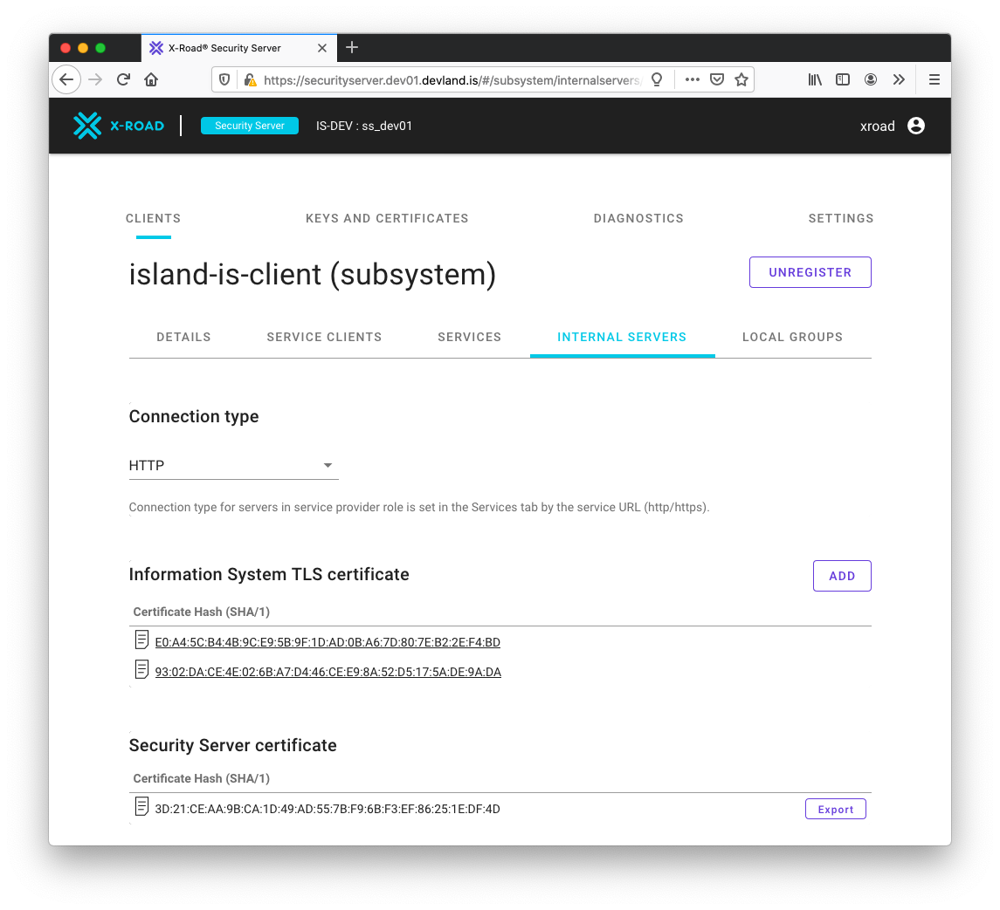

TLS lykil öryggisþjónsins er einnig að finna í umsýsluviðmótinu undir _Keys and Certificates -&gt; Security Server TLS Key_.


Eftirfarandi er dæmi um beiðni frá upplýsingakerfi til öryggisþjóns, í formu _curl_ skipunar:

```python
curl --cert dev-island-is_client.crt --key dev-island-is_client.key --cacert dev-island-is_ss.pem -H "X-Road-Client: IS-DEV/GOV/10000/island-is-client" https://ss_dev01:8443/r1/IS-DEV/COM/10002/Origo-Protected/APIS/company?name=nemur
```

`dev-island-is_client.crt` og `dev-island-is_client.key` eru skírteini upplýsingakerfisins / vefþjónustunnar sem sendir beiðni X-Road öryggisþjóns á eigin vegum, og `dev-island-is_ss.pem` stendur fyrir skírteini öryggisþjónsins.

Skírteini með eigin undirskrift fyrir upplýsingakerfið \(_curl_ skipunina\) í dæminu hér að ofan má til dæmis útbúa með eftirfarandi skipunum:

**create-self-signed-cert.sh**

```python
#!/bin/sh
openssl genrsa -des3 -passout pass:x -out server.pass.key 2048
openssl rsa -passin pass:x -in server.pass.key -out server.key
rm server.pass.key
openssl req -new -key server.key -out server.csr
openssl x509 -req -sha256 -days 7300 -in server.csr -signkey server.key -out server.crt
```

eða

```python
sudo openssl req -nodes -new -x509 -days 7300 \
-keyout server.key \
-out server.crt \
-subj "/C=ST/O=Local/CN=localhost"
```

Sjá nánar í kaflanum [Communication with the Client Information Systems](https://github.com/nordic-institute/X-Road/blob/develop/doc/Manuals/ug-ss_x-road_6_security_server_user_guide.md) í notendahandbók X-Road öryggisþjóna.

### Aðgreining aðgangs að undirkerfum

Þegar ólík upplýsingakerfi hafa aðgang að sama X-Road öryggisþjóni en það er ekki æskilegt að hvert þeirra hafi sama aðgang að öllum þeim undirkerfum sem öryggisþjónninn hýsir, þá er ofangreind mTLS samskipti leið til aðgreiningar heimilda hvers upplýsingakerfis að X-Road undirkerfum.

Tökum sem dæmi tvö upplýsingakerfi, **A** og **B** \(t.d. tvö aðskilin GraphQL lög\), sem vilja senda beiðnir út á Strauminn. Þessi tvö upplýsingakerfi hafa aðgang að X-Road öryggisþjóni sem hýsir tvö _client_ undirkerfi:

island-is-minar-sidur-client

- sem hefur heimild til að framkvæma beiðnir til vefþjónusta hjá Þjóðskrá

island-is-ytri-vefur-client

- sem hefur ekki aðgangsheimild að vefþjónustum Þjóðskrár

Upplýsingakerfi **A** hefur það hlutverk að kalla til Þjóðskrár í gegnum island-is-minar-sidur-client undirkerfið en upplýsingakerfi **B** á ekki að hafa heimild til þess.

Leið til þessarar aðgreiningar er að upplýsingakerfi **A** og undirkerfið island-is-minar-sidur-client skiptist á skírteinum til að koma á gagnkvæmu trausti; mTLS sambandi. Að sama skapi geta upplýsingakerfi **B** og undirkerfið island-is-ytri-vefur-client skipts á skírteinum.

Með þessu fyrirkomulagi getur upplýsingakerfi **B** ekki framkvæmt köll í gegnum undirkerfið island-is-minar-sidur-client og þar með öðlast aðgangsheimildir sem því hefur verið veitt.

### Aðgangur að X-Road þróunarumhverfi Ísland.is

Til að eiga samskipti við vefþjónustur yfir Strauminn í þróunarumhverfi Ísland.is (dev), þá þarf AWS SSO aðgangsheimildir að því umhverfi og fylgja eftirfarandi skrefum:

1. Taka afrit af umhverfisbreytum (environment variables) úr AWS SSO og setja í console
2. Keyra `aws eks update-kubeconfig --name dev-cluster01 --region eu-west-1` ([skrifar að sjálfgefnu í ~/.kube/config](https://docs.aws.amazon.com/cli/latest/reference/eks/update-kubeconfig.html))
3. Keyra `kubectl -n socat port-forward svc/socat-xroad 8080:80` svo umferð sé áframsend frá porti 8080 á þróunarvél (localhost:8080) að porti 80 á X-Road öryggisþjóni Ísland.is.

AWS SSO aðgangsheimildir eru veittar af DevOps umsjónaraðila Stafræns Íslands: [Andes](https://andes.is).

Með ofangreindum aðgangi að X-Road þjóni Ísland.is er hægt að lista upp þau undirkerfi (subsystem) sem eru skráð í viðkomandi X-Road umhverfi (IS-DEV instance), með skipun eins og:

```
curl ‘http://localhost:8080/listClients’
```

#### Öflun upplýsinga um undirkerfi og vefþjónustur innan þeirra

- REST

  Til að fá upplýsingar um vefþjónustur innan undirkerfis má gefa skipun eins og:

  ```
  curl -H ‘X-Road-Client: IS-DEV/GOV/10000/island-is-client’ ‘http://localhost:8080/r1/IS-DEV/provider-member-class/provider-member-code/provider-subsystem-name/listMethods’ | json_pp
  ```

  Ef vefþjónusta býður upp á OpenAPI 3 skil, þá er hægt að nálgast þau yfir X-Road með skipun eins og:

  ```
  curl -H ‘X-Road-Client: IS-DEV/GOV/10000/island-is-client’ ‘http://localhost:8080/r1/IS-DEV/provider-member-class/provider-member-code/provider-subsystem-name/getOpenAPI?serviceCode=provider-service-code’
  ```

- SOAP

  Upplýsingar um SOAP endapunkta innan undirkerfis er hægt að sækja með skipun eins og:

  ```
  curl --location --request POST 'http://localhost:8080/' --header 'Content-Type: text/xml;charset=UTF-8' --data @SJUKRA-protected-allowedMethods-fra-island-is.xml
  ```

  þar sem skráin `SJUKRA-protected-allowedMethods-fra-island-is.xml` getur innihaldið:

  ```xml
  <soapenv:Envelope xmlns:soapenv="http://schemas.xmlsoap.org/soap/envelope/" xmlns:isl="http://islandrg.service.mule.tr.is/" xmlns:xrd="http://x-road.eu/xsd/xroad.xsd" xmlns:id="http://x-road.eu/xsd/identifiers">
     <soapenv:Header>
        <xrd:protocolVersion>4.0</xrd:protocolVersion>
        <xrd:id>3903d152-1d2c-11eb-adc1-0242ac120002</xrd:id>
        <xrd:userId>anonymous</xrd:userId>
        <xrd:service id:objectType="SERVICE">
            <id:xRoadInstance>IS-DEV</id:xRoadInstance>
            <id:memberClass>GOV</id:memberClass>
            <id:memberCode>10007</id:memberCode>
            <id:subsystemCode>SJUKRA-Protected</id:subsystemCode>
            <id:serviceCode>allowedMethods</id:serviceCode>
        </xrd:service>
        <xrd:client id:objectType="SUBSYSTEM">
            <id:xRoadInstance>IS-DEV</id:xRoadInstance>
            <id:memberClass>GOV</id:memberClass>
            <id:memberCode>10000</id:memberCode>
            <id:subsystemCode>island-is-client</id:subsystemCode>
        </xrd:client>
     </soapenv:Header>
     <soapenv:Body>
        <xrd:allowedMethods/>
     </soapenv:Body>
  </soapenv:Envelope>
  ```

  WSDL skil SOAP þjónustu er hægt að sækja yfir X-Road með skipun eins og:

  ```
  curl --location --request POST 'http://localhost:8080/' --header 'Content-Type: text/xml;charset=UTF-8' --data @SJUKRA-protected-getWsdl-fra-island-is.xml
  ```

  þar sem skráin `SJUKRA-protected-getWsdl-fra-island-is.xml` getur innihaldið:

  ```xml
  <soapenv:Envelope xmlns:soapenv="http://schemas.xmlsoap.org/soap/envelope/" xmlns:isl="http://islandrg.service.mule.tr.is/" xmlns:xrd="http://x-road.eu/xsd/xroad.xsd" xmlns:id="http://x-road.eu/xsd/identifiers">
     <soapenv:Header>
        <xrd:protocolVersion>4.0</xrd:protocolVersion>
        <xrd:id>3903d152-1d2c-11eb-adc1-0242ac120002</xrd:id>
        <xrd:userId>anonymous</xrd:userId>
        <xrd:service id:objectType="SERVICE">
            <id:xRoadInstance>IS-DEV</id:xRoadInstance>
            <id:memberClass>GOV</id:memberClass>
            <id:memberCode>10007</id:memberCode>
            <id:subsystemCode>SJUKRA-Protected</id:subsystemCode>
            <id:serviceCode>getWsdl</id:serviceCode>
        </xrd:service>
        <xrd:client id:objectType="SUBSYSTEM">
            <id:xRoadInstance>IS-DEV</id:xRoadInstance>
            <id:memberClass>GOV</id:memberClass>
            <id:memberCode>10000</id:memberCode>
            <id:subsystemCode>island-is-client</id:subsystemCode>
        </xrd:client>
     </soapenv:Header>
     <soapenv:Body>
       <xrd:getWsdl>
           <xrd:serviceCode>profun</xrd:serviceCode>
       </xrd:getWsdl>
     </soapenv:Body>
  </soapenv:Envelope>
  ```

- API Catalog  
  Þessar upplýsingar eru einnig aðgengilegar í vefviðmóti Viskuausunnar, _API Catalog_ Stafræns Íslands [TODO: hlekkur].

## Uppsetning og rekstur X-Road öryggisþjóna í Straumnum

### Uppsetning og uppfærsla

Uppsetning X-Road byggir á Linux hugbúnaðarpökkum, sem eru útbúnir fyrir Ubuntu \(18.04 LTS\) og Red Hat \(RHEL 7 og 8\) dreifingarnar. Séríslensk afbrigði þessara hugbúnaðarpakka skulu notuð við uppsettningu þjóna sem tengjast Straumnum. Upplýsingar um net- og vélbúnaðarkröfur, uppsetningar- og skráningarskref fyrir X-Road öryggisþjóna er að finna í skjalinu _Straumurinn – Security Server installation and registration steps_.

Útgáfur uppsettra öryggisþjóna skulu ekki vera meira en tveimur útgáfunúmerum á eftir nýjustu útgáfu X-Road hverju sinni.

Í því keyrsluumhverfi sem er mælt með fyrir X-Road öryggisþjóna í rekstri – uppsetningar út frá stýrikerfispökkum í stað [gámauppsetninga](https://github.com/nordic-institute/X-Road-Security-Server-sidecar), sem verða þó í framtíðinni \(2021\) rekstrarhæfar – felst uppfærsla yfirleitt í því að uppfæra viðkomandi stýrikerfispakka. Í sumum tilfellum kann að vera nauðsynlegt að framkvæma handvirk skref, eins og aðlögun gagnagrunns. Ávallt skal gaumgæfa [útgáfulýsingar](https://confluence.niis.org/display/XRDKB/Release+Notes) áður en uppfærsla er framkvæmd, sérstaklega þegar um breytingar á megin-útgáfu er að ræða.

Nánara lesefni:

- [How to Set Up a Security Server?](https://confluence.niis.org/pages/viewpage.action?pageId=4292920)
  - sjá dæmi um uppfærsluskipanir í þessu yfirskjali
- [X-Road Knowledge Base](https://confluence.niis.org/display/XRDKB/X-Road+Knowledge+Base)
- [Sértæk skref við uppsetningu og þáttöku í Straumnum](https://github.com/digitaliceland/Straumurinn)

### Rekstur

X-Road er opinn hugbúnaður og án leyfisgjalda.

Rekstur miðlægra þjónusta Straumsins – skilríkjamiðstöðvar og miðlægrar skráningar – er á vegum Stafræns Íslands meðan stofnanir sjá um rekstur sinna öryggisþjóna:

- Hýsing, eftirlit og rekstur á Linux þjónum
- Ef Red Hat stýrikerfið \(RHEL\) er valið, þá felur það í sér leyfisgjöld, meðan Ubuntu, sem einnig er stutt, er án þeirra
- Rekstraraðili X-Road öryggisþjóns þarf að fylgjast með honum og uppfæra reglulega
- Endurnýjun skilríkja, þar sem þarf að óska eftir nýjum frá skilríkjamiðstöð Straumsins

Net-opnanir eru skjalaðar í uppsetningarleiðbeiningum og eftirfarandi mynd sýnir yfirlit þeirra til glöggvunar:

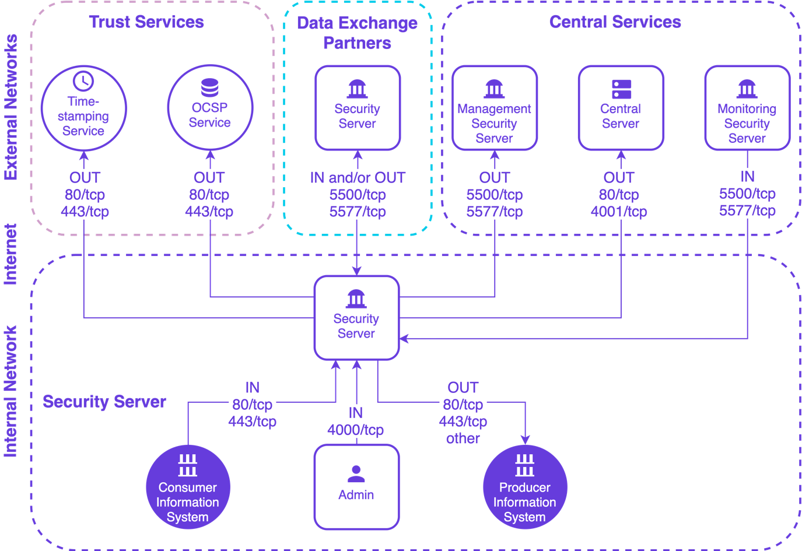

### Högun tiltækileika

Meðal kosta við við dreifða högun X-Road er að engin ein eining er kerfislægur flöskuháls eða uppspretta bilunar. Tiltækileika öryggisþjónustu fyrir hverja upplýsingaveitu og -biðlara er hægt að auka með tilhögun umfremdar \(e. redundant configuration\). Tvær leiðir eru mögulegar til að auka tiltækileika X-Road öryggisþjóna: Innri og ytri álagsdreifing. Val milli þessara leiða felst í málamiðlun milli einfaldleika og sveigjanleika.

X-Road öryggisþjónar búa yfir innbyggðum eiginleika til álagsdreifingar fyrir biðlara, ásamt því að styðja ytri álagsdreifingu. Innbyggð álagsdreifing fyrir biðlara veitir háan tiltækileika. Stuðningur við ytri álagsdreifingu veitir hins vegar hvort tveggja háan tiltækileika og aukin afköst, sem skalanleg högun.

### Innbyggð álagsdreifing

Innbyggð álagsdreifing er eiginleiki byggður inn í X-Road öryggisþjóna. Eiginleikinn veitir háan tiltækileika en ekki skalanleika, þar sem sömu þjónustur geta verið skráðar á marga öryggisþjóna, sem verða fyrir valinu eftir því hver verður fyrstur fyrir svörum. Ef sama þjónusta er tiltæk frá mörgum öryggisþjónum, þá er beiðnum til þjónustunnar dreift milli þjónanna en álaginu er ekki skipt jafnt milli þjónanna sem svara fyrir sömu upplýsingaveituna. Ef einn öryggisþjónanna aftengist, þá er beiðnum sjálfkrafa beint að öðrum tiltækum þjónum. Öryggisþjónn biðlara mun velja þann öryggisþjón upplýsingaveitu sem verður fyrstur til að svara. Þannig er umfremd innifalin í samskiptareglur milli öryggisþjóna \([X-Road message transport protocol](https://github.com/nordic-institute/X-Road/blob/develop/doc/Protocols/pr-messtransp_x-road_message_transport_protocol.md)\), svo fremi sem fleiri en einum öryggisþjóni er stillt upp fyrir þjónustur.

Uppsetning innri álagsdreifingar er einfaldari en ytri álagsdreifing, þar sem öryggisþjónarnir sjá innan kerfis um beiningu beiðna og sannprófun skilríkja. Slík uppsetning krefst þó þess að þjónustur séu skráðar eins hjá hverjum öryggisþjóni um sig; þegar nýrri þjónustu er bætt við þarf að sjá til þess að hún sé skráð sérstaklega á alla þá öryggisþjóna sem er ætlað að svara fyrir hana. Hver öryggisþjónn í slíkri uppsetningu þarf að hafa farið í gegnum sjálfstætt skráningarferli í miðlæga þjónustu Straumsins.


Fyrstur til svara vinnur: Sá öryggisþjónn sem nær fyrst að koma á TCP tengingu \(SS1, SS2 eða SS3\) verður fyrir vali öryggisþjóns biðlara \(SS\).

### Ytri álagsdreifing

Hvort tveggja háan tiltækileika og aukin afköst er hægt að ná með því að nýta stuðning X-Road öryggisþjóna við ytri álagsdreifingu \(e. load balancer\) sem snýr að Internetinu. Í slíkri högun er lausn til álagsdreifingar \(LB\) sett fyrir framan klasa öryggisþjóna og skeytum sem berast er dreift milli þjóna klasans, samkvæmt því reikniriti álagsdreifingar sem er valið að styðjast við. Með vöktunarskilum öryggisþjóna \(e. health check API\) getur álagsdreifingin greint ef einingar innan klasans hætta að svara og þá hætt að beina umferð til þeirra.

Uppsetning klasa öryggisþjóna er flóknari í samanburði við nýtingu innri álagsdreifingar, sem er innbyggður eiginleiki og að sjálfgefnu virkur. Uppfærsla öryggisþjóna er flóknari með ytri álagsdreifingu, þar sem samræma þarf uppfærsluferlið innan klasans. Á hinn bóginn er auðveldara að bæta einingum við klasann, þar sem ekki þarf að fara í gegnum skráningarferlið gagnvart miðlægri þjónustu Straumsins fyrir hverja þeirra, því allar einingar klasans deila sama auðkenni. Til samanburðar, þá hefur hver öryggisþjónn sem tekur þátt í innri álagsdreifingu sitt eigið auðkenni, og þarf því að fara í gegnum sjálfstætt skráningarferli.


Ytri álagsdreifingu er hægt að setja upp fyrir framan klasa af X-Road öryggisþjónum, þar sem er séð um að beina umferð milli eininga klasans.

Nánar má lesa í:

- [X-Road Architecture](https://x-road.global/architecture)
- [Balancing the Load in X-Road](https://www.niis.org/blog/2018/6/25/balancing-the-load)
- [X-Road Security Architecture: Availability](https://github.com/nordic-institute/X-Road/blob/develop/doc/Architecture/arc-sec_x_road_security_architecture.md)
- [X-Road: Security Server Architecture: Redundant Deployment](https://github.com/nordic-institute/X-Road/blob/develop/doc/Architecture/arc-ss_x-road_security_server_architecture.md)
- [X-Road: External Load Balancer Installation Guide](https://github.com/nordic-institute/X-Road/blob/develop/doc/Manuals/LoadBalancing/ig-xlb_x-road_external_load_balancer_installation_guide.md)

### Umsýsluviðmót X-Road öryggisþjóns

Umsýsluviðmót X-Road öryggisþjóns \(Security Server\) er hægt að nálgast á slóð eins og:

**Error! Hyperlink reference not valid.**

þar sem &lt;innri-IP-tala/innra-host-nafn&gt; er innra vistfang þjónsins á VPN- eða staðarneti, eingögu aðgengilegt viðkomandi starfsmönnum.

### Hlutverk notenda

Umsýsluviðmót \(e. admin UI\) X-Road öryggisþjóna veitir aðgang að helstu aðgerðum er lúta að daglegum rekstri þeirra, svo sem skráningu vefþjónusta, eins og var vikið að í kafla 2 - _Vefþjónustur í Straumnum_, og utanumhaldi skírteina. Hvaða aðgerðir eru sýnilegar notanda umsýsluviðmótsins er háð hvaða hlutverki henni hefur verið úthlutað. Hlutverkin eru skráð sem stýrikerfishópar og eru:

- **Security Officer** \(xroad-security-officer\), sýslar með lykla og skírteini.
- **Registration Officer** \(xroad-registration-officer\), heldur utan um skráningu undirkerfa.
- **Service Administrator** \(xroad-service-administrator\), skráir vefþjónustur og stýrir aðgangi að þeim.
- **System Administrator** \(xroad-system-administrator\), ber ábyrgð a uppsetningu, stillingum og viðhaldi öryggisþjóns.
- **Security Server Observer** \(xroad-securityserver-observer\), hefur lesaðgang að umsýsluviðmóti öryggisþjóns.

Hver notandi getur haft fleiri en eitt hlutverk og fleiri en einn notandi getur haft hvert hlutverk.

Sjá nánar í kaflanum [User Management](https://github.com/nordic-institute/X-Road/blob/develop/doc/Manuals/ug-ss_x-road_6_security_server_user_guide.md) í notendahandbók X-Road öryggisþjóna.

### Afritun og endurheimt

Undir _Settings -&gt; Backup and Restore_ má sjá yfirlit þau afrit sem eru sjálfvirkt tekin daglega. Jafnframt er hægt að taka afrit handvirkt með því að smella á hnappinn _Back Up Config_, sem birtist þá einnig í listanum. Á þessum skjá er einnig hægt að hlaðainn afriti, t.d. á nýuppsettum þjóni.

Þessar aðgerðir er einnig hægt að framkvæma frá skipanalínu, eins og er vikið að í kafla 4.5.4 _Afrit_.

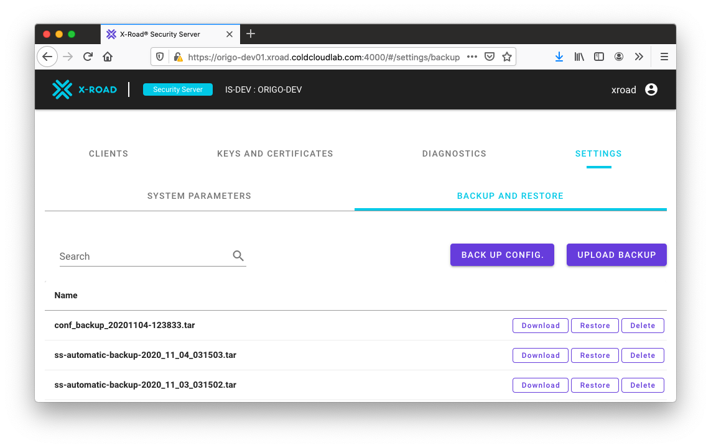

### Yfirlit kerfisstillinga

Yfirlit kerfisstillinga er að finna í umsýsluviðmótinu undir _Settings -&gt; System Parameters_. Þar er að finna aðgerðir til að flytja inn og út _Configuration Anchor_, skrá með upplýsingum um miðlægar þjónustur í umhverfi Straumsins sem er hægt að sækja frá:

[https://github.com/digitaliceland/Straumurinn](https://github.com/digitaliceland/Straumurinn)

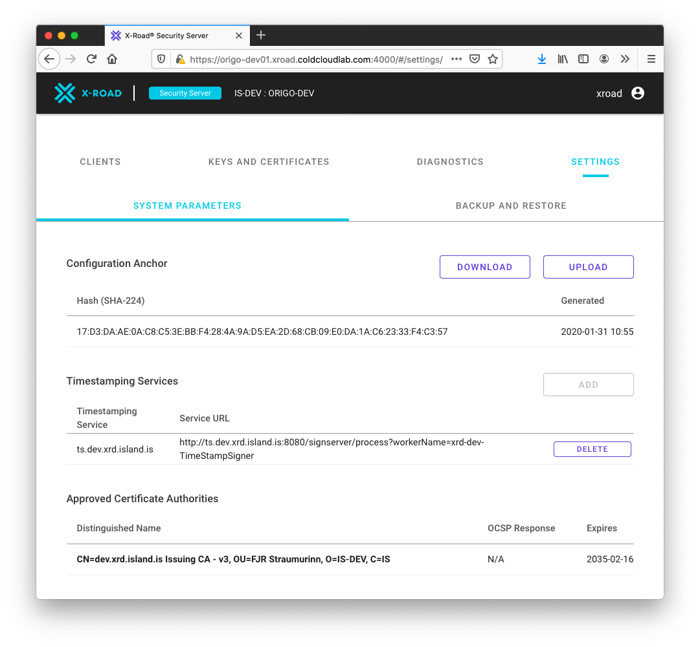

### Kerfisgreining

Undir _Diagnostics_ flipa umsýsluviðmóts er að finna yfirlit yfir stöðu öryggisþjónsins gagnvart miðlægum þjónustum Straumsins:

- _Global configuration_ sýnir hvort eintak öryggisþjónsins af víðværum stillingum Straumsins séu upp til dags, en í þeim er meðal annars að finna upplýsingar um aðra meðlimi Straumsins og þjónustur þeirra.
- _Timestamping_ segir til um samband við miðlæga tímastimpil-þjónustu Straumsins.
- Öryggisþjónar nota miðlægu _OCSP Responders_ þjónustuna til að sannprófa skilríki og hér má einnig sjá stöðu sambands við hana.

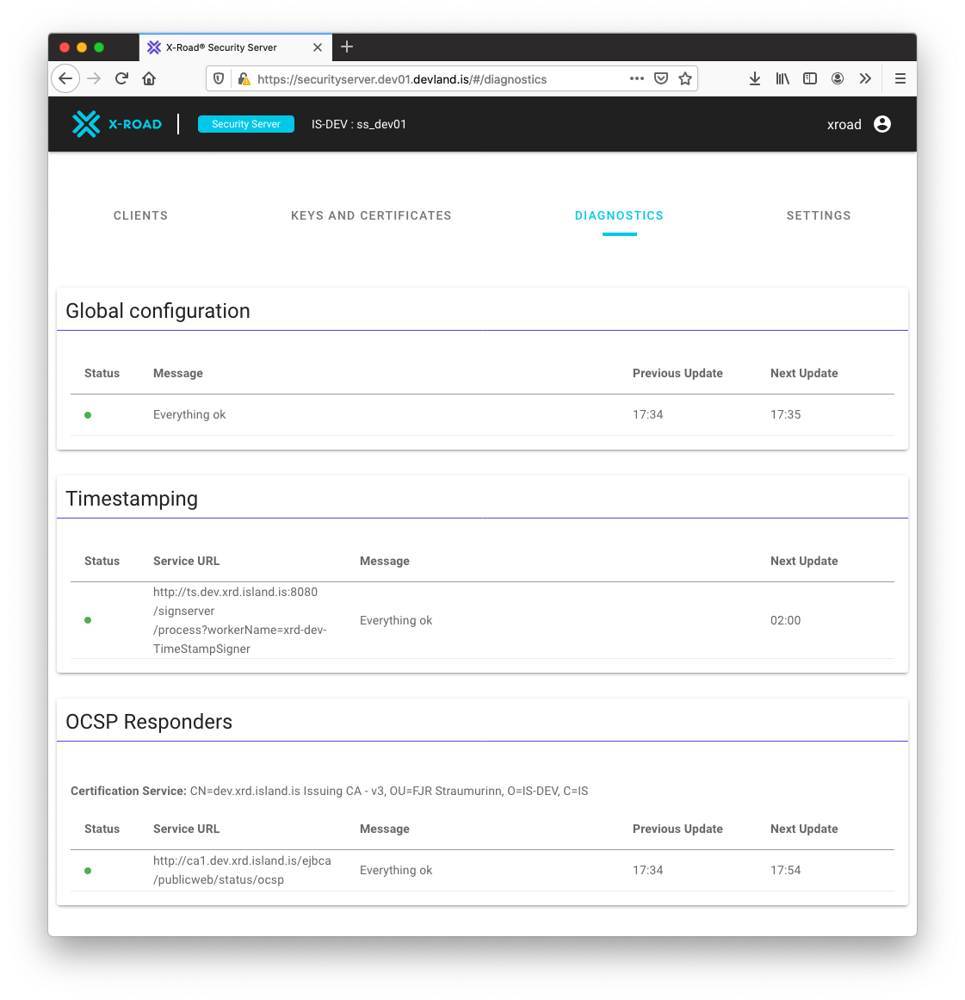

### Auðkenningar- og undirskriftarlyklar

Lykla og skírteini fyrir auðkenningu í samskiptum milli öryggisþjóna og fyrir undirskrift skeyta er að finna í umsýsluviðmótinu undir _Keys and Certificates -&gt; Sign and Auth Keys_. Þar er hægt að útbúa beiðnir um undirskrift \(CSR\) frá miðlægri umsýslu Straumsins, ásamt því að flytja inn undirrituð skírteini.

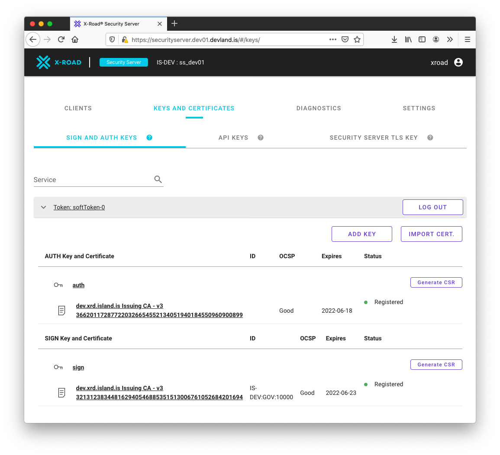

### API lyklar

Lykla sem veita aðgang að vélrænu umsýsluviðmóti öryggisþjóns – Management API – er hægt að útbúa undir _Keys and Certificates -&gt; API Keys_ í _Admin UI_ öryggisþjóns. Þegar er valið að búa til nýjan lykil, birtist gluggi með vali um notendahlutverk, sem er lýst í 4.4.1 - _Hlutverk notenda_.

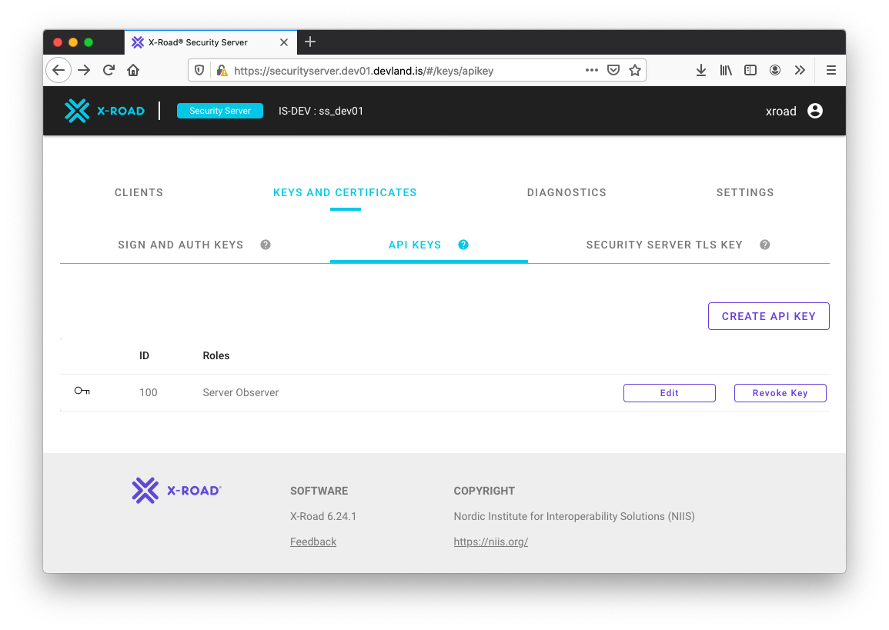

### TLS lykill öryggisþjóns

Undir flipanum _Keys and Certificates_ í umsýsluviðmóti öryggisþjóns er að finna upplýsingar um skírteini þjónsins, sem er hægt að nota í öruggum samskiptum við þau upplýsingakerfi sem hann svarar fyrir. Um þessi samskipti er fjallað í kafla 3.3 - _Samband öryggisþjóna við upplýsingakerfi_.

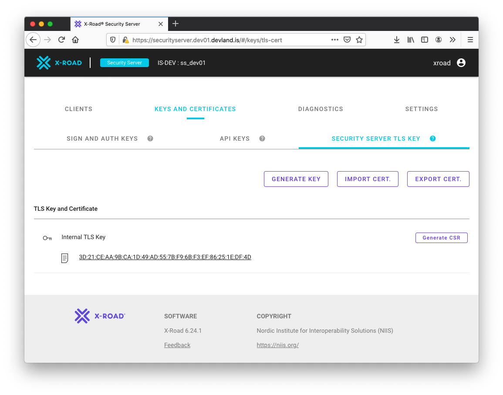

## Afritataka og vöktun

### Kerfisskrár

Kerfishlutar X-Road skrifa í logga undir `/var/log/xroad/*` . Mikilvægustu kerfishlutarnir og loggar þeirra eru:

- xroad-confclient, dreifir skráningarupplýsingum fyrir umhverfi Straumsins og skrifar í configuration_client.log
- xroad-proxy, miðlar skeytum og skrifar í proxy.log
- xroad-signer, sýslar með lykla og skrifar í signer.log
- xroad-proxy-ui-api, skil fyrir umsýsluviðmót sem skrifa í proxy_ui_api.log og proxy_ui_api_access.log

### Ræsing kerfishluta

Einstaka kerfishluta er hægt að ræsa með skipun eins og:

service &lt;nafn-kerfishluta&gt; start

Sjá nánar í [Logs and System Services](https://github.com/nordic-institute/X-Road/blob/develop/doc/Manuals/ug-ss_x-road_6_security_server_user_guide.md) kafla notendahandbókar X-Road öryggisþjóna.

### Samskiptaskrár

Samskipti milli X-Road öryggisþjóna er skráð í undirskrifuð og tímastimpluð skjöl \([Associated Signature Container](https://en.wikipedia.org/wiki/Associated_Signature_Containers)\), fyrst í gagnagrunni en eru með reglulegum hætti flutt út í skráakerfi hýsingarvélar X-Road öryggisþjónsins, samkvæmt stillingum sem eru útlistaðar í [Message Log](https://github.com/nordic-institute/X-Road/blob/develop/doc/Manuals/ug-ss_x-road_6_security_server_user_guide.md) kafla notendahandbókar fyrir öryggisþjóna.

Samskiptaskrárnar vistast í skráakerfi hýsingarvélarinnar, að sjálfgefnu undir  
`/var/lib/xroad`

Nánar um samskiptaskrárnar og skoðun þeirra má lesa í skjalinu:

- [Signed Document Download and Verification Manual](https://github.com/nordic-institute/X-Road/blob/develop/doc/Manuals/ug-sigdoc_x-road_signed_document_download_and_verification_manual.md)

Séríslensk útgáfa X-Road hugbúnaðarpakka [afvirkjar skráningu á innihaldi skeyta](https://github.com/nordic-institute/X-Road/blob/develop/src/packages/src/xroad/default-configuration/override-securityserver-is.ini) sem eru send á milli upplýsingakerfa með hjálp X-Road öryggisþjóna. Ef ákvörðun liggur fyrir um að innihald skeyta skuli skráð – sem felur í sér frekari möguleika á staðfestingu þess að tiltekin samskipti hafi átt sér stað, en gerir einnig frekari kröfur um úttektir m.t.t. persónuverndarlöggjafar – þá er hægt að virkja slíka skráningu með eftirfarandi í skránni `/etc/xroad/conf.d/local.in`:

```python
[message-log]
message-body-logging=false
```

Sjá einnig almenna umfjöllun um X-Road skráningu í:

- X-Road Logs Explained – [Part 1](https://www.niis.org/blog/2018/5/27/x-road-logs-basics), [Part 2](https://www.niis.org/blog/2018/6/3/x-road-logs-explained-part-2) and [Part 3](https://www.niis.org/blog/2018/6/12/x-road-logs-explained-part-3)

### **Útflutningur samskiptaskráa af hýsingarvél**

Svo samskiptaskrár fylli ekki skráakerfi hýsingarvélar öryggisþjónsins er vert að sjá til þess að þær séu fluttar af vélinni til varanlegri geymslu, með skilgreindum 90 daga varðveislutíma.

Sýnidæmi um slíkan útflutning er að finna í notendahandbók X-Road öryggisþjóna í kaflanum [Transferring the Archive Files from the Security Server](https://github.com/nordic-institute/X-Road/blob/develop/doc/Manuals/ug-ss_x-road_6_security_server_user_guide.md).

### Afrit stillinga öryggisþjóns

Afrit af stillingum X-Road öryggisþjóns er tekið [einu sinni á dag að sjálfgefnu](https://github.com/nordic-institute/X-Road/blob/develop/doc/Manuals/ug-ss_x-road_6_security_server_user_guide.md) \(13.3 Automatic Backups\) og þau eru vistuð undir `/var/lib/xroad/backup/` - þaðan sem er vert að flytja þau til varanlegri geymslu, eins og er vikið að fyrir samskiptaskrár í 4.5.3.1. Yfilit afrita er hægt að sjá í umsýsluviðmóti, eins og er lýst í 4.4.2.

Þegar afrit er lesið inn á nýuppsettan þjón í umsýsluviðmóti, þarf að gæta þess að _Server Code_ þjónsins sé það sama og afritið inniheldur. Að öðrum kosti er hægt að [lesa inn afritið frá skipanalínu með þvingunarrofum](https://github.com/nordic-institute/X-Road/blob/develop/doc/Manuals/ug-ss_x-road_6_security_server_user_guide.md) \(13.2 Restore from the Command Line\).

Sjá nánar í:

- [Back up and Restore](https://github.com/nordic-institute/X-Road/blob/develop/doc/Manuals/ug-ss_x-road_6_security_server_user_guide.md) kafla notendahandbókar

### Vöktun

X-Road býður upp á umhverfis- og aðgerðavöktun. Aðgerðavöktunin tekur saman upplýsingar um virkni öryggisþjóna, eins og hvaða þjónustur hefur verið kallað í, hve oft, stærð svara, o.s.frv. Gögnum um aðgerðir X-Road öryggisþjóna er safnað saman og þau gerð aðgengileg með viðkomandi skilum \(JMXMP\) til handa ytri vöktunartólum, eins og Dynatrace, Zabbix, Nagios, Icinga, SolarWinds eða DataDog.

Einnig er hægt að fylgjast með heilsufari öryggisþjóns, hvort hann sé líklegur til að senda og taka á móti skeytum, með því að fylgjast með þar til gerðum HTTP endapunkti. Þessi endapunktur er nýttur í ytri álagsdreifingu til að meta hvort þjónn sé hæfur til að vera virkur þáttakandi í klasa öryggisþjóna.

Nánara lesefni:

- [Operational Monitoring](https://github.com/nordic-institute/X-Road/blob/develop/doc/Manuals/ug-ss_x-road_6_security_server_user_guide.md) í X-Road notendahandbók
- [Environmental Monitoring](https://github.com/nordic-institute/X-Road/blob/develop/doc/Manuals/ug-ss_x-road_6_security_server_user_guide.md) í notendahandbók X-Road öryggisþjóna
- [X-Road: Operational Monitoring Daemon Architecture](https://github.com/nordic-institute/X-Road/blob/develop/doc/OperationalMonitoring/Architecture/arc-opmond_x-road_operational_monitoring_daemon_architecture_Y-1096-1.md)
- [X-Road: External Load Balancer Installation Guide - Health check service configuration](https://github.com/nordic-institute/X-Road/blob/develop/doc/Manuals/LoadBalancing/ig-xlb_x-road_external_load_balancer_installation_guide.md)
