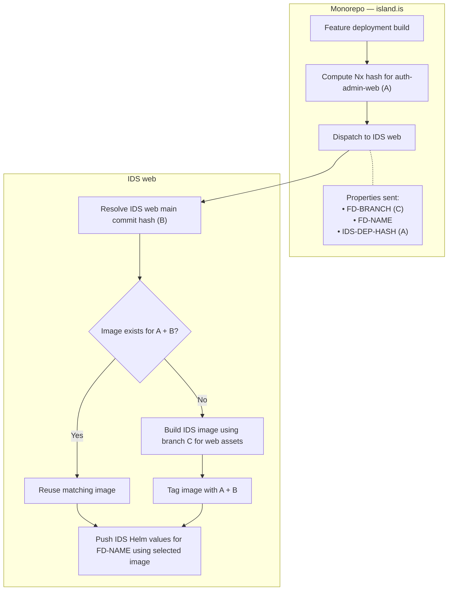

# IDS feature deployment

This document describes the proposed feature deployment (FD) flow on the
whiteboard. The monorepo builds its feature and dispatches deployment information
to IDS web. IDS web then reuses or builds an image and updates the IDS Helm values.

The whiteboard explicitly assigns the IDS Helm values update to IDS web: the
monorepo does not push those values in this proposed flow.

## Flow

## Dispatch properties

The monorepo sends the following properties to IDS web:

- `FD-BRANCH` (C): The monorepo feature branch supplying `auth-admin-web` assets
  when a build is needed.
- `FD-NAME`: The feature environment whose IDS Helm values are updated.
- `IDS-DEP-HASH` (A): The Nx hash for `auth-admin-web`, the monorepo dependency
  consumed by IDS.

These field names follow the whiteboard; they do not specify an implemented
dispatch API.

## Image identity and reuse

IDS web determines B from its own `main` commit hash. B identifies the IDS web
revision used for the image and is not sent in the dispatch.

The combination A + B identifies a reusable image. If a matching image exists,
IDS web skips the build and uses it for the Helm values update. Otherwise, IDS web
builds an image using `auth-admin-web` assets from the monorepo feature branch C,
tags the result with A + B, and updates the Helm values with that image.

A + B is a logical combination of the two hashes. The whiteboard does not define
the exact image tag format.

## Relationship to the current repository

This is a proposed design, not a description of the current implementation.
The current [feature deployment workflow](../.github/workflows/push.yml)
generates feature values and pushes them from the monorepo.
Its [manifest preparation script](../scripts/ci/docker/feature-deploy-get-data.mjs)
includes `charts/ids-features/deployments` and currently returns a hard-coded
test image tag for IDS. The proposed flow moves the IDS image selection/build and
IDS Helm values update into IDS web.
