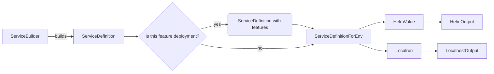

## Maintainer's Guide for the Configuration DSL

### Purpose

To ensure seamless and error-free connectivity between our code and the execution environment, we created a Domain-Specific Language (DSL) that allows developers to define the expected configuration of services expressively. This DSL is designed to enforce our conventions and principles.

We are also experimenting with using the DSL to generate Bash commands for running services locally. The abstraction level of the DSL allows flexibility for generating deployment setups in different environments, such as Docker Compose or raw Kubernetes manifests, without being tied to a specific one.

### Key Abstractions

Developers primarily interact with a `ServiceBuilder` to define the configuration of their services. Common configurations include setting environment variables and secrets, along with other properties. When a configuration value is missing, it is crucial to use the constant `MissingSetting` instead of an empty string or other placeholder values. This special type enforces our policies for deployment readiness across differing environments.

`ServiceBuilder`s can depend on or be required by other `ServiceBuilder`s, representing runtime dependencies between services. The design intentionally prevents circular dependencies. However, currently, there exists a circular dependency between `api` and `application-system-api`. This is managed through specific workarounds; search for "hacks" in the DSL's code for more details.

The complete set of services for a specific deployment in a particular environment is referred to as a "habitat." Although we sometimes generate deployments for a subset of the habitat (e.g., feature deployments or local setups), production deployments always involve the entire habitat.

### Configuration Generation Process

The following illustrates the processing of each service:

After processing each service, a combined output is generated for the deployment configuration.