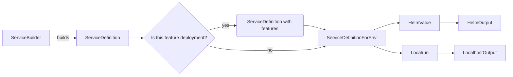

# Maintainer's Guide for Configuration DSL

## Purpose

To streamline code connection to the execution environment, we developed a Domain-Specific Language (DSL) for expressive service configuration. The DSL enforces conventions and principles. It's adaptable for generating various deployment environments, like bash scripts, Docker Compose, or Kubernetes manifests.

## Key Concepts

Developers mainly use [`ServiceBuilder`](dsl.ts) for service configuration, typically for environment variables and secrets. If a configuration value is missing, use the constant [`MissingSetting`](types/input-types.ts#L10) instead of placeholders. This type helps enforce deployment readiness policies.

`ServiceBuilder`s can depend on other `ServiceBuilder`s, representing runtime dependencies, avoiding circular references. Note that current exceptions, like between `api` and `application-system-api`, are managed with workarounds in the DSL code.

A collection of services for a deployment in a particular environment is a "habitat." While subsets may be deployed for features or local setups, full habitats are used for production.

## Configuration Processing Pipeline

Each service is processed as follows:

After processing, a combined output for deployment is generated.
