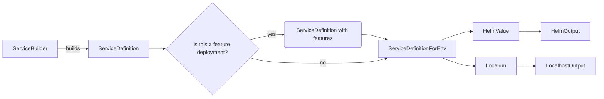

# Maintainer's guide for the configuration DSL

## Why

The Domain-Specific Language (DSL) has been developed to enable developers to expressively define the services' configuration, ensuring seamless connectivity with the execution environment. This DSL enforces conventions and principles established within our development workflow.

Furthermore, there is ongoing exploration into utilizing the DSL to produce bash commands for local service execution. The flexibility of the DSL allows for supporting various deployment environments like Docker Compose, raw Kubernetes manifests, and potentially more in the future.

## Key Abstractions

Developers work with a [`ServiceBuilder`](dsl.ts) to configure services. This involves setting environment variables, secrets, and other configuration properties. It is critical to use the constant [`MissingSetting`](types/input-types.ts#L10) when a configuration value is absent, ensuring compliance with our deployment readiness policies.

Services can depend on or provide dependencies to other services through `ServiceBuilder`s. Circular references are intentionally disallowed, except for the managed instance between `api` and `application-system-api`. Refer to the "hacks" section in the DSL code for details on how this is handled.

A group of services for a specific deployment in a particular environment is termed a "habitat." While deployments may be tailored for specific features or local environments, the complete habitat is always deployed in production.

## General Processing Pipeline for Configuration Generation

The following steps outline the processing for each service:

Upon processing each service, a consolidated output is generated for the deployment configuration.