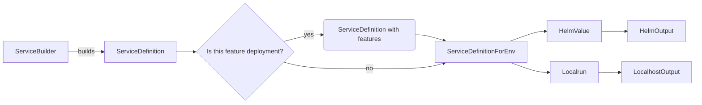

# Maintainer's guide for the configuration DSL

## Why

In order to ensure the most effortless and error-free way to connect our code to the execution environment we created a Domain-Specific Language(DSL) to support an expressive way for developers to define the services' expected configuration. The DSL is written intentionally such that it enforces conventions and principles we have.

Additionally, we have started experimenting with using the DSL to generate _bash_ commands for running locally services. The DSL is abstract enough that is not tied to any one specific execution environment and leaves our options open to generating pretty much any deployment environments we might want to explore in the future - docker-compose, raw k8s manifests, etc.

## A few key abstractions

Developers mostly interact with a [`ServiceBuilder`](dsl.ts) to define the configuration for their services. Most often this includes setting environment variables and secrets, but there are other configuration properties as well. Whenever a value for a configuration is missing, it is important that the constant [`MissingSetting`](types/input-types.ts#L10) is used instead of empty string or other 'magic' values. This special type, allows us to apply our policies regarding when we are ready to deploy code to different environments.

`ServiceBuilder`s can be provided/required as dependencies to other `ServiceBuilder`s and represents runtime dependencies between services. It is intentional that this way of connecting services does not allow for circular references. Here should be noted that although that is something we strive to achieve, currently we have at least one instance of circular dependency - between `api` and `application-system-api`. To see how that is being handled, search for "hacks" in the DSL's code.

That full set of services for a specific deployment in a specific environment is referred to as "habitat". We sometimes generate a deployment for a subset of the habitat - feature deployments or local setups, but in production we deploy always the whole habitat.

## General processing pipeline for generating configuration

This is how we process each service

After each service is processed, we generate a combined output for the deployment configuration.
