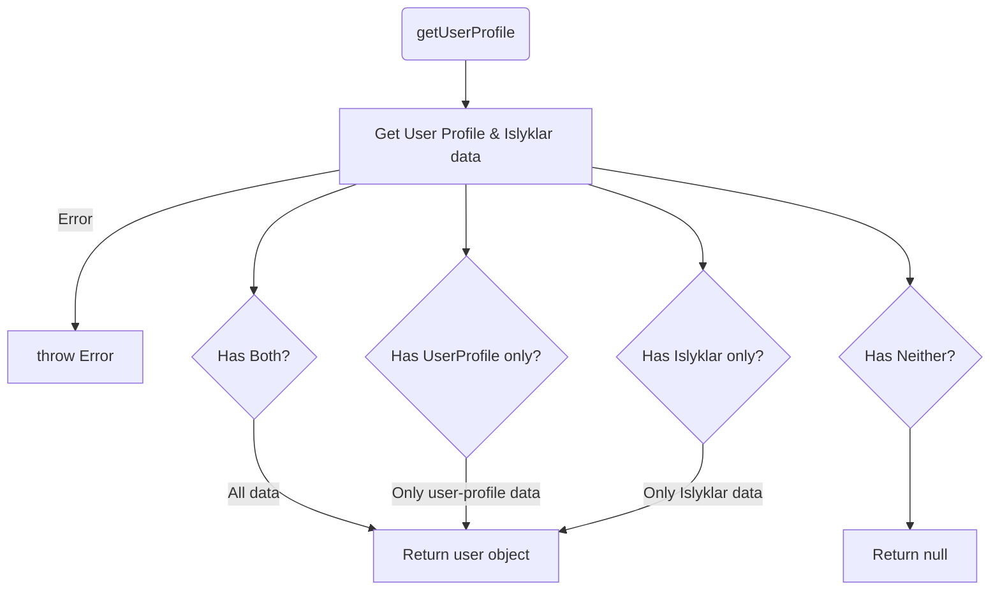

# api-domains-user-profile

This library was generated with [Nx](https://nx.dev).

## Running Unit Tests

Run `nx test api-domains-user-profile` to execute the unit tests via [Jest](https://jestjs.io).

## Development

To run this in development, you need to start the service:

```bash
yarn start services-user-profile
```

To locally develop the Islyklar service, you will need the `islyklar.p12` file. This file is not part of the parameter store, so you will need to obtain it from the code owners of this service. Note: The Islyklar file is not a requirement to run the user-profile.

## Islyklar and UserProfile Integration

With the addition of the Islyklar service, the user-profile service operates slightly differently.

The Islyklar service is a temporary solution while user data migration from the previous island.is web is underway. Currently, it merges Islyklar data with user-profile data to retrieve user information from the old web.

### `getUserProfile`

The `getUserProfile` function retrieves data from both the user-profile and Islyklar databases, if available. If only one set of data exists, it will return the available information, with default values used for any missing data.



### `getUserProfileLocale`

`getUserProfile` provides both user-profile and Islyklar data for the current logged-in user. The `getUserProfileLocale` function specifically fetches the user's locale profile. If the user is logged in as a delegate, it retrieves the actor's locale instead.

### `getIslykillProfile`

This function returns default values for user-profile while fetching the Islyklar data. It is used when a `userProfileApiWithAuth` call returns a 404, ensuring users receive Islyklar data despite missing user-profile API data.

### `createUserProfile`

Creates a user profile using `userProfileControllerCreate` and handles Islyklar data by determining whether to create (`createIslykillSettings`) or update (`updateIslykillSettings`) the data, based on its existence.

### `updateUserProfile`

Updates a user profile using `userProfileControllerUpdate`. Similar to creation, it determines whether to create or update the Islyklar data accordingly.

### `deleteIslykillValue`

If the user posts empty values to the email and telephone fields, the `DataStatus` is marked as `EMPTY`. This status indicates that these fields are intended to be empty.

```json
{
  "emailStatus": "DataStatus.EMPTY",
  "mobileStatus": "DataStatus.EMPTY"
}
```

### `createSmsVerification` & `createEmailVerification`

When creating or updating user information, it is important to verify its validity. Users receive an email or text message to verify the provided information.

- The default state of a `DataStatus` is `NOT_DEFINED`.
- The empty state is represented as `EMPTY`, prompting the user to save their email despite it not being mandatory.
- The verified state is `VERIFIED`, indicating confirmation of correct email.
- An uncommon state, `NOT_VERIFIED`, suggests an email exists but is unverified, possibly due to migration with unconfirmed Islyklar service data.