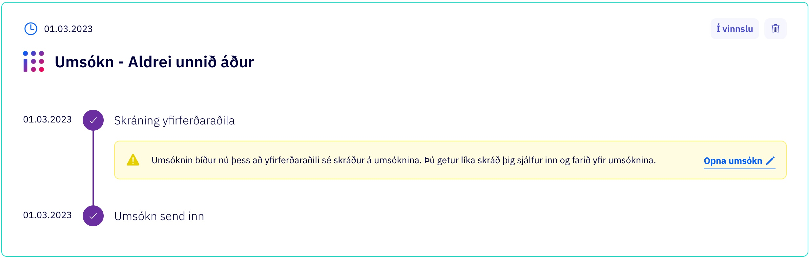
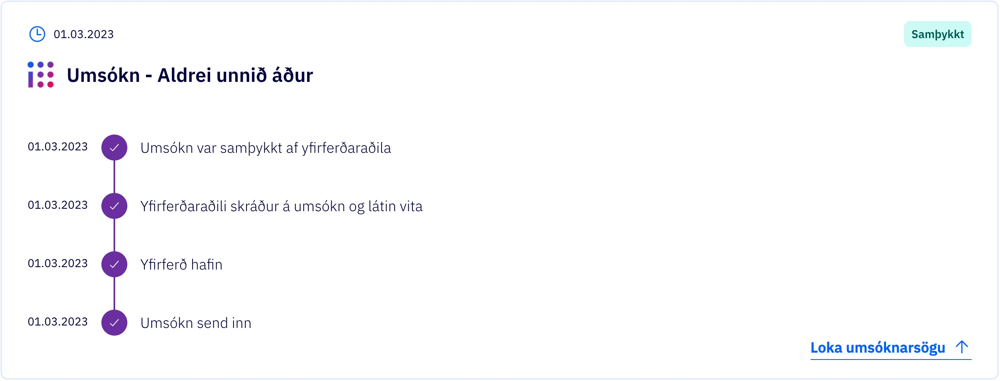

<!-- gitbook-navigation: "Core" -->

# Application Core

## About

This library contains all types, and utilities needed to build applications, forms, and schemas that act as the main base for the whole application system.

## Application

The `application` type describes an instance of a stored application. It includes information about:

- who the `applicant` is
- what is (s)he applying for (`typeId`)
- the needed `answers` to the questions in the application
- the `externalData` attached to the application
- what `state` the application is in
- and more

## Data Providers

Many applications need to store external data that cannot be manipulated, but should be stored within the application. This data is often fetched from external sources (via x-road or other services available to island.is) and is used for either pre-filling fields in the form, or for validation and information uses.

## Application Template

The `ApplicationTemplate` interface is the heart of the whole system. Each self-service application flow depends on having a template that extends this interface.
Each application template has a unique `type`, a `dataSchema` for quick data validation, `answerValidators` for more customizable server side validation, and, most importantly,
a `stateMachineConfig` to describe the overall flow for the application, and how users with different roles can interact with an application in its varying states.

### Translations

In order to define "translatable" messages on the API side, you will need to define the `translationNamespaces` field on the template. It accepts an array of namespaces, in case you are using messages from multiple namespaces, coming from Contentful.

Once loading a namespace for the first time, it will the latest data from Contentful, and will cache the messages for 15 minutes.

#### Configuration

Add the following to your template object.

```diff
const ReferenceApplicationTemplate: ApplicationTemplate<
  ApplicationContext,
  ApplicationStateSchema<ReferenceTemplateEvent>,
  ReferenceTemplateEvent
 > = {
  type: ApplicationTypes.EXAMPLE,
  name: m.name,
+ translationNamespaces: [ApplicationConfigurations.ExampleForm.translation],
  dataSchema: ExampleSchema,
```

Example from [here](https://github.com/island-is/island.is/blob/main/libs/application/templates/reference-template/src/lib/ReferenceApplicationTemplate.ts#L84).

#### States

You can define a `title` and a `description` fields on each state of your state machine. These two fields will be used on the applications list on the service portal. It gives a better understanding for the user the current step of the process it is in.

```diff
[States.draft]: {
  meta: {
    name: 'Umsókn um ökunám',
+   title: m.draftTitle,
+   description: m.draftDescription,
    progress: 0.25,
    lifecycle: DefaultStateLifeCycle,
    roles: [
```



At the moment, only the `description` field is used on application list. The `title` field is meant to be use in a later iteration of the application page's design.


### Header information

In order to show the information in the header (as shown bellow) regarding the institution handling the application and the application name, you need to pass an `institution` field to the template. It is accepting both a string and a "translatable" object.


```diff
const ReferenceApplicationTemplate: ApplicationTemplate<
  ApplicationContext,
  ApplicationStateSchema<ReferenceTemplateEvent>,
  ReferenceTemplateEvent
 > = {
  type: ApplicationTypes.EXAMPLE,
  name: m.name,
+ institution: m.institutionName,
  translationNamespaces: [ApplicationConfigurations.ExampleForm.translation],
  dataSchema: ExampleSchema,
```

The application's name will be picked up from the `name` field from the same object above.

### Feature flags

In order to introduce an application behind a featureflag you can follow the following steps:

1.  Ask someone from DevOps for invite to ConfigCat.
2.  Once you're in (https://app.configcat.com/) you can add your feature flag. The initial values should always be "On" in Dev and (probably always to start with) "Off" in Production and Staging.
3.  Remember to add the label "applicationSystemFlag" to your flag.
4.  Make sure that the `CONFIGCAT_SDK_KEY` environment variable is exported in .env.secret in the root of the repository. You can fetch it by calling for example `yarn get-secrets application-system-form`.
5.  Add your flag to the package @island.is/feature-flags in libs/feature-flags/src/lib/features.ts
6.  Now you can add the featureFlag to the application template under "featureFlag".

```diff
const ReferenceApplicationTemplate: ApplicationTemplate<
 ApplicationContext,
 ApplicationStateSchema<ReferenceTemplateEvent>,
 ReferenceTemplateEvent
 > = {
 type: ApplicationTypes.EXAMPLE,
 name: m.name,
 institution: m.institutionName,
+ featureFlag: Feature.exampleApplication
 translationNamespaces: [ApplicationConfigurations.ExampleForm.translation],
 dataSchema: ExampleSchema,
```

#### DataSchema

We are using zod to create the schema of the application. To pass a custom error message using a translation, we need to use the `params` field from the error message callback. You then can pass the "translatable" object from your message file.

```typescript
.refine((n) => n && !kennitala.isValid(n), {
  params: m.dataSchemeNationalId,
}),
```

Example from [here](https://github.com/island-is/island.is/blob/main/libs/application/templates/reference-template/src/lib/ReferenceApplicationTemplate.ts#L56).

#### AnswerValidators

Same pattern as other fields, you can pass a string or a "translatable" object from your messages file.

### Application Type

Each application template has its own unique application type. When a new application template is created, a respective enum value should be added to the `ApplicationTypes` enum.

### Data schema

In order to have consistent form validation in the frontend and backend, each application template should be accompanied by a `dataSchema`. This `dataSchema` is
implemented using [Zod](https://github.com/vriad/zod) which is a powerful TypeScript-first schema declaration and validation library. The schema is an object, where
the keys are the ids of all the questions that need validation for this given application template, and the value is a zod object describing what validation is needed
for that given question and what error message to show if it fails.

### Answer Validators

Sometimes, we need to provide our application templates with more complicated validation than a Zod `dataSchema` can offer. That is where answer validators come in.
The answer validators are stored in a map, where the key is a path to the answer that needs to have this custom validation, and the value is a function which gets the
current application and the new answer as parameters. The validators are only run on the server when the client tries to update an answer with a designated validator.

### State Machine

Behind the scenes, `application-core` has types and interfaces for state machines which are extended from [xstate](https://xstate.js.org/docs/).
Each `state` in the application template state machine must include a `meta` object which describes the name of the state, what `roles` can access it, and what each role can do in said state.

### States

Each application defines their own [states](https://xstate.js.org/docs/guides/states.html#state-methods-and-properties). They can be as many as needed depending on how complicated or simple the application flow is.

> A state is an abstract representation of a system (such as an application) at a specific point in time. As an application is interacted with, events cause it to change state. A finite state machine can be in only one of a finite number of states at any given time.

You can see a simple example from the reference-template [here](https://github.com/island-is/island.is/blob/287e1769d8fa3f0665ff767a9c82933d0c785fdc/libs/application/templates/reference-template/src/lib/ReferenceApplicationTemplate.ts#L60-L152), or a more complex example from the Parental Leave [here](https://github.com/island-is/island.is/blob/ed3ac581b75862cd5e45d5ee8a6811d40216ac46/libs/application/templates/parental-leave/src/lib/ParentalLeaveTemplate.ts#L30-L41).

#### Status

We have a few different statuses that an application can be in. They are:

- `notstarted` The user has opened the application / it is saved in the database, but is not listed yet (eg. still in prerequisites)
- `draft` - The application has been created but not submitted.
- `inprogress` - The application has been submitted to another entity other than the applicant and has yet to receive some information from that party in order to be completed.
- `completed` - The application has been submitted and requires no further action and is finished.
- `rejected` - The application has been rejected by a 3rd party and is finished.
- `approved` - The application has been approved by a 3rd party and is finished.

```typescript
export enum ApplicationStatus {
  NOT_STARTED = 'notstarted',
  IN_PROGRESS = 'inprogress',
  COMPLETED = 'completed',
  REJECTED = 'rejected',
  APPROVED = 'approved',
  DRAFT = 'draft',
}
```

#### Life cycle

States can define their own life cycle:

```typescript
type StateLifeCycle =
  | {
      // Controls visibility from my pages + /umsoknir/:type when in current state
      shouldBeListed: boolean
      shouldBePruned: false
      shouldDeleteChargeIfPaymentFulfilled?: boolean | null
    }
  | {
      shouldBeListed: boolean
      shouldBePruned: true
      // If set to a number prune date will equal current timestamp + whenToPrune (ms)
      whenToPrune: number | ((application: Application) => Date)
      shouldDeleteChargeIfPaymentFulfilled?: boolean | null
    }
```

By default states will not be pruned and will always be listed. The default options are defined in `libs/application/core/src/lib/constants.ts`.

Sample use case:

- An application template needs to validate some logic before "creating" the actual application, in this case "created means":
  - visible to the user from my pages and application overview screen (`/umsoknir/:type`)
  - not automatically pruned after a few hours of inactivity
- The initial state will then define the life cycle property as following:
  - `shouldBeListed: false` the application will not be listed in my pages or on `/umsoknir/:type`
  - `shouldBePruned: true` inactive applications will be automatically pruned to not waste space in the database if they are not moved into another state after a certain period of time
  - `whenToPrune: 12 * 3600 * 1000` the application can be deleted after 12 hours of inactivity

These values are persisted into database for querying, so if an application has already been published and they are changed a database migration will also have to be included to update existing applications.

### Roles

Each role can `read` or `write` different data stored in the application. Not only that, but each role has its own `formLoader` to describe what form should be rendered for said role in this specific state.
For example, when an application is in review, the `applicant` should see a different form than the `reviewer`. Also, the `applicant` can no longer `write` any new answers, only `read` them, while a `reviewer` might be able to `read` everything and even `write` some new answers as well.
This logic is also applied by the backend to make sure when a person queries for an application, the answers stored in the database for said application are trimmed so the person only gets to see the answers that (s)he is allowed
to in that state.

In addition to information about which form to load, what data this role can read and write, the role includes a (possibly empty) list of `actions`. Each `action` maps to an event that is used by the state machine to transition into another state. In the example below, the `applicant`
cannot perform any actions in the `inReview` state, while the `reviewer` has all the power to `APPROVE` or `REJECT` the application, resulting in a state transition.

```ts
stateMachineConfig: {
  states: {
    ...
    inReview: {
      meta: {
        name: 'In Review',
        roles: [
          {
            id: 'reviewer',
            formLoader: () =>
              import('../forms/ReviewApplication').then((val) =>
                Promise.resolve(val.ReviewApplication),
              ),
            actions: [
              { event: 'APPROVE', name: 'Samþykkja', type: 'primary' },
              { event: 'REJECT', name: 'Hafna', type: 'reject' },
            ],
            read: 'all',
            write: {
              answers: ['reviewerComment'],
            },
          },
          {
            id: 'applicant',
            formLoader: () =>
              import('../forms/PendingReview').then((val) =>
                Promise.resolve(val.PendingReview),
              ),
            read: 'all',
          },
        ],
      },
      on: {
        APPROVE: { target: 'approved' },
        REJECT: { target: 'rejected' },
      },
    },
    ...
  },
},
```

### Pending Action



For each state, you have the option to set a "pendingAction". This will appear as the top item in the application history logs, along with a user prompt. This is not persisted between states.

```ts
[States.waitingToAssign]: {
  meta: {
    name: 'Waiting to assign',
    ...
    actionCard: {
      pendingAction: {
        title: 'Skráning yfirferðaraðila',
        content:
          'Umsóknin bíður nú þess að yfirferðaraðili sé skráður á umsóknina. Þú getur líka skráð þig sjálfur inn og farið yfir umsóknina.',
        displayStatus: 'warning',
      },
      ...
    },
```

You can pass a function that uses the application answers and the user's role to determine the color, content, and title of the box to display to the user.

```ts
  ...
    actionCard: {
      pendingAction: (answers, role) => {
        let title, content, displayStatus
        if (role === 'applicant') {
          title = 'Waiting for Reviewer'
          content =
            'Your application is waiting for a reviewer to be assigned.'
          displayStatus = 'info'
        } else if (role === 'reviewer') {
          title = 'Applications to Review'
          content = 'You have applications waiting to be reviewed.'
          displayStatus = 'warning'
        } else {
          //display something else
          ...
        }
        return { title, content, displayStatus }
      },
  ...
```

### Application History

You can display a history log for each event that can be triggered within each state. The logs will be ordered below the current [Pending Action](###-Pending-Action) (if present) with the most recent entries at the top.

The events are stored and recorded in db seperately so the log messages can be added later or updated.

```ts
[States.inReview]: {
  meta: {
    name: 'In review',
    ...
    actionCard: {
      ...
      historyLogs: [
        {
          onEvent: DefaultEvents.SUBMIT,
          logMessage: application.applicationSubmitted,
        }
      ],
      ...
    },
```

An example of a history log (with no [Pending Action](###-Pending-Action) present)


### Delete Application

In order to enable users to delete applications within a state simply add `delete: true` to the desired role and state.

```diff
stateMachineConfig: {
  states: {
    ...
    draft: {
      meta: {
        name: 'Draft',
        roles: [
          {
            id: 'applicant',
            formLoader: () =>
              import('../forms/Draft).then((val) =>
                Promise.resolve(val.Draft),
              ),
            read: 'all',
+           delete: true
          },
        ],
      },
    ...
  },
},
```

This will add a delete button in the Draft state available only to the `Applicant` role like so:
application-pending-action.jpeg

## Form

The `Form` type describes how to structure the flow of a form. It is basically a big json object which is used by `application-ui-shell` to know what to render on the screen.

The structure of a form describes how questions and other fields are displayed, in what section or subsection they belong to, and in what order. It is basically a tree where the root is the `Form`, and the leaves are renderable `Fields`. In between there are nodes that describe the structure in more detail, such as `Sections`, `SubSections`, `MultiFields`, `ExternalDataProviders` and `Repeaters`.

### Fields

A form field can be a question that the applicant needs to answer, or just something purely cosmetic or informational. This library provides prebuilt reusable fields (such as TextField, CheckboxField, RadioField and more), and also an interface for a custom field. In order to get data schema validation for a field, the `id` of the field needs to be present in the application template `dataSchema` object. It is even possible to provide a field with pure `defaultValue` if no answer has been provided by the user.

### How to create a new field component

1. Add the new name of your field to both `FieldTypes` and `FieldComponents` enums in `libs/application/types/src/lib/fields.ts`
2. Create a new interface in `libs/application/types/src/lib/fields.ts` that extends `BaseField`. Add your custom props to the interface along with type and component.

```typescript
export interface NewField extends BaseField {
  readonly type: FieldTypes.NEW_FIELD
  component: FieldComponents.NEW_FIELD
  myProp: string
  myOtherProp: number
}
```

3. In the same file, add your new field to the exported `Field` type.

4. Create a new function in `libs/application/core/src/lib/fieldBuilders.ts`. This function accepts a parameter of the new type we created, `NewField`, but we have to omit `type`, `component` and `children`. Then add the props as follows.

```typescript
export function buildNewField(
  data: Omit<NewField, 'type' | 'component' | 'children'>,
): NewField {
  const { myProp, myOtherProp } = data
  return {
    ...extractCommonFields(data),
    children: undefined,
    myProp,
    myOtherProp,
    type: FieldTypes.NEW_FIELD,
    component: FieldComponents.NEW_FIELD,
  }
}
```

5. Create a new folder with the name of your field in `libs/application/ui-fields/src/lib/`. Also create your react component there with the same name and with `.tsx` file ending.


6. Create new function in the new file with the same name you created in step 1 in the `FieldComponents` enum. This functions props should extend `FieldBaseProps`. Add Field to your props with the type of the interface you created in step 2.

```typescript
interface Props extends FieldBaseProps {
  field: NewField
}

export const NewFormField: FC<Props> = ({ application, field }) => {
  return <Box>Your new component.</Box>
}
```

7. Remember to add your new component as a new export in the parent `index.ts` file.

8. You have now created a new field component. You can now use it in your application forms.

### Conditions

Fields can have conditions to be shown/hidden under some given circumstances. These conditions can be _dynamic_ (open-ended function), or _static_ (depend on answers to other questions).

### Sections and SubSections

These are only used for cosmetic reasons. They divide the form flow into meaningful chapters, which allow users to know how far into the form process they are.

### Multi-fields

These are only used for cosmetic reasons. They group fields together so the `application-form` UI renders multiple fields on the screen, instead of the default one field per screen behavior.

### External Data Providers

Many applications rely on external data that should not be editable by any user or consumer of an api. The `externalData` of an application is only updated by the backend via custom-made `DataProviders`.

### Custom errors for Data Providers

You can add in custom error/warning title and summary to display for the user on the dataprovider screen when a dataprovider requirements fail according to the response received.

An example of this would be if you dont meet the age requirements of an application and the team wants to stop the application from transitioning to the next state.

In your dataprovider implementation add the following

```diff
  export class SampleDataProvider extends BasicDataProvider {
  type = 'SampleDataProvider'

  async provide(_application: Application): Promise<unknown> {
    await new Promise((resolve) => setTimeout(resolve, 500))

    const data: SampleProviderData = {
      value: 'Hello world',
    }

+    if (!SampleProviderData.value) {
+      return Promise.reject({
+        reason: {
+          title: error.someFailMessage.title,
+          summary: error.someFailMessage.summary,
+        },
+        statusCode: 404,
+      })
+    }

    return Promise.resolve(data)
  }

+  onProvideError(error: {
+    reason: ProviderErrorReason
+    statusCode?: number
+  }): FailedDataProviderResult {
+    return {
+      date: new Date(),
+      data: {},
+      reason: error.reason,
+      status: 'failure',
+      statusCode: error.statusCode,
+    }
+  }
}
```

This would then display as a yellow box warning when the user has fetched the data and failed to meet the requirements like so:


### Dynamic name for application

You can add a dynamic name for the application by supplying a function to the `name` variable instead of a translation string in the `template` object of an application. This will be used to generate the name of the application in the overview screen and within the application.

You need to define the function so that it accepts the application object and returns a translation string.

```ts
const determineMessageFromApplicationAnswers = (application: Application) => {
  const careerHistory = getValueViaPath(
    application.answers,
    'careerHistory',
    undefined,
  ) as string | undefined
  if (careerHistory === 'no') {
    return m.nameApplicationNeverWorkedBefore
  }
  return m.name
}
```

```diff
template: {
  ...
- name: m.name
+ name: determineMessageFromApplicationAnswers,
  ...
}
```

This will then return the name for the application depending on the answers provided in the overview and at the top of the application shell.
Keep in mind when using dynamic names that there should not be any personal information in the name.

## Draft status bar for application action cards

Default behaviour and custom behavior is explained below.  
The reason default behavior does not work for all applications is because it counts all screens, including the dynamic ones, which results in too many screens listed for some applications.

### Default draft status bar behavior

- draftFinishedSteps
  - Uses form screens, current active index as default value
- draftTotalSteps
  - Uses form screens.length as default value

### Custom draft status bar behavior

- draftFinishedSteps
  - Uses the draftPageNumber for the current section
- draftTotalSteps
  - Searches all sections, returns the max value for draftPageNumber
- You can add the page number for each section in the form builder which overrides the default behavior.
  - If you have for example 10 screens that are dynamic, and only one of them is shown during the application fill out process (some logic chooses between them). Then you can put the same draftPageNumber to all of them. For example here below we have two screens with same number but only one is rendered based on a condition.

```diff
  buildSection({
    id: 'id-1',
    title: 'demo-title',
+   draftPageNumber: 1,
  children: [],
  }),
  buildSection({
    id: 'id-2',
    title: 'demo-title',
+   draftPageNumber: 2,
    children: [],
  }),
  buildSection({
    id: 'id-3',
    title: 'payment-transcation',
+   draftPageNumber: 3,
    children: [],
    condition: (_formValue) => {
      return _formValue.paymentMethod === "TRANSACTION"
    }
  }),
  buildSection({
    id: 'id-4',
    title: 'payment-visa',
+   draftPageNumber: 3,
    children: [],
    condition: (_formValue) => {
      return _formValue.paymentMethod === "VISA"
    }
  }),
```

## Code owners and maintainers

- [Norda](https://github.com/orgs/island-is/teams/norda-applications/members)
