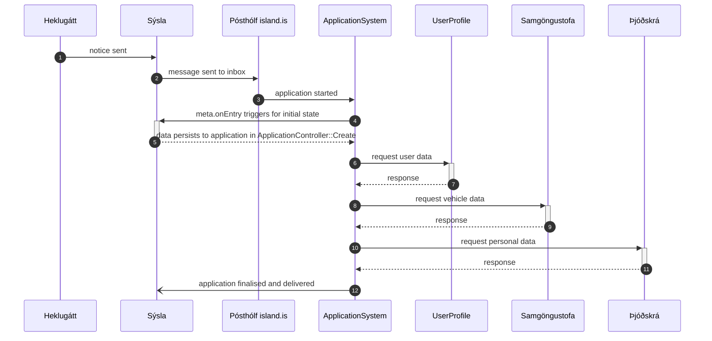

# Application Templates Announcement of Death

## Application Sequence Diagram

```mermaid
sequenceDiagram
    autonumber
    participant Heklugátt
    participant Sýsla
    participant Pósthólf island.is
    participant ApplicationSystem
    participant UserProfile
    participant Samgöngustofa
    participant Þjóðskrá

    Heklugátt->>Sýsla: notice sent
    Sýsla->>Pósthólf island.is: message sent to inbox
    Pósthólf island.is->>ApplicationSystem: application started

    ApplicationSystem->>+Sýsla: meta.onEntry triggers for initial state
    Sýsla-->>-ApplicationSystem: data persists to application in ApplicationController::Create

    ApplicationSystem->>+UserProfile: request user data
    UserProfile-->>-ApplicationSystem: response

    ApplicationSystem->>+Samgöngustofa: request vehicle data
    Samgöngustofa-->>-ApplicationSystem: response

    ApplicationSystem->>+Þjóðskrá: request personal data
    Þjóðskrá-->>-ApplicationSystem: response

    ApplicationSystem-)Sýsla: application finalised and delivered
```
