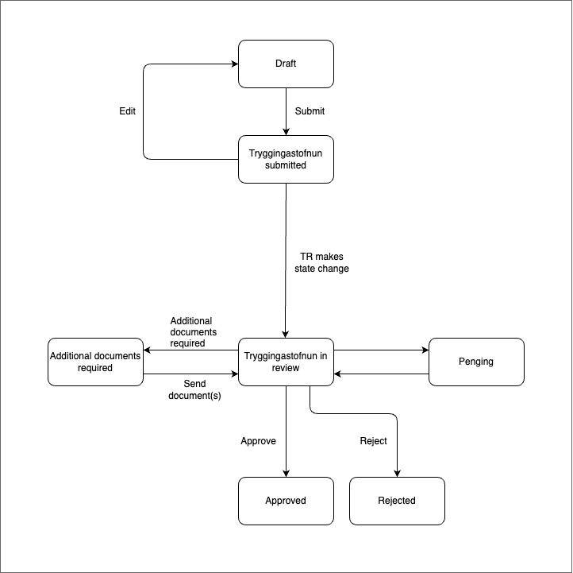

# Application Templates Child pension

## Description

This application template allows applicants to apply for child pension.

### States

#### Prerequisites

This state is a temporary state that all new applications will be created in. It has a short lifespan and is unlisted.

The purpose of this state is to be a guard into the actual application. There is an external data step which fetches data from Þjóðskrá, TR and user profile.

#### Draft

In this state the applicant can start the actual application and fill in all the relevant data.

#### Tryggingastofnun submitted

When applicant has sent in the application to TR the application is in this state. Here the application can be edited.

#### Tryggingastofnun in review

For application to be in this state, TR need to make a state change when they start to review the application. Here the application can not be edited.

#### Additional document required

If TR needs additional documents to finish processing the application they can make a state change so the applicant can add their missing documents.

#### Pending

Application has been put on hold by TR.

#### Approved

Application has been approved by TR.

#### Rejected

Application has been rejected by TR.

### Localisation

All localisation can be found on Contentful.

- [Child pension application translations](https://app.contentful.com/spaces/8k0h54kbe6bj/entries/cp.application)
- [Application system translations](https://app.contentful.com/spaces/8k0h54kbe6bj/entries/application.system)

When creating new text strings in the messages.ts file for the application, be sure to update Contentful, see [message extraction](../../../localization/README.md#message-extraction).

## Setup

See [application-system](../../../../apps/application-system/README.md) setup on how to get started.

Once you have everything running you can navigate to [http://localhost:4242/umsoknir/barnalifeyrir](http://localhost:4242/umsoknir/barnalifeyrir) and start developing.
