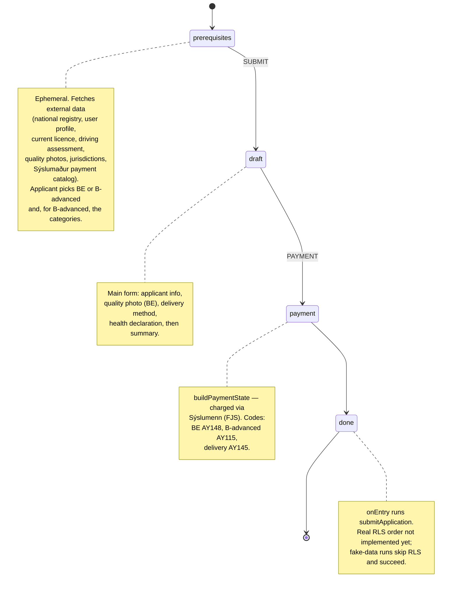

# Driving License – Additional Rights (`driving-license-additional`)

Application template for adding **extra driving rights to an existing full B
licence**. It is a separate flow from the standard "new / renew driving licence"
template (`driving-license`) and covers that a holder of a full B licence
can apply for:

| Choice (`applicationFor`) | Icelandic                     | What it is                                                                                                        | Charge code |
| ------------------------- | ----------------------------- | ----------------------------------------------------------------------------------------------------------------- | ----------- |
| `BE`                      | Kerruréttindi                 | Trailer rights on top of a B licence                                                                              | `AY148`     |
| `B-advanced`              | Aukin ökuréttindi / meirapróf | Larger-vehicle categories: `C1`, `C`, `D1`, `D`, their `E` (trailer) variants and the professional (`A`) variants | `AY115`     |

A delivery fee (`AY145`) is added when the applicant chooses to have the licence
posted rather than picked up at a district commissioner's office.

> **Status:** `readyForProduction: false`. The real RLS order is **not wired up
> yet** — see [Known gaps](#known-gaps). Today the flow is fully exercisable end
> to end only with fake data (gervigögn).

## Who can apply / eligibility

Eligibility is derived from the applicant's real (or faked) data pulled in the
prerequisites step, and controls which options are enabled on the
"what are you applying for" screen:

- **BE** requires:
  - an existing **full** B licence (a temporary / bráðabirgða licence,
    `validToCode === 8`, is not eligible),
  - age **18–64**,
  - not already holding BE.
- **B-advanced** requires:
  - an existing full B licence, and
  - at least one advanced category the applicant is old enough for and does not
    already hold (minimum ages: `C1` 18, `C` 21, `D1` 21, `D` 23; see
    `advancedLicenseMap` in [`src/lib/constants.ts`](./src/lib/constants.ts)).

## Which gervimenn (test personas) can use this template?

**Any gervimaður can be used**, because the RLS/Þjóðskrá staging lookups are
replaced by fake data. The "Gervigögn" section is only rendered when the
`ALLOW_FAKE` feature flag is enabled
(see [`getApplicationFeatureFlags.ts`](./src/lib/getApplicationFeatureFlags.ts)),
and it lets you simulate the inputs that would otherwise come from RLS staging
(dev x-road):

- **Current licence** — none / temporary / full B / B+BE.
- **Advanced categories already held** — to test that already-owned categories
  are correctly excluded.
- **Age** — drives the eligibility rules above.
- **Þjóðskrá photo** and **RLS quality photo** — present / absent / real, plus a
  `metadata-only` mode that reproduces the prod-observed legacy record where the
  photo metadata exists but the binary is missing.
- **Submit to RLS?** — by default a fake run returns a stubbed response and does
  **not** call RLS. Enabling this sends a real request to the RLS dev x-road
  endpoint instead.

Everything else on the application (email, phone, delivery choice, health
certificate upload, etc.) is always real input — the fake data only stands in for
the RLS/registry prerequisite lookups so the flow can be tested without holding
the corresponding rights in the RLS staging database.

## State flow (high level)

```text
prerequisites ──SUBMIT──▶ draft ──PAYMENT──▶ payment ──▶ done
 (ephemeral)              (main form)        (FJS charge)  (onEntry: submit)
```



| State           | Mode              | Role      | What happens                                                                                                                                                 |
| --------------- | ----------------- | --------- | ------------------------------------------------------------------------------------------------------------------------------------------------------------ |
| `prerequisites` | draft (ephemeral) | applicant | Pulls all external data providers, applicant approves data sharing, chooses `applicationFor`, and (for B-advanced) selects categories. `SUBMIT` → `draft`.   |
| `draft`         | draft             | applicant | Main form — applicant info, quality photo (BE), delivery method + jurisdiction, health-declaration certificate upload, and a summary. `PAYMENT` → `payment`. |
| `payment`       | —                 | applicant | `buildPaymentState`; charge created against Sýslumenn using the codes above. On success → `done`.                                                            |
| `done`          | completed         | applicant | `onEntry` triggers `submitApplication` (see [Known gaps](#known-gaps)) and shows the completed screen.                                                       |

Events are `SUBMIT`, `PAYMENT`, `APPROVE`, `ABORT` (see
[`src/utils/constants.ts`](./src/utils/constants.ts)). There is a single role,
`applicant`.

## Structure

```text
src/
├── dataProviders/           # Sýslumaður payment-catalog data providers
├── fields/                  # Custom React fields
│   ├── AdvancedLicenseSelection/   # category picker (C1/C/D1/D + E + professional)
│   ├── ApplicationSection/         # summary rows
│   ├── ApplicationSummary/         # review overview
│   └── CreatePhoto/                # quality-photo rendering
├── forms/
│   ├── prerequisitesForm/   # external data, fake data, applicationFor, category select, summary
│   ├── mainForm/            # applicant info, quality photo, delivery, health declaration, summary
│   └── completedForm/       # done screen
├── lib/
│   ├── template.ts          # state machine
│   ├── dataSchema.ts        # zod schema for answers
│   ├── constants.ts         # licence types, category map, charge codes, fake-data types
│   ├── messages.ts          # localized strings (dla.application namespace)
│   └── utils/               # eligibility / form helpers (+ specs)
└── utils/constants.ts       # States, Roles, Events
```

The server-side action lives in
[`libs/application/template-api-modules/.../driving-license-additional`](../../template-api-modules/src/lib/modules/templates/driving-license-additional).

## Known gaps

The `done`-state `submitApplication` action does **not** place a real order with
RLS yet, and is intentionally loud about it (throws a typed error on the real
path; fake-data runs are let through so the DONE screen can still be tested).
Two RLS-API decisions block it, both living outside this repo:

1. **B-advanced (meirapróf)** categories have no client method in
   `@island.is/clients/driving-license`. A new RLS endpoint + client method is
   required (`postApplicationNewCollaborative` is for lost/stolen duplicates, not
   added categories).
2. **BE**: the existing `applyForBELicense` client method expects an
   `instructorSSN` and a full health-declaration model, which this "add rights to
   an existing full B licence" flow does not collect. The correct endpoint /
   payload must be confirmed with the RLS API owner before wiring.

See the doc comment on `submitApplication` in
[`driving-license-additional.service.ts`](../../template-api-modules/src/lib/modules/templates/driving-license-additional/driving-license-additional.service.ts)
for details.

## Running unit tests

Run `nx test driving-license-additional` to execute the unit tests via [Jest](https://jestjs.io).

## Extracting translation strings

Run `nx extract-strings driving-license-additional` to sync the `dla.application`
namespace strings to Contentful.
